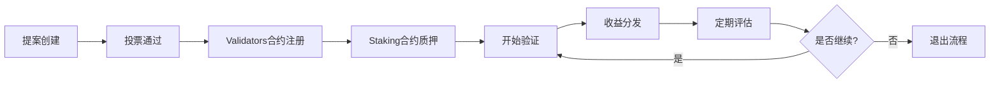

# JuChain PoSA 区块链部署与运维指南

## 📋 概述

JuChain 是基于以太坊技术栈构建的高性能区块链网络，采用 Congress PoSA (Proof of Stake Authority) 混合共识机制。本文档提供了从零开始的完整部署、配置和运维指南。

### � 核心特性

- **🏛️ Congress PoSA**: 结合 PoA 和 PoS 的混合共识机制
- **⚡ 高性能**: 1秒出块间隔，高TPS处理能力
- **🔒 安全性**: 多层验证者管理和惩罚机制
- **🏗️ 模块化**: 系统合约与业务逻辑分离
- **🛠️ 工具链**: 完整的CLI工具和自动化脚本

## 🏗️ 系统架构

### 核心组件架构图

```
┌─────────────────────────────────────────────────────────────┐
│                    JuChain Network                          │
├─────────────────┬─────────────────┬─────────────────────────┤
│   Geth Client   │  Congress CLI   │    System Contracts     │
│                 │                 │                         │
│ • Mining        │ • Validator Mgmt│ • Validators (0xf000)   │
│ • P2P Network   │ • Proposal Mgmt │ • Punish (0xf001)       │
│ • JSON-RPC API  │ • Query Tools   │ • Proposal (0xf002)     │
│ • External Sign │ • Auto Scripts  │ • Staking (0xf003)      │
└─────────────────┴─────────────────┴─────────────────────────┘
```

### 系统合约地址

| 合约名称 | 地址 | 功能说明 |
|---------|------|----------|
| **Validators** | `0x000000000000000000000000000000000000f000` | 验证者状态管理、奖励分发 |
| **Punish** | `0x000000000000000000000000000000000000f001` | 验证者惩罚机制、监禁处理 |
| **Proposal** | `0x000000000000000000000000000000000000f002` | 治理提案、投票管理 |
| **Staking** | `0x000000000000000000000000000000000000f003` | 质押管理、委托机制 |

### 网络参数

| 参数 | 主网 | 测试网 | 说明 |
|------|------|--------|------|
| **Chain ID** | 202599 | 202583 | 网络标识符 |
| **Block Time** | 1秒 | 1秒 | 平均出块间隔 |
| **Epoch Length** | 86400块 | 86400块 | 验证者轮换周期 |
| **Max Validators** | 21 | 21 | 最大活跃验证者数量 |
| **Min Stake** | 10000 JU | 1000 JU | 最低质押要求 |

## ⚙️ 系统配置参数

### Congress 共识参数

在创世块文件中配置核心共识参数：

```json
{
  "config": {
    "congress": {
      "period": 1,        // 出块时间间隔 (秒)
      "epoch": 86400,       // 验证者轮换周期 (块数)
      "rewards": "0x56BC75E2D63100000"  // 区块奖励 (wei)
    }
  }
}
```

### 系统合约参数详解

这些参数在合约编译时设置，修改后需重新编译并更新创世块：

| 参数名称 | 默认值 | 单位 | 说明 |
|----------|--------|------|------|
| `punishThreshold` | 24 | 块 | 连续错过块数触发收益没收 |
| `removeThreshold` | 48 | 块 | 连续错过块数触发验证者移除 |
| `decreaseRate` | 24 | % | 惩罚时的削减比例 |
| `withdrawProfitPeriod` | 28800 | 块 | 收益提取间隔 (~24小时) |
| `proposalLastingPeriod` | 86400 | 秒 | 提案有效期 (24小时) |
| `increasePeriod` | 1y | 块 | 增发周期 |
| `minStakeAmount` | 10000 | JU | Staking合约最低质押金额 |
| `commissionRateBase` | 10000 | 基点 | 佣金率基数 (100% = 10000) |

> ⚠️ **重要提醒**: 修改合约参数需要：
>
> 1. 重新编译系统合约 (`forge build`)
> 2. 生成新的合约字节码 (`npm run generate`)
> 3. 更新创世块文件 (`npm run init-genesis`)
> 4. 重新初始化所有节点数据目录

### Staking 机制参数

JuChain 引入了双合约验证者管理机制：

```json
{
  "staking": {
    "minStakeAmount": "10000000000000000000000",  // 10000 JU (wei)
    "maxCommissionRate": 5000,                    // 最大佣金率 50%
    "unbondingPeriod": 201600,                    // 解绑期 7天 (块数)
    "maxValidators": 21,                          // 最大活跃验证者数量
    "slashingRate": 500                           // 作恶惩罚率 5%
  }
}
```

## 📄 创世块配置

### 完整创世块结构

JuChain 的创世块配置包含网络参数、系统合约部署和初始状态设置：

```json
{
  "config": {
    "chainId": 202599,
    "homesteadBlock": 0,
    "eip150Block": 0,
    "eip150Hash": "0x0000000000000000000000000000000000000000000000000000000000000000",
    "eip155Block": 0,
    "eip158Block": 0,
    "byzantiumBlock": 0,
    "constantinopleBlock": 0,
    "petersburgBlock": 0,
    "istanbulBlock": 0,
    "berlinBlock": 0,
    "londonBlock": 0,
    "congress": {
      "period": 3,
      "epoch": 200
    }
  },
  "difficulty": "0x1",
  "gasLimit": "0x47b760",
  "alloc": {
    "000000000000000000000000000000000000f000": {
      "balance": "0x0",
      "code": "0x608060405234801561001057600080fd5b50...",
      "storage": {}
    },
    "000000000000000000000000000000000000f001": {
      "balance": "0x0",
      "code": "0x608060405234801561001057600080fd5b50...",
      "storage": {}
    },
    "000000000000000000000000000000000000f002": {
      "balance": "0x0",
      "code": "0x608060405234801561001057600080fd5b50...",
      "storage": {}
    },
    "000000000000000000000000000000000000f003": {
      "balance": "0x0",
      "code": "0x608060405234801561001057600080fd5b50...",
      "storage": {}
    }
  },
  "extraData": "0x0000000000000000000000000000000000000000000000000000000000000000f39fd6e51aad88f6f4ce6ab8827279cfffb92266970e8128ab834e3eac664312d6e30df9e93cb3578ec64c67c554dddd8d1da2c256e30df9e93cb3578ec64c67c554dddd8d1da2c256a45ffca201b0a7d75fd23bb302c12332c5e40003d968443d9b72bcef4409b3a2d5e31031390fc826b175474e89094c44da98b954eedeac495271d0f0000000000000000000000000000000000000000000000000000000000000000000000000000000000000000000000000000000000000000000000000000000000",
  "gasUsed": "0x0",
  "mixHash": "0x0000000000000000000000000000000000000000000000000000000000000000",
  "nonce": "0x0",
  "number": "0x0",
  "parentHash": "0x0000000000000000000000000000000000000000000000000000000000000000",
  "timestamp": "0x0"
}
```

### 关键配置说明

#### 1. 网络标识设置

```json
{
  "config": {
    "chainId": 202599,    // JuChain 测试网 ID
    "congress": {
      "period": 1,        // 1秒出块间隔
      "epoch": 86400        // 每86400块轮换验证者
    }
  }
}
```

#### 2. 系统合约预部署

所有系统合约在创世块中预部署到固定地址：

- **合约字节码**: 通过 `forge build` 编译生成
- **存储布局**: 初始状态存储在 `storage` 字段
- **余额设置**: 系统合约初始余额为 0

#### 3. 初始验证者设置

`extraData` 字段编码格式：

```
extraData = vanity(32字节) + validators(20字节*N) + signature(65字节)
```

其中：

- **vanity**: 32字节的填充数据 (通常为0)
- **validators**: 初始验证者地址列表 (每个20字节)
- **signature**: 65字节的签名数据 (创世块签名)

#### 4. 预分配账户

```json
{
  "alloc": {
    "f39fd6e51aad88f6f4ce6ab8827279cfffb92266": {
      "balance": "0x21e19e0c9bab2400000"  // 10000 ETH (开发用)
    },
    "970e8128ab834e3eac664312d6e30df9e93cb357": {
      "balance": "0x21e19e0c9bab2400000"  // 10000 ETH (验证者1)
    }
  }
}
```

### 合约字节码生成流程

系统合约字节码需要通过以下步骤生成：

```bash
# 1. 编译所有合约
cd sys-contract
forge build

# 2. 生成合约部署代码
npm run generate

# 3. 自动更新创世块文件
npm run init-genesis

# 4. 验证创世块文件
node scripts/verify-genesis.js
```

> 📝 **注意**: 每次修改系统合约代码后，都需要重新生成创世块文件并重新初始化所有节点。

## 🚀 环境搭建与编译

### 开发环境要求

#### 必需软件清单

| 软件 | 最低版本 | 推荐版本 | 用途 |
|------|----------|----------|------|
| **Go** | 1.23+ | 1.24+ | 编译Geth客户端 |
| **Node.js** | 18+ | 20+ | 运行合约脚本和工具 |
| **Foundry** | 1.2.3+ | 最新版 | 智能合约开发框架 |
| **GCC/G++** | 7+ | 11+ | C++编译器依赖 |
| **Git** | 2.30+ | 最新版 | 版本控制 |
| **Make** | 4.0+ | 最新版 | 构建工具 |

#### 环境安装

```bash
# 🔧 安装 Foundry (智能合约工具链)
curl -L https://foundry.paradigm.xyz | bash
foundryup

# 🔧 安装 Node.js (推荐使用 nvm)
curl -o- https://raw.githubusercontent.com/nvm-sh/nvm/v0.39.0/install.sh | bash
nvm install 20
nvm use 20

# 🔧 安装 Go (macOS 示例)
brew install go
# 或从官方下载: https://golang.org/dl/

# 🔧 验证安装
go version          # 应显示 go1.24.x
node --version      # 应显示 v20.x.x
forge --version     # 应显示 foundry 版本
```

### 源码获取

#### 完整项目结构

```bash
# 📥 克隆完整项目
git clone <repository-url> ju-chain
cd ju-chain

# 📁 项目结构概览
ju-chain/
├── chain/                 # Geth客户端源码
│   ├── build/            # 编译输出目录
│   ├── cmd/              # 命令行工具
│   ├── consensus/        # 共识算法实现
│   │   └── congress/     # Congress PoSA 实现
│   ├── core/             # 核心区块链逻辑
│   ├── eth/              # 以太坊协议实现
│   └── Makefile          # 构建脚本
├── sys-contract/          # 系统合约源码
│   ├── contracts/        # Solidity合约源码
│   ├── congress-cli/     # CLI工具源码
│   ├── scripts/          # 自动化脚本
│   ├── foundry.toml      # Foundry配置
│   └── package.json      # Node.js依赖
└── README.md             # 项目说明
```

### 编译流程

#### 1. 编译区块链客户端

```bash
# 🏗️ 编译完整工具链
cd chain
make all

# 或者单独编译组件
make geth          # 仅编译主客户端
make bootnode      # 仅编译引导节点
make evm          # 仅编译EVM工具

# ✅ 验证编译结果
ls -la build/bin/
# 应包含: geth, bootnode, clef, ethkey 等
```

#### 2. 编译系统合约

```bash
# 🏗️ 编译智能合约
cd sys-contract

# 安装 Node.js 依赖
npm install

# 安装 Foundry 依赖
forge install

# 编译所有合约
forge build

# ✅ 验证合约编译
ls -la out/
# 应包含所有合约的编译产物
```

#### 3. 生成创世块配置

```bash
# 🔄 生成合约部署代码
npm run generate

# 🔄 更新创世块文件
npm run init-genesis

# ✅ 验证创世块
node scripts/verify-genesis.js
echo "✅ 创世块文件生成完成: genesis.json"
```

#### 4. 编译管理工具

```bash
# 🛠️ 编译 Congress CLI 工具
cd sys-contract/congress-cli
make build

# ✅ 测试工具功能
./build/congress-cli --version
./build/congress-cli help

# 🛠️ 编译自动化脚本
chmod +x *.sh
echo "✅ 所有工具编译完成"
```

### 构建验证

#### 完整性检查

```bash
# 🔍 验证所有组件
echo "=== 验证 Geth 客户端 ==="
./chain/build/bin/geth version

echo "=== 验证系统合约 ==="
forge test --root ./sys-contract

echo "=== 验证 CLI 工具 ==="
./sys-contract/congress-cli/build/congress-cli --version

echo "=== 验证创世块 ==="
./chain/build/bin/geth --datadir temp_test init ./sys-contract/genesis.json
rm -rf temp_test

echo "✅ 所有组件验证通过"
```

### 常见编译问题

#### Go 编译问题

**问题**: `go: cannot find module`

```bash
# 解决方案: 更新Go模块
cd chain
go mod download
go mod tidy
```

**问题**: CGO编译错误

```bash
# 解决方案: 安装C++编译器
# Ubuntu/Debian:
sudo apt-get install build-essential

# macOS:
xcode-select --install
```

#### Foundry 编译问题

**问题**: `forge not found`

```bash
# 解决方案: 重新安装Foundry
curl -L https://foundry.paradigm.xyz | bash
source ~/.bashrc
foundryup
```

**问题**: 合约依赖错误

```bash
# 解决方案: 清理并重新安装
cd sys-contract
rm -rf lib/
forge install
forge build --force
```

## 🚀 节点部署与配置

### 部署架构选择

#### 单节点开发环境

适用于开发测试，快速验证功能：

```bash
# 🔧 创建开发节点
mkdir -p dev-node/data
cd dev-node

# 初始化创世块
../chain/build/bin/geth --datadir data init ../sys-contract/genesis.json

# 启动开发节点 (自动挖矿)
../chain/build/bin/geth \
  --datadir data \
  --http \
  --http.addr "0.0.0.0" \
  --http.port 8545 \
  --http.api "eth,net,web3,personal,admin,congress" \
  --mine \
  --miner.etherbase "0xf39Fd6e51aad88F6F4ce6aB8827279cffFb92266" \
  --allow-insecure-unlock \
  --unlock "0xf39Fd6e51aad88F6F4ce6aB8827279cffFb92266" \
  --password <(echo "") \
  --console
```

#### 多节点验证者网络

生产环境推荐配置，多验证者确保网络安全：

```bash
# 🏗️ 创建多节点网络
for i in {1..5}; do
  mkdir -p validator$i/data
  
  # 初始化每个节点
  ./chain/build/bin/geth --datadir validator$i/data init sys-contract/genesis.json
  
  # 配置静态节点连接
  echo '[
    "enode://node1@127.0.0.1:30301",
    "enode://node2@127.0.0.1:30302",
    "enode://node3@127.0.0.1:30303"
  ]' > validator$i/data/static-nodes.json
done
```

### 节点配置详解

#### 基础配置参数

```bash
# 📋 标准验证者节点配置
./chain/build/bin/geth \
  --datadir data \                    # 数据目录
  --port 30303 \                      # P2P监听端口
  --http \                            # 启用HTTP-RPC
  --http.addr "127.0.0.1" \          # RPC监听地址
  --http.port 8545 \                 # RPC监听端口
  --http.api "eth,net,web3,personal,admin,congress" \  # 启用的API
  --ws \                             # 启用WebSocket
  --ws.addr "127.0.0.1" \           # WebSocket地址
  --ws.port 8546 \                  # WebSocket端口
  --ws.api "eth,net,web3,congress" \ # WebSocket API
  --mine \                          # 启用挖矿
  --miner.etherbase "0x..." \       # 矿工收益地址
  --miner.threads 1 \               # 挖矿线程数
  --miner.gasprice 1000000000 \     # 最低Gas价格
  --txpool.pricelimit 1000000000 \  # 交易池最低价格
  --maxpeers 50 \                   # 最大连接节点数
  --cache 1024 \                    # 缓存大小(MB)
  --syncmode "full" \               # 同步模式
  --gcmode "archive"                # 垃圾回收模式
```

#### 高级网络配置

```bash
# 🌐 网络发现配置
--discovery \                       # 启用节点发现
--bootnodes "enode://..." \        # 引导节点列表
--nat "extip:外部IP" \             # NAT穿透配置
--netrestrict "192.168.0.0/24" \   # 网络限制

# 🔒 安全配置
--allow-insecure-unlock \          # 允许HTTP解锁(仅开发)
--unlock "0x..." \                 # 自动解锁账户
--password password.txt \          # 密码文件
--keystore keystore/ \             # 密钥存储目录

# 📊 监控配置
--metrics \                        # 启用指标收集
--metrics.addr "127.0.0.1" \      # 指标监听地址
--metrics.port 6060 \              # 指标端口
--pprof \                          # 启用性能分析
--pprof.addr "127.0.0.1" \        # 性能分析地址
--pprof.port 6061                  # 性能分析端口
```

### 验证者账户管理

#### 创建验证者账户

```bash
# 🔑 创建新的验证者账户
./chain/build/bin/geth account new --datadir validator1/data
# 输入密码并记录地址

# 🔑 导入现有私钥
echo "私钥内容" > private.key
./chain/build/bin/geth account import private.key --datadir validator1/data
rm private.key  # 导入后删除明文私钥

# 📋 查看所有账户
./chain/build/bin/geth account list --datadir validator1/data
```

#### 账户安全管理

```bash
# 🛡️ 创建密码文件
echo "你的安全密码" > validator1/password.txt
chmod 600 validator1/password.txt

# 🛡️ 配置密钥存储权限
chmod 700 validator1/data/keystore/
chmod 600 validator1/data/keystore/*

# 🛡️ 使用外部签名器 (推荐生产环境)
./chain/build/bin/clef \
  --keystore validator1/data/keystore \
  --configdir validator1/clef \
  --chainid 202599 \
  --http \
  --http.addr "127.0.0.1" \
  --http.port 8550
```

### 网络连接配置

#### 静态节点配置

```json
// validator1/data/static-nodes.json
[
  "enode://节点1公钥@IP1:端口1",
  "enode://节点2公钥@IP2:端口2",
  "enode://节点3公钥@IP3:端口3"
]
```

#### 可信节点配置

```json
// validator1/data/trusted-nodes.json
[
  "enode://受信任节点1@IP1:端口1",
  "enode://受信任节点2@IP2:端口2"
]
```

#### 动态节点发现

```bash
# 🔍 通过控制台添加节点
geth attach validator1/data/geth.ipc

# 在控制台中执行
admin.addPeer("enode://节点公钥@IP:端口")

# 查看连接状态
admin.peers
net.peerCount
```

### 启动脚本示例

#### 验证者节点启动脚本

```bash
#!/bin/bash
# start-validator.sh

set -e

# 配置变量
DATADIR="./data"
VALIDATOR_ADDR="0xf39Fd6e51aad88F6F4ce6aB8827279cffFb92266"
PASSWORD_FILE="./password.txt"
LOG_FILE="./validator.log"

# 检查必要文件
if [ ! -f "$PASSWORD_FILE" ]; then
    echo "❌ 密码文件不存在: $PASSWORD_FILE"
    exit 1
fi

if [ ! -d "$DATADIR/keystore" ]; then
    echo "❌ 密钥存储目录不存在: $DATADIR/keystore"
    exit 1
fi

# 启动验证者节点
echo "🚀 启动验证者节点..."
echo "📍 验证者地址: $VALIDATOR_ADDR"
echo "📁 数据目录: $DATADIR"
echo "📄 日志文件: $LOG_FILE"

./chain/build/bin/geth \
  --datadir "$DATADIR" \
  --port 30303 \
  --http \
  --http.addr "0.0.0.0" \
  --http.port 8545 \
  --http.corsdomain "*" \
  --http.api "eth,net,web3,personal,admin,congress" \
  --ws \
  --ws.addr "0.0.0.0" \
  --ws.port 8546 \
  --ws.origins "*" \
  --ws.api "eth,net,web3,congress" \
  --mine \
  --miner.etherbase "$VALIDATOR_ADDR" \
  --allow-insecure-unlock \
  --unlock "$VALIDATOR_ADDR" \
  --password "$PASSWORD_FILE" \
  --maxpeers 50 \
  --cache 1024 \
  --syncmode "full" \
  --log.file "$LOG_FILE" \
  --log.level 3 \
  2>&1 | tee -a "$LOG_FILE"
```

#### 非验证者节点启动脚本

```bash
#!/bin/bash
# start-fullnode.sh

# 全节点 (不参与挖矿)
./chain/build/bin/geth \
  --datadir "./data" \
  --port 30303 \
  --http \
  --http.addr "0.0.0.0" \
  --http.port 8545 \
  --http.api "eth,net,web3,congress" \
  --ws \
  --ws.addr "0.0.0.0" \
  --ws.port 8546 \
  --ws.api "eth,net,web3,congress" \
  --maxpeers 50 \
  --cache 512 \
  --syncmode "fast" \
  --console
```

## 👥 验证者管理与治理

### 双合约验证者系统

JuChain 采用创新的双合约验证者管理机制：

| 合约 | 地址 | 主要功能 |
|------|------|----------|
| **Validators** | 0xf000 | 验证者状态管理、奖励分发、活跃验证者列表 |
| **Staking** | 0xf003 | 质押管理、委托机制、经济激励 |

### 验证者生命周期



### 添加新验证者

#### 完整流程 (使用自动化脚本)

```bash
# 🤖 使用一键添加脚本 (推荐)
cd sys-contract/congress-cli
./add_validator6.sh

# 该脚本会自动执行以下步骤:
# 1. 创建添加验证者提案
# 2. 收集必要的验证者投票
# 3. 执行提案 (添加到Validators合约)
# 4. 在Staking合约中注册并质押
# 5. 验证所有步骤完成
```

#### 手动执行流程

**步骤 1: 准备新验证者**

```bash
# 🔑 创建新验证者账户
NEW_VALIDATOR_ADDR="0x新验证者地址"
echo "新验证者地址: $NEW_VALIDATOR_ADDR"

# 确保账户有足够余额用于质押
echo "请确保账户余额 >= 10000 JU"
```

**步骤 2: 创建添加提案**

```bash
# 📝 由现有验证者创建提案
PROPOSER_ADDR="0xf39Fd6e51aad88F6F4ce6aB8827279cffFb92266"

./build/congress-cli create_proposal \
  -p $PROPOSER_ADDR \
  -t $NEW_VALIDATOR_ADDR \
  -o add \
  --rpc_laddr http://localhost:8545

# 签名交易
./build/congress-cli sign \
  -f createProposal.json \
  -k proposer.key \
  -p password.txt \
  --chainId 202599

# 发送交易
./build/congress-cli send \
  -f createProposal_signed.json \
  --rpc_laddr http://localhost:8545

echo "✅ 提案已创建，提案ID: [查看交易收据获取]"
```

**步骤 3: 验证者投票**

```bash
# 🗳️ 其他验证者投票支持
PROPOSAL_ID="0x提案ID"

# 验证者1投票
./build/congress-cli vote_proposal \
  -s "0x970e8128ab834e3eac664312d6e30df9e93cb357" \
  -i $PROPOSAL_ID \
  -a true \
  --rpc_laddr http://localhost:8545

# 验证者2投票
./build/congress-cli vote_proposal \
  -s "0x6e30df9e93cb3578ec64c67c554dddd8d1da2c25" \
  -i $PROPOSAL_ID \
  -a true \
  --rpc_laddr http://localhost:8545

# 验证者3投票 (达到多数通过)
./build/congress-cli vote_proposal \
  -s "0x3858ffca201b0a7d75fd23bb302c12332c5e4000" \
  -i $PROPOSAL_ID \
  -a true \
  --rpc_laddr http://localhost:8545

echo "✅ 提案投票完成，等待执行"
```

**步骤 4: Staking合约注册**

```bash
# 💰 在Staking合约中注册验证者
./build/congress-cli staking register \
  --from $NEW_VALIDATOR_ADDR \
  --stake 10000 \
  --commission 500 \
  --rpc_laddr http://localhost:8545

echo "✅ 验证者已在Staking合约中注册"
```

**步骤 5: 启动验证者节点**

```bash
# 🚀 启动新验证者节点
./chain/build/bin/geth \
  --datadir newvalidator/data \
  --port 30306 \
  --http \
  --http.port 8547 \
  --mine \
  --miner.etherbase $NEW_VALIDATOR_ADDR \
  --unlock $NEW_VALIDATOR_ADDR \
  --password password.txt \
  --console

echo "✅ 新验证者节点已启动"
```

### 验证者查询与监控

#### 基础查询命令

```bash
# 📊 查询所有活跃验证者
./build/congress-cli miners --rpc_laddr http://localhost:8545

# 👤 查询特定验证者详情
./build/congress-cli miner \
  -a 0xf39Fd6e51aad88F6F4ce6aB8827279cffFb92266 \
  --rpc_laddr http://localhost:8545

# 💰 查询Staking合约信息
./build/congress-cli staking list-top-validators \
  --rpc_laddr http://localhost:8545

# 🏆 查询特定验证者质押信息
./build/congress-cli staking query-validator \
  --address 0xf39Fd6e51aad88F6F4ce6aB8827279cffFb92266 \
  --rpc_laddr http://localhost:8545
```

#### 高级监控查询

```bash
# 📈 验证者性能统计
./build/congress-cli validator-stats \
  --address 0xf39Fd6e51aad88F6F4ce6aB8827279cffFb92266 \
  --blocks 1000 \
  --rpc_laddr http://localhost:8545

# ⚠️ 检查验证者惩罚状态
./build/congress-cli punishment-status \
  --address 0xf39Fd6e51aad88F6F4ce6aB8827279cffFb92266 \
  --rpc_laddr http://localhost:8545

# 💎 查询验证者奖励
./build/congress-cli validator-rewards \
  --address 0xf39Fd6e51aad88F6F4ce6aB8827279cffFb92266 \
  --rpc_laddr http://localhost:8545
```

### 验证者收益管理

#### 收益提取

```bash
# 💸 提取验证者收益
VALIDATOR_ADDR="0xf39Fd6e51aad88F6F4ce6aB8827279cffFb92266"

# 检查可提取收益
./build/congress-cli check-withdrawable \
  -a $VALIDATOR_ADDR \
  --rpc_laddr http://localhost:8545

# 创建提取交易
./build/congress-cli withdraw-profits \
  -a $VALIDATOR_ADDR \
  --rpc_laddr http://localhost:8545

# 签名并发送
./build/congress-cli sign \
  -f withdrawProfits.json \
  -k validator.key \
  -p password.txt \
  --chainId 202599

./build/congress-cli send \
  -f withdrawProfits_signed.json \
  --rpc_laddr http://localhost:8545

echo "✅ 收益提取交易已发送"
```

#### 收益分配机制

| 收益来源 | 分配方式 | 说明 |
|----------|----------|------|
| **交易手续费** | 按验证比例分配 | 实时累积到验证者账户 |
| **区块奖励** | 固定奖励 | 每个区块的基础奖励 |
| **委托奖励** | 按佣金率分成 | 来自委托用户的质押收益 |

### 验证者移除流程

#### 主动退出

```bash
# 📤 验证者主动退出
VALIDATOR_ADDR="0x要退出的验证者地址"

# 1. 创建移除提案
./build/congress-cli create_proposal \
  -p $VALIDATOR_ADDR \
  -t $VALIDATOR_ADDR \
  -o remove \
  --rpc_laddr http://localhost:8545

# 2. 收集投票 (需要其他验证者支持)
echo "等待其他验证者投票支持移除提案"

# 3. Staking合约解除质押
./build/congress-cli staking unstake \
  --from $VALIDATOR_ADDR \
  --rpc_laddr http://localhost:8545

echo "✅ 验证者退出流程启动"
```

#### 被动移除 (惩罚机制)

当验证者出现以下情况时会被自动处罚：

| 违规行为 | 惩罚措施 | 触发条件 |
|----------|----------|----------|
| **长时间离线** | 收益没收 | 连续错过 24 个块 |
| **严重离线** | 强制移除 | 连续错过 48 个块 |
| **双重签名** | 大额罚没 | 在同一高度签署多个块 |
| **恶意行为** | 永久禁入 | 被治理投票认定的恶意行为 |

### 治理提案系统

#### 系统参数修改

```bash
# 🔧 修改系统参数提案
PARAM_INDEX=0      # 0: proposalLastingPeriod
NEW_VALUE=172800   # 48小时

./build/congress-cli create-config-proposal \
  -p $PROPOSER_ADDR \
  -i $PARAM_INDEX \
  -v $NEW_VALUE \
  --rpc_laddr http://localhost:8545

echo "✅ 系统参数修改提案已创建"
```

#### 可修改的系统参数

| 参数索引 | 参数名称 | 说明 | 默认值 |
|----------|----------|------|--------|
| 0 | proposalLastingPeriod | 提案有效期 | 86400秒 (24小时) |
| 1 | punishThreshold | 惩罚阈值 | 24块 |
| 2 | removeThreshold | 移除阈值 | 48块 |
| 3 | decreaseRate | 削减比例 | 24% |
| 4 | withdrawProfitPeriod | 收益提取间隔 | 28800块 (~24小时) |

## 🔧 系统配置管理

### 动态参数调整

系统关键参数可通过治理提案进行调整，无需重启网络：

#### 创建配置更新提案

```bash
# 📝 配置项参数说明
echo "0: proposalLastingPeriod (提案有效期，秒)"
echo "1: punishThreshold (惩罚阈值，块数)"  
echo "2: removeThreshold (移除阈值，块数)"
echo "3: decreaseRate (削减比例，百分比)"
echo "4: withdrawProfitPeriod (收益提取间隔，块数)"

# 示例：修改提案有效期为48小时
PROPOSER_ADDR="0xf39Fd6e51aad88F6F4ce6aB8827279cffFb92266"
PARAM_INDEX=0
NEW_VALUE=172800  # 48小时

./build/congress-cli create-config-proposal \
  -p $PROPOSER_ADDR \
  -i $PARAM_INDEX \
  -v $NEW_VALUE \
  --rpc_laddr http://localhost:8545

# 签名并发送配置提案
./build/congress-cli sign \
  -f createConfigProposal.json \
  -k proposer.key \
  -p password.txt \
  --chainId 202599

./build/congress-cli send \
  -f createConfigProposal_signed.json \
  --rpc_laddr http://localhost:8545

echo "✅ 配置更新提案已创建"
```

#### 查询当前系统参数

```bash
# 📊 查询所有系统参数
./build/congress-cli get-params --rpc_laddr http://localhost:8545

# 🔍 查询特定参数
curl -X POST http://localhost:8545 \
  -H "Content-Type: application/json" \
  -d '{
    "jsonrpc": "2.0",
    "method": "eth_call",
    "params": [{
      "to": "0x000000000000000000000000000000000000f001",
      "data": "0x5c19a95c"
    }, "latest"],
    "id": 1
  }'
```

### 奖励分发管理

#### 验证者奖励提取

```bash
# 💰 检查可提取奖励
VALIDATOR_ADDR="0xf39Fd6e51aad88F6F4ce6aB8827279cffFb92266"

./build/congress-cli check-rewards \
  -a $VALIDATOR_ADDR \
  --rpc_laddr http://localhost:8545

# 创建奖励提取交易
./build/congress-cli withdraw-rewards \
  -a $VALIDATOR_ADDR \
  --rpc_laddr http://localhost:8545

# 签名并发送
./build/congress-cli sign \
  -f withdrawRewards.json \
  -k validator.key \
  -p password.txt \
  --chainId 202599

./build/congress-cli send \
  -f withdrawRewards_signed.json \
  --rpc_laddr http://localhost:8545
```

#### 提取限制与规则

| 限制类型 | 规则 | 说明 |
|----------|------|------|
| **时间间隔** | 28800块 | 约24小时提取一次 |
| **权限验证** | feeAddr匹配 | 只有指定收益地址可提取 |
| **状态检查** | 未被惩罚 | 被监禁验证者无法提取 |
| **余额验证** | 大于0 | 确保有可提取余额 |

## � 系统监控与运维

### 网络健康监控

#### 基础状态检查

```bash
# 🌐 网络连接状态
curl -X POST http://localhost:8545 \
  -H "Content-Type: application/json" \
  -d '{"jsonrpc":"2.0","method":"net_peerCount","params":[],"id":1}'

# 📊 区块同步状态
curl -X POST http://localhost:8545 \
  -H "Content-Type: application/json" \
  -d '{"jsonrpc":"2.0","method":"eth_syncing","params":[],"id":1}'

# 🔗 最新区块信息
curl -X POST http://localhost:8545 \
  -H "Content-Type: application/json" \
  -d '{"jsonrpc":"2.0","method":"eth_blockNumber","params":[],"id":1}'

# ⛏️ 挖矿状态
curl -X POST http://localhost:8545 \
  -H "Content-Type: application/json" \
  -d '{"jsonrpc":"2.0","method":"eth_mining","params":[],"id":1}'
```

#### 验证者专用监控

```bash
# 👥 活跃验证者列表
./build/congress-cli validators --rpc_laddr http://localhost:8545

# 📈 验证者性能统计
./build/congress-cli validator-performance \
  --address 0xf39Fd6e51aad88F6F4ce6aB8827279cffFb92266 \
  --blocks 1000 \
  --rpc_laddr http://localhost:8545

# ⚠️ 惩罚和监禁状态
./build/congress-cli punishment-history \
  --address 0xf39Fd6e51aad88F6F4ce6aB8827279cffFb92266 \
  --rpc_laddr http://localhost:8545
```

### 事件监听与告警

#### 关键事件监听

```javascript
// 📡 监听验证者变更事件
const Web3 = require('web3');
const web3 = new Web3('ws://localhost:8546');

// 监听验证者添加
web3.eth.subscribe('logs', {
    address: '0x000000000000000000000000000000000000f000',
    topics: ['0x...'] // LogCreateValidator 事件签名
}).on('data', log => {
    console.log('🎉 新验证者添加:', log);
    // 发送告警通知
});

// 监听提案创建
web3.eth.subscribe('logs', {
    address: '0x000000000000000000000000000000000000f002',
    topics: ['0x...'] // LogCreateProposal 事件签名
}).on('data', log => {
    console.log('📝 新提案创建:', log);
    // 通知相关验证者投票
});

// 监听惩罚事件
web3.eth.subscribe('logs', {
    address: '0x000000000000000000000000000000000000f001',
    topics: ['0x...'] // LogPunishValidator 事件签名
}).on('data', log => {
    console.log('⚠️ 验证者被惩罚:', log);
    // 发送紧急告警
});
```

#### 自动化监控脚本

```bash
#!/bin/bash
# monitor.sh - JuChain网络监控脚本

set -e

# 配置参数
RPC_URL="http://localhost:8545"
ALERT_WEBHOOK="https://hooks.slack.com/your-webhook"
LOG_FILE="./monitor.log"

# 获取网络状态
get_network_status() {
    local peer_count=$(curl -s -X POST $RPC_URL \
        -H "Content-Type: application/json" \
        -d '{"jsonrpc":"2.0","method":"net_peerCount","params":[],"id":1}' \
        | jq -r '.result' | xargs printf "%d\n")
    
    local block_number=$(curl -s -X POST $RPC_URL \
        -H "Content-Type: application/json" \
        -d '{"jsonrpc":"2.0","method":"eth_blockNumber","params":[],"id":1}' \
        | jq -r '.result' | xargs printf "%d\n")
    
    local mining=$(curl -s -X POST $RPC_URL \
        -H "Content-Type: application/json" \
        -d '{"jsonrpc":"2.0","method":"eth_mining","params":[],"id":1}' \
        | jq -r '.result')
    
    echo "$(date): 连接节点数:$peer_count, 区块高度:$block_number, 挖矿状态:$mining" | tee -a $LOG_FILE
    
    # 告警检查
    if [ $peer_count -lt 3 ]; then
        send_alert "⚠️ 警告: 连接节点数过少 ($peer_count)"
    fi
    
    if [ "$mining" != "true" ]; then
        send_alert "🚨 紧急: 节点停止挖矿"
    fi
}

# 发送告警
send_alert() {
    local message="$1"
    echo "$(date): ALERT - $message" | tee -a $LOG_FILE
    
    # 发送到Slack/Discord等
    curl -X POST $ALERT_WEBHOOK \
        -H "Content-Type: application/json" \
        -d "{\"text\":\"$message\"}" 2>/dev/null || true
}

# 检查验证者状态
check_validators() {
    local validators=$(./build/congress-cli validators --rpc_laddr $RPC_URL | grep "0x" | wc -l)
    echo "$(date): 活跃验证者数量:$validators" | tee -a $LOG_FILE
    
    if [ $validators -lt 3 ]; then
        send_alert "🚨 严重: 活跃验证者数量不足 ($validators)"
    fi
}

# 主监控循环
main() {
    echo "🚀 启动JuChain网络监控..." | tee -a $LOG_FILE
    
    while true; do
        get_network_status
        check_validators
        echo "---" | tee -a $LOG_FILE
        sleep 60  # 每分钟检查一次
    done
}

# 启动监控
main
```

### 性能优化建议

#### 节点性能调优

```bash
# 💾 内存优化
--cache 2048 \              # 增加缓存到2GB
--cache.database 75 \       # 数据库缓存比例
--cache.trie 25 \          # Trie缓存比例

# 🌐 网络优化
--maxpeers 100 \           # 增加最大连接数
--netrestrict "10.0.0.0/8" \ # 限制网络范围

# 💿 存储优化
--gcmode "archive" \       # 归档模式保留历史
--syncmode "fast" \        # 快速同步模式
--snapshot                 # 启用快照加速
```

#### 数据库维护

```bash
# 🧹 数据库压缩
./chain/build/bin/geth removedb --datadir ./data
./chain/build/bin/geth --datadir ./data init genesis.json

# 📊 数据库统计
./chain/build/bin/geth --datadir ./data db stat

# 🔧 数据库修复
./chain/build/bin/geth --datadir ./data db check
```

## 🛠️ 故障排除指南

### 常见问题诊断

#### 节点无法启动

**问题症状**: 节点启动失败或立即退出

**诊断步骤**:

```bash
# 1. 检查数据目录权限
ls -la data/
chmod 755 data/
chmod 600 data/keystore/*

# 2. 验证创世块配置
./chain/build/bin/geth --datadir temp init genesis.json

# 3. 检查端口占用
netstat -tulpn | grep :30303
netstat -tulpn | grep :8545

# 4. 查看详细错误日志
./chain/build/bin/geth --datadir data --verbosity 5
```

**常见解决方案**:

| 错误信息 | 原因 | 解决方案 |
|----------|------|----------|
| `permission denied` | 权限问题 | `chmod 755 data/` |
| `port already in use` | 端口冲突 | 修改端口或停止冲突进程 |
| `invalid genesis` | 创世块错误 | 重新生成创世块文件 |
| `account unlock failed` | 账户密码错误 | 检查密码文件 |

#### 网络连接问题

**问题症状**: 节点无法连接到其他节点

**诊断步骤**:

```bash
# 1. 检查网络连接
admin.peers              # 查看已连接节点
net.peerCount           # 连接数量
admin.nodeInfo          # 本节点信息

# 2. 测试网络可达性
ping [目标节点IP]
telnet [目标节点IP] [端口]

# 3. 检查防火墙设置
sudo ufw status
sudo iptables -L
```

**解决方案**:

```bash
# 手动添加节点
admin.addPeer("enode://...")

# 配置静态节点
echo '[
  "enode://node1@ip1:port1",
  "enode://node2@ip2:port2"
]' > data/static-nodes.json

# 开放防火墙端口
sudo ufw allow 30303
sudo ufw allow 8545
```

#### 验证者不出块

**问题症状**: 验证者节点运行但不产生区块

**诊断步骤**:

```bash
# 1. 检查验证者状态
./build/congress-cli validator-status \
  --address [验证者地址] \
  --rpc_laddr http://localhost:8545

# 2. 检查账户解锁
personal.listWallets
eth.accounts

# 3. 检查挖矿状态
eth.mining
miner.mining

# 4. 检查验证者是否在活跃列表
./build/congress-cli validators --rpc_laddr http://localhost:8545
```

**解决方案**:

```bash
# 解锁验证者账户
personal.unlockAccount("[验证者地址]", "密码", 0)

# 启动挖矿
miner.setEtherbase("[验证者地址]")
miner.start(1)

# 检查是否被惩罚
./build/congress-cli punishment-status \
  --address [验证者地址] \
  --rpc_laddr http://localhost:8545
```

#### 提案投票失败

**问题症状**: 创建提案或投票交易失败

**常见原因与解决方案**:

```bash
# 1. Gas费用不足
# 解决: 增加gas limit和gas price
--gas 500000 --gasprice 20000000000

# 2. 账户余额不足
# 解决: 确保账户有足够JU代币

# 3. 提案已过期
# 解决: 检查提案有效期，重新创建提案

# 4. 重复投票
# 解决: 检查是否已经投过票
./build/congress-cli proposal-votes \
  --proposal-id [提案ID] \
  --rpc_laddr http://localhost:8545
```

### 紧急恢复程序

#### 网络停滞恢复

当网络出现停滞时的恢复步骤：

```bash
# 1. 收集网络状态信息
echo "=== 网络诊断 ==="
./build/congress-cli network-status --rpc_laddr http://localhost:8545

# 2. 重启所有验证者节点
echo "=== 重启验证者 ==="
systemctl restart juchain-validator

# 3. 检查网络恢复
echo "=== 监控恢复 ==="
watch -n 5 'curl -s -X POST http://localhost:8545 \
  -H "Content-Type: application/json" \
  -d "{\"jsonrpc\":\"2.0\",\"method\":\"eth_blockNumber\",\"params\":[],\"id\":1}" \
  | jq -r ".result" | xargs printf "%d\n"'
```

#### 数据恢复

```bash
# 1. 备份当前数据
cp -r data/ data_backup_$(date +%Y%m%d_%H%M%S)

# 2. 从快照恢复
wget [快照下载链接]
tar -xzf snapshot.tar.gz -C data/

# 3. 重新同步
./chain/build/bin/geth --datadir data --syncmode "fast"
```

## 📚 合约接口详解

### Validators合约接口

#### 核心管理函数

```solidity
// 创建或编辑验证者信息
function createOrEditValidator(
    address payable feeAddr,    // 收益地址
    string calldata moniker,    // 验证者名称
    string calldata identity,   // 身份标识  
    string calldata website,    // 官方网站
    string calldata email,      // 联系邮箱
    string calldata details     // 详细描述
) external;

// 提取验证者收益
function withdrawProfits(address validator) external;

// 获取活跃验证者列表
function getActiveValidators() external view returns (address[] memory);

// 获取验证者详细信息
function getValidatorInfo(address val) external view returns (
    address feeAddr,
    uint256 status,
    uint256 accumulatedRewards,
    uint256 totalJailedHB,
    uint256 lastWithdrawProfitsBlock
);
```

### Proposal合约接口

#### 提案管理函数

```solidity
// 创建提案
function createProposal(
    address dst,              // 目标验证者地址
    bool flag,               // true: 添加, false: 移除
    string calldata details  // 提案描述
) external returns (bytes32);

// 投票
function voteProposal(
    bytes32 id,    // 提案ID
    bool auth      // true: 支持, false: 反对
) external;

// 获取提案信息
function getProposalInfo(bytes32 id) external view returns (
    address proposer,
    address dst,
    string memory details,
    uint256 createTime,
    uint256 voteCount,
    bool finished
);
```

### Staking合约接口

#### 质押管理函数

```solidity
// 注册验证者并质押
function register(uint256 commissionRate) external payable;

// 委托质押
function delegate(address validator) external payable;

// 解除委托
function undelegate(address validator, uint256 amount) external;

// 获取验证者质押信息
function getValidatorInfo(address validator) external view returns (
    uint256 selfStake,
    uint256 totalDelegated,
    uint256 totalStake,
    uint256 commissionRate,
    bool isJailed,
    uint256 jailUntilBlock
);
```

## 📋 最佳实践总结

### 部署检查清单

#### 部署前准备

- [ ] **环境配置**: Go 1.23+, Node.js 20+, Foundry已安装
- [ ] **源码编译**: 所有组件编译成功，无错误
- [ ] **创世块**: 生成正确的创世块文件
- [ ] **网络规划**: 节点IP、端口分配合理
- [ ] **安全配置**: 私钥管理、防火墙设置

#### 节点启动检查

- [ ] **数据初始化**: 创世块初始化成功
- [ ] **账户管理**: 验证者账户创建并解锁
- [ ] **网络连接**: 节点间可正常通信
- [ ] **挖矿状态**: 验证者节点正常出块
- [ ] **合约功能**: 系统合约调用正常

#### 运维监控

- [ ] **性能监控**: CPU、内存、磁盘使用率
- [ ] **网络监控**: 连接节点数、网络延迟
- [ ] **业务监控**: 出块速度、交易处理
- [ ] **告警机制**: 异常情况及时通知
- [ ] **备份策略**: 定期数据备份

### 安全建议

#### 网络安全

```bash
# 🔒 防火墙配置
sudo ufw enable
sudo ufw allow ssh
sudo ufw allow 30303/tcp  # P2P端口
sudo ufw allow from [信任IP] to any port 8545  # RPC访问限制

# 🔐 TLS配置
# 为RPC接口配置TLS证书
./chain/build/bin/geth \
  --http.corsdomain "*" \
  --http.vhosts "*" \
  --ws.origins "*" \
  --rpc.enabledeprecatedpersonal
```

#### 密钥管理

```bash
# 🗝️ 使用硬件钱包或外部签名器
./chain/build/bin/clef \
  --keystore /secure/keystore \
  --chainid 202599 \
  --http

# 🛡️ 密钥文件权限设置
chmod 700 keystore/
chmod 600 keystore/*
chown validator:validator keystore/
```

### 性能优化

#### 硬件建议

| 组件 | 最低配置 | 推荐配置 | 说明 |
|------|----------|----------|------|
| **CPU** | 4核 | 8核+ | 多线程处理 |
| **内存** | 8GB | 16GB+ | 大缓存提升性能 |
| **存储** | 100GB SSD | 500GB NVMe | 快速I/O很重要 |
| **网络** | 100Mbps | 1Gbps+ | 稳定的网络连接 |

#### 软件调优

```bash
# 📈 系统优化
echo "* soft nofile 65536" >> /etc/security/limits.conf
echo "* hard nofile 65536" >> /etc/security/limits.conf

# 🚀 Geth优化参数
--cache 2048 \
--cache.database 75 \
--cache.snapshot 25 \
--maxpeers 100 \
--txpool.globalslots 10000 \
--txpool.globalqueue 5000
```

## 🎯 总结

JuChain区块链网络通过以下关键组件实现高性能和高安全性：

### 🏛️ 技术架构优势

1. **Congress PoSA共识**: 结合PoA和PoS优势，实现快速出块和经济安全
2. **双合约系统**: Validators + Staking合约分工明确，功能完整
3. **治理机制**: 完善的提案投票系统，支持参数动态调整
4. **惩罚机制**: 多层次惩罚确保验证者诚实行为

### 🛠️ 运维工具完善

1. **Congress CLI**: 功能全面的命令行管理工具
2. **自动化脚本**: 一键部署和验证者管理
3. **监控系统**: 实时网络状态和性能监控
4. **故障恢复**: 完整的故障诊断和恢复流程

### 📈 扩展性设计

1. **模块化架构**: 各组件独立，便于升级维护
2. **参数可调**: 关键参数支持治理调整
3. **兼容性**: 与以太坊生态完全兼容
4. **可升级性**: 支持硬分叉升级机制

### 🎯 适用场景

- **企业联盟链**: 多方验证者的联盟网络
- **DeFi应用**: 高性能的去中心化金融平台  
- **NFT平台**: 快速确认的数字资产交易
- **游戏应用**: 低延迟的链上游戏体验

通过本指南，您应该能够：

✅ **成功部署**: 完整的JuChain网络环境  
✅ **熟练管理**: 验证者的增删和维护  
✅ **监控运维**: 网络状态和性能监控  
✅ **故障处理**: 常见问题的诊断和解决  

### 📖 相关资源

- [Congress CLI使用指南](./congress-cli-guide.md)
- [Clef外部签名器指南](./clef-external-signer-guide.md)
- [系统合约API文档](../contracts/README.md)
- [Foundry开发框架](https://book.getfoundry.sh/)
- [Go-Ethereum文档](https://geth.ethereum.org/docs/)

---

*🚀 恭喜！您已完成JuChain区块链网络的完整部署和配置。如有问题，请参考故障排除章节或联系技术支持团队。*
