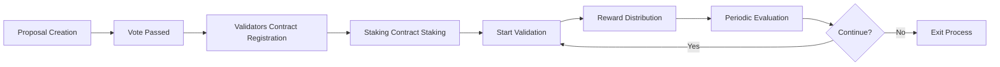

# JuChain PoSA Blockchain Deployment and Operations Guide

## 📋 Overview

JuChain is a high-performance blockchain network built on the Ethereum technology stack, utilizing the JuChain PoSA (Proof of Stake Authority) hybrid consensus mechanism. This document provides a complete deployment, configuration, and operations guide from scratch.

### Core Features

- **🏛️ JuChain PoSA**: Hybrid consensus mechanism combining PoA and PoS
- **⚡ High Performance**: 1-second block intervals, high TPS processing capability
- **🔒 Security**: Multi-layer validator management and punishment mechanisms
- **🏗️ Modularization**: Separation of system contracts and business logic
- **🛠️ Toolchain**: Complete CLI tools and automation scripts

## 🏗️ System Architecture

### Core Component Architecture Diagram

```
┌─────────────────────────────────────────────────────────────┐
│                    JuChain Network                          │
├─────────────────┬─────────────────┬─────────────────────────┤
│   Geth Client   │     Ju CLI      │    System Contracts     │
│                 │                 │                         │
│ • Mining        │ • Validator Mgmt│ • Validators (0xf010)   │
│ • P2P Network   │ • Proposal Mgmt │ • Punish (0xf011)       │
│ • JSON-RPC API  │ • Query Tools   │ • Proposal (0xf012)     │
│ • External Sign │ • Auto Scripts  │ • Staking (0xf013)      │
└─────────────────┴─────────────────┴─────────────────────────┘
```

### System Contract Addresses

| Contract Name | Address | Function Description |
|---------|------|----------|
| **Validators** | `0x000000000000000000000000000000000000f010` | Validator status management, reward distribution |
| **Punish** | `0x000000000000000000000000000000000000f011` | Validator punishment mechanism, imprisonment handling |
| **Proposal** | `0x000000000000000000000000000000000000f012` | Governance proposals, voting management |
| **Staking** | `0x000000000000000000000000000000000000f013` | Staking management, delegation mechanism |

### Network Parameters

| Parameter | Mainnet | Testnet | Description |
|------|------|--------|------|
| **Chain ID** | 210000 | 202599 | Network identifier |
| **Block Time** | 1 second | 1 second | Average block interval |
| **Epoch Length** | 86400 blocks | 86400 blocks | Validator rotation period |
| **Max Validators** | 21 | 21 | Maximum active validator count |
| **Min Stake** | 10000 JU | 1000 JU | Minimum staking requirement |

## ⚙️ System Configuration Parameters

### JuChain Consensus Parameters

Core consensus parameters configured in the genesis block:

```json
{
  "config": {
    "congress": {
      "period": 1,        // Block interval (seconds)
      "epoch": 86400,       // Validator rotation period (blocks)
    }
  }
}
```

### System Contract Parameter Details

These parameters are initialized with defaults at deployment (genesis). After initialization, they can be updated via governance proposals (see below); recompilation/genesis updates are only needed if you want different defaults:

| Parameter Name | Default Value | Unit | Description |
|----------|--------|------|------|
| `proposalLastingPeriod` | 604800 | Blocks | Proposal validity period (~7 days) |
| `punishThreshold` | 24 | Blocks | Continuous missed blocks triggering profit confiscation |
| `removeThreshold` | 48 | Blocks | Continuous missed blocks triggering validator removal |
| `decreaseRate` | 24 | % | Reduction rate during punishment |
| `withdrawProfitPeriod` | 86400 | Blocks | Profit withdrawal interval (~24 hours) |
| `blockReward` | 200000000000000000 | Wei | Block reward amount (0.2 JU) |
| `unbondingPeriod` | 604800 | Blocks | Unbonding period (7 days) |
| `validatorUnjailPeriod` | 86400 | Blocks | Validator unjail period (~24 hours) |
| `minValidatorStake` | 100000000000000000000000 | Wei | Minimum validator staking amount (100,000 JU) |
| `maxValidators` | 21 | Count | Maximum number of active validators |
| `minDelegation` | 10000000000000000000 | Wei | Minimum delegation amount (10 JU) |
| `minUndelegation` | 1000000000000000000 | Wei | Minimum undelegation amount (1 JU) |
| `doubleSignSlashAmount` | 50000000000000000000000 | Wei | Double-sign slash amount (50,000 JU) |
| `doubleSignRewardAmount` | 10000000000000000000000 | Wei | Double-sign reporter reward (10,000 JU) |
| `doubleSignWindow` | 86400 | Blocks | Double-sign evidence window (~24 hours) |
| `burnAddress` | 0x000000000000000000000000000000000000dEaD | Address | Burn destination for slashed remainder |

> ⚠️ **Important Reminder**: If you want different **default** parameters at genesis, you must:
>
> 1. Recompile system contracts (`forge build`)
> 2. Generate new contract bytecode (`npm run generate`)
> 3. Update genesis block file (`npm run init-genesis`)
> 4. Reinitialize all node data directories
>
> For changes after launch, use governance proposals (see below).

### Staking Mechanism Parameters

JuChain introduces a dual-contract validator management mechanism:

```json
{
  "staking": {
    "minStakeAmount": "100000000000000000000000",  // 100000 JU (wei)
    "maxCommissionRate": 5000,                    // Maximum commission rate 50%
    "unbondingPeriod": 604800,                    // Unbonding period 7 days (blocks)
    "maxValidators": 21,                          // Maximum active validator count
  }
}
```

## 📄 Genesis Block Configuration

### Complete Genesis Block Structure

JuChain's genesis block configuration includes network parameters, system contract deployment, and initial state settings:

```json
{
  "config": {
    "chainId": 202599,
    "homesteadBlock": 0,
    "eip150Block": 0,
    "eip150Hash": "0x0000000000000000000000000000000000000000000000000000000000000000",
    "eip155Block": 0,
    "eip158Block": 0,
    "byzantiumBlock": 0,
    "constantinopleBlock": 0,
    "petersburgBlock": 0,
    "istanbulBlock": 0,
    "berlinBlock": 0,
    "londonBlock": 0,
    "congress": {
      "period": 3,
      "epoch": 200
    }
  },
  "difficulty": "0x1",
  "gasLimit": "0x47b760",
  "alloc": {
    "000000000000000000000000000000000000f000": {
      "balance": "0x0",
      "code": "0x608060405234801561001057600080fd5b50...",
      "storage": {}
    },
    "000000000000000000000000000000000000f001": {
      "balance": "0x0",
      "code": "0x608060405234801561001057600080fd5b50...",
      "storage": {}
    },
    "000000000000000000000000000000000000f002": {
      "balance": "0x0",
      "code": "0x608060405234801561001057600080fd5b50...",
      "storage": {}
    },
    "000000000000000000000000000000000000f003": {
      "balance": "0x0",
      "code": "0x608060405234801561001057600080fd5b50...",
      "storage": {}
    }
  },
  "extraData": "0x0000000000000000000000000000000000000000000000000000000000000000f39fd6e51aad88f6f4ce6ab8827279cfffb92266970e8128ab834e3eac664312d6e30df9e93cb3578ec64c67c554dddd8d1da2c256e30df9e93cb3578ec64c67c554dddd8d1da2c256a45ffca201b0a7d75fd23bb302c12332c5e40003d968443d9b72bcef4409b3a2d5e31031390fc826b175474e89094c44da98b954eedeac495271d0f0000000000000000000000000000000000000000000000000000000000000000000000000000000000000000000000000000000000000000000000000000000000",
  "gasUsed": "0x0",
  "mixHash": "0x0000000000000000000000000000000000000000000000000000000000000000",
  "nonce": "0x0",
  "number": "0x0",
  "parentHash": "0x0000000000000000000000000000000000000000000000000000000000000000",
  "timestamp": "0x0"
}
```

### Key Configuration Explanation

#### 1. Network Identifier Settings

```json
{
  "config": {
    "chainId": 202599,    // JuChain testnet ID
    "congress": {
      "period": 1,        // 1-second block interval
      "epoch": 86400        // Rotate validators every 86400 blocks
    }
  }
}
```

#### 2. System Contract Pre-deployment

All system contracts are pre-deployed to fixed addresses in the genesis block:

- **Contract Bytecode**: Generated through `forge build` compilation
- **Storage Layout**: Initial state stored in `storage` field
- **Balance Setting**: System contract initial balance is 0

#### 3. Initial Validator Setup

`extraData` field encoding format:

```
extraData = vanity(32 bytes) + validators(20 bytes*N) + signature(65 bytes)
```

Where:

- **vanity**: 32 bytes of padding data (usually 0)
- **validators**: Initial validator address list (20 bytes each)
- **signature**: 65-byte signature data (genesis block signature)

#### 4. Pre-allocated Accounts

```json
{
  "alloc": {
    "f39fd6e51aad88f6f4ce6ab8827279cfffb92266": {
      "balance": "0x21e19e0c9bab2400000"  // 10000 ETH (for development)
    },
    "970e8128ab834e3eac664312d6e30df9e93cb357": {
      "balance": "0x21e19e0c9bab2400000"  // 10000 ETH (Validator 1)
    }
  }
}
```

### Contract Bytecode Generation Process

System contract bytecode needs to be generated through the following steps:

```bash
# 1. Compile all contracts
cd chain-contract
forge build

# 2. Generate contract deployment code
npm run generate

# 3. Automatically update genesis block file
npm run init-genesis

# 4. Verify genesis block file
node scripts/verify-genesis.js
```

> 📝 **Note**: Each time system contract code is modified, the genesis block file must be regenerated and all nodes reinitialized.

## 🚀 Environment Setup and Compilation

### Development Environment Requirements

#### Required Software List

| Software | Minimum Version | Recommended Version | Purpose |
|------|----------|----------|------|
| **Go** | 1.23+ | 1.24+ | Compile Geth client |
| **Node.js** | 18+ | 20+ | Run contract scripts and tools |
| **Foundry** | 1.2.3+ | Latest | Smart contract development framework |
| **GCC/G++** | 7+ | 11+ | C++ compiler dependencies |
| **Git** | 2.30+ | Latest | Version control |
| **Make** | 4.0+ | Latest | Build tool |

#### Environment Installation

```bash
# 🔧 Install Foundry (smart contract toolchain)
curl -L https://foundry.paradigm.xyz | bash
foundryup

# 🔧 Install Node.js (recommended using nvm)
curl -o- https://raw.githubusercontent.com/nvm-sh/nvm/v0.39.0/install.sh | bash
nvm install 20
nvm use 20

# 🔧 Install Go (macOS example)
brew install go
# Or download from official site: https://golang.org/dl/

# 🔧 Verify installation
go version          # Should show go1.24.x
node --version      # Should show v20.x.x
forge --version     # Should show foundry version
```

### Source Code Acquisition

#### Complete Project Structure

```bash
# 📥 Clone complete project
git clone <repository-url> ju-chain
cd ju-chain

# 📁 Project structure overview
ju-chain/
├── chain/                 # Geth client source code
│   ├── build/            # Compilation output directory
│   ├── cmd/              # Command-line tools
│   ├── consensus/        # Consensus algorithm implementation
│   │   └── congress/     # Congress PoSA implementation
│   ├── core/             # Core blockchain logic
│   ├── eth/              # Ethereum protocol implementation
│   └── Makefile          # Build scripts
├── chain-contract/          # System contract source code
│   ├── contracts/        # Solidity contract source code
│   ├── tools/     # CLI tool source code
│   ├── scripts/          # Automation scripts
│   ├── foundry.toml      # Foundry configuration
│   └── package.json      # Node.js dependencies
└── README.md             # Project description
```

### Compilation Process

#### 1. Compile Blockchain Client

```bash
# 🏗️ Compile complete toolchain
cd chain
make all

# Or compile components separately
make geth          # Only compile main client
make bootnode      # Only compile bootstrap node
make evm          # Only compile EVM tool

# ✅ Verify compilation results
ls -la build/bin/
# Should contain: geth, bootnode, clef, ethkey, etc.
```

#### 2. Compile System Contracts

```bash
# 🏗️ Compile smart contracts
cd chain-contract

# Install Node.js dependencies
npm install

# Install Foundry dependencies
forge install

# Compile all contracts
forge build

# ✅ Verify contract compilation
ls -la out/
# Should contain all compiled contract artifacts
```

#### 3. Generate Genesis Block Configuration

```bash
# 🔄 Generate contract deployment code
npm run generate

# 🔄 Update genesis block file
npm run init-genesis

# ✅ Verify genesis block
node scripts/verify-genesis.js
echo "✅ Genesis block file generation complete: genesis.json"
```

#### 4. Compile Management Tools

```bash
# 🛠️ Compile Ju CLI tool
cd chain-contract/tools
make build

# ✅ Test tool functionality
./build/ju-cli version
./build/ju-cli --help

# 🛠️ Compile automation scripts
chmod +x *.sh
echo "✅ All tools compiled successfully"
```

### Build Verification

#### Integrity Check

```bash
# 🔍 Verify all components
echo "=== Verifying Geth Client ==="
./chain/build/bin/geth version

echo "=== Verifying System Contracts ==="
forge test --root ./chain-contract

echo "=== Verifying CLI Tool ==="
./chain-contract/tools/build/ju-cli --version

echo "=== Verifying Genesis Block ==="
./chain/build/bin/geth --datadir temp_test init ./chain-contract/genesis.json
rm -rf temp_test

echo "✅ All components verified successfully"
```

### Common Compilation Issues

#### Go Compilation Issues

**Issue**: `go: cannot find module`

```bash
# Solution: Update Go modules
cd chain
go mod download
go mod tidy
```

**Issue**: CGO compilation errors

```bash
# Solution: Install C++ compiler
# Ubuntu/Debian:
sudo apt-get install build-essential

# macOS:
xcode-select --install
```

#### Foundry Compilation Issues

**Issue**: `forge not found`

```bash
# Solution: Reinstall Foundry
curl -L https://foundry.paradigm.xyz | bash
source ~/.bashrc
foundryup
```

**Issue**: Contract dependency errors

```bash
# Solution: Clean and reinstall
cd chain-contract
rm -rf lib/
forge install
forge build --force
```

## 🚀 Node Deployment and Configuration

### Deployment Architecture Selection

#### Single Node Development Environment

Suitable for development testing, quick feature validation:

```bash
# 🔧 Create development node
mkdir -p dev-node/data
cd dev-node

# Initialize genesis block
../chain/build/bin/geth --datadir data init ../chain-contract/genesis.json

# Start development node (auto-mining)
../chain/build/bin/geth \
  --datadir data \
  --http \
  --http.addr "0.0.0.0" \
  --http.port 8545 \
  --http.api "eth,net,web3,personal,admin,congress" \
  --mine \
  --miner.etherbase "0xf39Fd6e51aad88F6F4ce6aB8827279cffFb92266" \
  --allow-insecure-unlock \
  --unlock "0xf39Fd6e51aad88F6F4ce6aB8827279cffFb92266" \
  --password <(echo "") \
  --console
```

#### Multi-node Validator Network

Recommended configuration for production environments, multiple validators ensure network security:

```bash
# 🏗️ Create multi-node network
for i in {1..5}; do
  mkdir -p validator$i/data
  
  # Initialize each node
  ./chain/build/bin/geth --datadir validator$i/data init chain-contract/genesis.json
  
  # Configure static node connections
  echo '[
    "enode://node1@127.0.0.1:30301",
    "enode://node2@127.0.0.1:30302",
    "enode://node3@127.0.0.1:30303"
  ]' > validator$i/data/static-nodes.json
done
```

### Node Configuration Details

#### Basic Configuration Parameters

```bash
# 📋 Standard validator node configuration
./chain/build/bin/geth \
  --datadir data \                    # Data directory
  --port 30303 \                      # P2P listening port
  --http \                            # Enable HTTP-RPC
  --http.addr "127.0.0.1" \          # RPC listening address
  --http.port 8545 \                 # RPC listening port
  --http.api "eth,net,web3,personal,admin,congress" \  # Enabled APIs
  --ws \                             # Enable WebSocket
  --ws.addr "127.0.0.1" \           # WebSocket address
  --ws.port 8546 \                  # WebSocket port
  --ws.api "eth,net,web3,congress" \ # WebSocket API
  --mine \                          # Enable mining
  --miner.etherbase "0x..." \       # Miner reward address
  --miner.threads 1 \               # Mining threads
  --miner.gasprice 1000000000 \     # Minimum gas price
  --txpool.pricelimit 1000000000 \  # Transaction pool minimum price
  --maxpeers 50 \                   # Maximum connected nodes
  --cache 1024 \                    # Cache size (MB)
  --syncmode "full" \               # Sync mode
  --gcmode "archive"                # Garbage collection mode
```

#### Advanced Network Configuration

```bash
# 🌐 Network discovery configuration
--discovery \                       # Enable node discovery
--bootnodes "enode://..." \        # Bootstrap node list
--nat "extip:External IP" \         # NAT traversal configuration
--netrestrict "192.168.0.0/24" \   # Network restrictions

# 🔒 Security configuration
--allow-insecure-unlock \          # Allow HTTP unlock (development only)
--unlock "0x..." \                 # Auto-unlock account
--password password.txt \          # Password file
--keystore keystore/ \             # Keystore directory

# 📊 Monitoring configuration
--metrics \                        # Enable metrics collection
--metrics.addr "127.0.0.1" \      # Metrics listening address
--metrics.port 6060 \              # Metrics port
--pprof \                          # Enable performance profiling
--pprof.addr "127.0.0.1" \        # Performance profiling address
--pprof.port 6061                  # Performance profiling port
```

### Validator Account Management

#### Creating Validator Accounts

```bash
# 🔑 Create new validator account
./chain/build/bin/geth account new --datadir validator1/data
# Enter password and record address

# 🔑 Import existing private key
echo "private key content" > private.key
./chain/build/bin/geth account import private.key --datadir validator1/data
rm private.key  # Delete plaintext private key after import

# 📋 View all accounts
./chain/build/bin/geth account list --datadir validator1/data
```

#### Account Security Management

```bash
# 🛡️ Create password file
echo "your secure password" > validator1/password.txt
chmod 600 validator1/password.txt

# 🛡️ Configure keystore permissions
chmod 700 validator1/data/keystore/
chmod 600 validator1/data/keystore/*

# 🛡️ Use external signer (recommended for production)
./chain/build/bin/clef \
  --keystore validator1/data/keystore \
  --configdir validator1/clef \
  --chainid 202599 \
  --http \
  --http.addr "127.0.0.1" \
  --http.port 8550
```

### Network Connection Configuration

#### Static Node Configuration

```json
// validator1/data/static-nodes.json
[
  "enode://node1 public key@IP1:Port1",
  "enode://node2 public key@IP2:Port2",
  "enode://node3 public key@IP3:Port3"
]
```

#### Trusted Node Configuration

```json
// validator1/data/trusted-nodes.json
[
  "enode://trusted node1@IP1:Port1",
  "enode://trusted node2@IP2:Port2"
]
```

#### Dynamic Node Discovery

```bash
# 🔍 Add nodes through console
geth attach validator1/data/geth.ipc

# Execute in console
admin.addPeer("enode://node public key@IP:Port")

# View connection status
admin.peers
net.peerCount
```

### Startup Script Examples

#### Validator Node Startup Script

```bash
#!/bin/bash
# start-validator.sh

set -e

# Configuration variables
DATADIR="./data"
VALIDATOR_ADDR="0xf39Fd6e51aad88F6F4ce6aB8827279cffFb92266"
PASSWORD_FILE="./password.txt"
LOG_FILE="./validator.log"

# Check required files
if [ ! -f "$PASSWORD_FILE" ]; then
    echo "❌ Password file does not exist: $PASSWORD_FILE"
    exit 1
fi

if [ ! -d "$DATADIR/keystore" ]; then
    echo "❌ Keystore directory does not exist: $DATADIR/keystore"
    exit 1
fi

# Start validator node
echo "🚀 Starting validator node..."
echo "📍 Validator address: $VALIDATOR_ADDR"
echo "📁 Data directory: $DATADIR"
echo "📄 Log file: $LOG_FILE"

./chain/build/bin/geth \
  --datadir "$DATADIR" \
  --port 30303 \
  --http \
  --http.addr "0.0.0.0" \
  --http.port 8545 \
  --http.corsdomain "*" \
  --http.api "eth,net,web3,personal,admin,congress" \
  --ws \
  --ws.addr "0.0.0.0" \
  --ws.port 8546 \
  --ws.origins "*" \
  --ws.api "eth,net,web3,congress" \
  --mine \
  --miner.etherbase "$VALIDATOR_ADDR" \
  --allow-insecure-unlock \
  --unlock "$VALIDATOR_ADDR" \
  --password "$PASSWORD_FILE" \
  --maxpeers 50 \
  --cache 1024 \
  --syncmode "full" \
  --log.file "$LOG_FILE" \
  --log.level 3 \
  2>&1 | tee -a "$LOG_FILE"
```

#### Non-validator Node Startup Script

```bash
#!/bin/bash
# start-fullnode.sh

# Full node (not participating in mining)
./chain/build/bin/geth \
  --datadir "./data" \
  --port 30303 \
  --http \
  --http.addr "0.0.0.0" \
  --http.port 8545 \
  --http.api "eth,net,web3,congress" \
  --ws \
  --ws.addr "0.0.0.0" \
  --ws.port 8546 \
  --ws.api "eth,net,web3,congress" \
  --maxpeers 50 \
  --cache 512 \
  --syncmode "fast" \
  --console
```

## 👥 Validator Management and Governance

### Dual-contract Validator System

JuChain uses an innovative dual-contract validator management mechanism:

| Contract | Address | Main Functions |
|------|------|----------|
| **Validators** | 0xf000 | Validator status management, reward distribution, active validator list |
| **Staking** | 0xf003 | Staking management, delegation mechanism, economic incentives |

### Validator Lifecycle



### Adding New Validators

#### Complete Process (Using Automation Scripts)

```bash
# 🤖 Use one-click addition script (recommended)
cd chain-contract/tools
./add_validator6.sh

# This script automatically performs the following steps:
# 1. Create add validator proposal
# 2. Collect necessary validator votes
# 3. Execute proposal (add to Validators contract)
# 4. Register and stake in Staking contract
# 5. Verify all steps completed
```

#### Manual Execution Process

**Step 1: Prepare New Validator**

```bash
# 🔑 Create new validator account
NEW_VALIDATOR_ADDR="0xNew validator address"
echo "New validator address: $NEW_VALIDATOR_ADDR"

# Ensure account has sufficient balance for staking
echo "Please ensure account balance >= 10000 JU"
```

**Step 2: Create Addition Proposal**

```bash
# 📝 Created by existing validator
PROPOSER_ADDR="0xf39Fd6e51aad88F6F4ce6aB8827279cffFb92266"

./build/ju-cli proposal create \
  -p $PROPOSER_ADDR \
  -t $NEW_VALIDATOR_ADDR \
  -o add \
  -r http://localhost:8545

# Sign transaction
./build/ju-cli misc sign \
  -f createProposal.json \
  -k proposer.key \
  -p password.txt

# Send transaction
./build/ju-cli misc send \
  -f createProposal_signed.json \
  -r http://localhost:8545

echo "✅ Proposal created, Proposal ID: [Check transaction receipt]"
```

**Step 3: Validator Voting**

```bash
# 🗳️ Other validators vote in support
PROPOSAL_ID="0xProposal ID"

# Validator 1 vote
./build/ju-cli proposal vote \
  -s "0x970e8128ab834e3eac664312d6e30df9e93cb357" \
  -i $PROPOSAL_ID \
  -a \
  -r http://localhost:8545

# Validator 2 vote
./build/ju-cli vote_proposal \
  -s "0x6e30df9e93cb3578ec64c67c554dddd8d1da2c25" \
  -i $PROPOSAL_ID \
  -a true \
  --rpc_laddr http://localhost:8545

# Validator 3 vote (majority reached)
./build/ju-cli vote_proposal \
  -s "0x3858ffca201b0a7d75fd23bb302c12332c5e4000" \
  -i $PROPOSAL_ID \
  -a true \
  --rpc_laddr http://localhost:8545

echo "✅ Proposal voting completed, awaiting execution"
```

**Step 4: Staking Contract Registration**

```bash
# 💰 Register validator in Staking contract
./build/ju-cli staking validator-register \
  -p $NEW_VALIDATOR_ADDR \
  -s 10000 \
  -c 500 \
  -r http://localhost:8545

echo "✅ Validator registered in Staking contract"
```

**Step 5: Start Validator Node**

```bash
# 🚀 Start new validator node
./chain/build/bin/geth \
  --datadir newvalidator/data \
  --port 30306 \
  --http \
  --http.port 8547 \
  --mine \
  --miner.etherbase $NEW_VALIDATOR_ADDR \
  --unlock $NEW_VALIDATOR_ADDR \
  --password password.txt \
  --console

echo "✅ New validator node started"
```

### Validator Query and Monitoring

#### Basic Query Commands

```bash
# 📊 Query all active validators
./build/ju-cli validator list -r http://localhost:8545

# 👤 Query specific validator details
./build/ju-cli validator query \
  -a 0xf39Fd6e51aad88F6F4ce6aB8827279cffFb92266 \
  -r http://localhost:8545

# 💰 Query Staking contract information
./build/ju-cli staking list-top-validators \
  -r http://localhost:8545

# 🏆 Query specific validator staking information
./build/ju-cli staking query-validator \
  --address 0xf39Fd6e51aad88F6F4ce6aB8827279cffFb92266 \
  -r http://localhost:8545
```

#### Advanced Monitoring Queries

```bash
# 📈 Validator performance statistics
./build/ju-cli validator stats \
  --address 0xf39Fd6e51aad88F6F4ce6aB8827279cffFb92266 \
  --blocks 1000 \
  -r http://localhost:8545

# ⚠️ Check validator punishment status
./build/ju-cli validator punishment-status \
  --address 0xf39Fd6e51aad88F6F4ce6aB8827279cffFb92266 \
  -r http://localhost:8545

# 💎 Query validator rewards
./build/ju-cli staking validator-rewards \
  --address 0xf39Fd6e51aad88F6F4ce6aB8827279cffFb92266 \
  -r http://localhost:8545
```

### Validator Reward Management

#### Reward Withdrawal

```bash
# 💸 Withdraw validator rewards
VALIDATOR_ADDR="0xf39Fd6e51aad88F6F4ce6aB8827279cffFb92266"

# Check withdrawable rewards
./build/ju-cli validator check-withdrawable \
  -a $VALIDATOR_ADDR \
  -r http://localhost:8545

# Create withdrawal transaction
./build/ju-cli validator withdraw-profits \
  -a $VALIDATOR_ADDR \
  -r http://localhost:8545

# Sign and send
./build/ju-cli misc sign \
  -f withdrawProfits.json \
  -k validator.key \
  -p password.txt

./build/ju-cli misc send \
  -f withdrawProfits_signed.json \
  -r http://localhost:8545

echo "✅ Reward withdrawal transaction sent"
```

#### Reward Distribution Mechanism

| Reward Source | Distribution Method | Description |
|----------|----------|------|
| **Transaction Fees** | Distributed by validation ratio | Accumulated in real-time to validator account |
| **Block Rewards** | Fixed rewards | Base reward for each block |
| **Delegation Rewards** | Split by commission rate | Rewards from delegated user stakes |

### Validator Removal Process

#### Voluntary Exit

```bash
# 📤 Validator voluntary exit
VALIDATOR_ADDR="0xAddress of validator to exit"

# 1. Create removal proposal
./build/ju-cli proposal create \
  -p $VALIDATOR_ADDR \
  -t $VALIDATOR_ADDR \
  -o remove \
  -r http://localhost:8545

# 2. Collect votes (requires support from other validators)
echo "Waiting for other validators to vote in support of removal proposal"

# 3. Unstake in Staking contract
./build/ju-cli staking undelegate \
  -d $VALIDATOR_ADDR \
  -v $VALIDATOR_ADDR \
  -r http://localhost:8545

echo "✅ Validator exit process initiated"
```

#### Involuntary Removal (Punishment Mechanism)

Validators will be automatically penalized when the following situations occur:

| Violation | Penalty Measures | Trigger Conditions |
|----------|----------|----------|
| **Long-term Offline** | Profit Confiscation | Miss 24 consecutive blocks |
| **Severe Offline** | Forced Removal | Miss 48 consecutive blocks |
| **Double Signing** | Large Slash | Sign multiple blocks at same height |
| **Malicious Behavior** | Permanent Ban | Malicious behavior confirmed by governance vote |

### Governance Proposal System

#### System Parameter Modification

```bash
# 🔧 Modify system parameter proposal
PARAM_INDEX=0      # 0: proposalLastingPeriod
NEW_VALUE=172800   # 48 hours

./build/ju-cli proposal create-config \
  -p $PROPOSER_ADDR \
  -i $PARAM_INDEX \
  -v $NEW_VALUE \
  -r http://localhost:8545

echo "✅ System parameter modification proposal created"
```

#### Modifiable System Parameters

| Parameter Index | Parameter Name | Description | Default Value |
|----------|----------|------|--------|
| 0 | proposalLastingPeriod | Proposal validity period (1 hour - 30 days) | 604800 blocks (~7 days) |
| 1 | punishThreshold | Continuous missed blocks triggering profit confiscation | 24 blocks |
| 2 | removeThreshold | Continuous missed blocks triggering validator removal | 48 blocks |
| 3 | decreaseRate | Reduction rate during punishment | 24% |
| 4 | withdrawProfitPeriod | Profit withdrawal interval | 86400 blocks (~24 hours) |
| 5 | blockReward | Block reward amount | 200000000000000000 wei (0.2 JU) |
| 6 | unbondingPeriod | Unbonding period | 604800 blocks (7 days) |
| 7 | validatorUnjailPeriod | Validator unjail period | 86400 blocks (~24 hours) |
| 8 | minValidatorStake | Minimum validator staking amount | 100000000000000000000000 wei (100,000 JU) |
| 9 | maxValidators | Maximum number of active validators | 21 |
| 10 | minDelegation | Minimum delegation amount | 10000000000000000000 wei (10 JU) |
| 11 | minUndelegation | Minimum undelegation amount | 1000000000000000000 wei (1 JU) |
| 12 | doubleSignSlashAmount | Double-sign slash amount | 50000000000000000000000 wei (50,000 JU) |
| 13 | doubleSignRewardAmount | Double-sign reporter reward | 10000000000000000000000 wei (10,000 JU) |
| 14 | burnAddress | Burn destination for slashed remainder | 0x000000000000000000000000000000000000dEaD |
| 15 | doubleSignWindow | Double-sign evidence window | 86400 blocks (~24 hours) |

## 🔧 System Configuration Management

### Dynamic Parameter Adjustment

Key system parameters can be adjusted through governance proposals without restarting the network:

#### Create Configuration Update Proposal

```bash
# 📝 Configuration item parameter explanation
echo "0: proposalLastingPeriod (Proposal validity period, 1 hour - 30 days)"
echo "1: punishThreshold (Continuous missed blocks triggering profit confiscation)  "
echo "2: removeThreshold (Continuous missed blocks triggering validator removal)"
echo "3: decreaseRate (Reduction rate during punishment, %)"
echo "4: withdrawProfitPeriod (Profit withdrawal interval, blocks)"
echo "5: blockReward (Block reward amount, wei)"
echo "6: unbondingPeriod (Unbonding period, blocks)"
echo "7: validatorUnjailPeriod (Validator unjail period, blocks)"
echo "8: minValidatorStake (Minimum validator staking amount, wei)"
echo "9: maxValidators (Maximum number of active validators)"
echo "10: minDelegation (Minimum delegation amount, wei)"
echo "11: minUndelegation (Minimum undelegation amount, wei)"
echo "12: doubleSignSlashAmount (Double-sign slash amount, wei)"
echo "13: doubleSignRewardAmount (Double-sign reporter reward, wei)"
echo "14: burnAddress (Burn destination, address as uint256)"
echo "15: doubleSignWindow (Double-sign evidence window, blocks)"

# Example: Modify proposal validity period to 48 hours
PROPOSER_ADDR="0xf39Fd6e51aad88F6F4ce6aB8827279cffFb92266"
PARAM_INDEX=0
NEW_VALUE=172800  # 48 hours

./build/ju-cli create-config-proposal \
  -p $PROPOSER_ADDR \
  -i $PARAM_INDEX \
  -v $NEW_VALUE \
  --rpc_laddr http://localhost:8545

# Sign and send configuration proposal
./build/ju-cli misc sign \
  -f createConfigProposal.json \
  -k proposer.key \
  -p password.txt

./build/ju-cli misc send \
  -f createConfigProposal_signed.json \
  -r http://localhost:8545

echo "✅ Configuration update proposal created"
```

#### Query Current System Parameters

```bash
# 📊 Query all system parameters
./build/ju-cli proposal get-params -r http://localhost:8545

# 🔍 Query specific parameter
curl -X POST http://localhost:8545 \
  -H "Content-Type: application/json" \
  -d '{
    "jsonrpc": "2.0",
    "method": "eth_call",
    "params": [{
      "to": "0x000000000000000000000000000000000000f001",
      "data": "0x5c19a95c"
    }, "latest"],
    "id": 1
  }'
```

### Reward Distribution Management

#### Validator Reward Withdrawal

```bash
# 💰 Check withdrawable rewards
VALIDATOR_ADDR="0xf39Fd6e51aad88F6F4ce6aB8827279cffFb92266"

./build/ju-cli staking check-rewards \
  -c $VALIDATOR_ADDR \
  -v $VALIDATOR_ADDR \
  -r http://localhost:8545

# Create reward withdrawal transaction
./build/ju-cli staking claim-rewards \
  -c $VALIDATOR_ADDR \
  -v $VALIDATOR_ADDR \
  -r http://localhost:8545

# Sign and send
./build/ju-cli misc sign \
  -f withdrawRewards.json \
  -k validator.key \
  -p password.txt

./build/ju-cli misc send \
  -f withdrawRewards_signed.json \
  -r http://localhost:8545
```

#### Withdrawal Restrictions and Rules

| Restriction Type | Rule | Description |
|----------|------|------|
| **Time Interval** | 28800 blocks | Withdraw once approximately every 24 hours |
| **Permission Verification** | FeeAddr match | Only designated reward address can withdraw |
| **Status Check** | Not punished | Imprisoned validators cannot withdraw |
| **Balance Verification** | Greater than 0 | Ensure there is a withdrawable balance |

## 🛠️ System Monitoring and Operations

### Network Health Monitoring

#### Basic Status Check

```bash
# 🌐 Network connection status
curl -X POST http://localhost:8545 \
  -H "Content-Type: application/json" \
  -d '{"jsonrpc":"2.0","method":"net_peerCount","params":[],"id":1}'

# 📊 Block synchronization status
curl -X POST http://localhost:8545 \
  -H "Content-Type: application/json" \
  -d '{"jsonrpc":"2.0","method":"eth_syncing","params":[],"id":1}'

# 🔗 Latest block information
curl -X POST http://localhost:8545 \
  -H "Content-Type: application/json" \
  -d '{"jsonrpc":"2.0","method":"eth_blockNumber","params":[],"id":1}'

# ⛏️ Mining status
curl -X POST http://localhost:8545 \
  -H "Content-Type: application/json" \
  -d '{"jsonrpc":"2.0","method":"eth_mining","params":[],"id":1}'
```

#### Validator-specific Monitoring

```bash
# 👥 Active validator list
./build/ju-cli validator list -r http://localhost:8545

# 📈 Validator performance statistics
./build/ju-cli validator performance \
  --address 0xf39Fd6e51aad88F6F4ce6aB8827279cffFb92266 \
  --blocks 1000 \
  -r http://localhost:8545

# ⚠️ Punishment and imprisonment status
./build/ju-cli validator punishment-history \
  --address 0xf39Fd6e51aad88F6F4ce6aB8827279cffFb92266 \
  -r http://localhost:8545
```

### Event Listening and Alerts

#### Key Event Listening

```javascript
// 📡 Listen for validator change events
const Web3 = require('web3');
const web3 = new Web3('ws://localhost:8546');

// Listen for validator additions
web3.eth.subscribe('logs', {
    address: '0x000000000000000000000000000000000000f000',
    topics: ['0x...'] // LogCreateValidator event signature
}).on('data', log => {
    console.log('🎉 New validator added:', log);
    // Send alert notification
});

// Listen for proposal creation
web3.eth.subscribe('logs', {
    address: '0x000000000000000000000000000000000000f002',
    topics: ['0x...'] // LogCreateProposal event signature
}).on('data', log => {
    console.log('📝 New proposal created:', log);
    // Notify relevant validators to vote
});

// Listen for punishment events
web3.eth.subscribe('logs', {
    address: '0x000000000000000000000000000000000000f001',
    topics: ['0x...'] // LogPunishValidator event signature
}).on('data', log => {
    console.log('⚠️ Validator punished:', log);
    // Send emergency alert
});
```

#### Automated Monitoring Script

```bash
#!/bin/bash
# monitor.sh - JuChain network monitoring script

set -e

# Configuration parameters
RPC_URL="http://localhost:8545"
ALERT_WEBHOOK="https://hooks.slack.com/your-webhook"
LOG_FILE="./monitor.log"

# Get network status
get_network_status() {
    local peer_count=$(curl -s -X POST $RPC_URL \
        -H "Content-Type: application/json" \
        -d '{"jsonrpc":"2.0","method":"net_peerCount","params":[],"id":1}' \
        | jq -r '.result' | xargs printf "%d\n")
    
    local block_number=$(curl -s -X POST $RPC_URL \
        -H "Content-Type: application/json" \
        -d '{"jsonrpc":"2.0","method":"eth_blockNumber","params":[],"id":1}' \
        | jq -r '.result' | xargs printf "%d\n")
    
    local mining=$(curl -s -X POST $RPC_URL \
        -H "Content-Type: application/json" \
        -d '{"jsonrpc":"2.0","method":"eth_mining","params":[],"id":1}' \
        | jq -r '.result')
    
    echo "$(date): Connected peers:$peer_count, Block height:$block_number, Mining status:$mining" | tee -a $LOG_FILE
    
    # Alert check
    if [ $peer_count -lt 3 ]; then
        send_alert "⚠️ Warning: Too few connected peers ($peer_count)"
    fi
    
    if [ "$mining" != "true" ]; then
        send_alert "🚨 Emergency: Node stopped mining"
    fi
}

# Send alert
send_alert() {
    local message="$1"
    echo "$(date): ALERT - $message" | tee -a $LOG_FILE
    
    # Send to Slack/Discord, etc.
    curl -X POST $ALERT_WEBHOOK \
        -H "Content-Type: application/json" \
        -d "{\"text\":\"$message\"}" 2>/dev/null || true
}

# Check validator status
check_validators() {
    local validators=$(./build/ju-cli validators --rpc_laddr $RPC_URL | grep "0x" | wc -l)
    echo "$(date): Active validator count:$validators" | tee -a $LOG_FILE
    
    if [ $validators -lt 3 ]; then
        send_alert "🚨 Critical: Insufficient active validators ($validators)"
    fi
}

# Main monitoring loop
main() {
    echo "🚀 Starting JuChain network monitoring..." | tee -a $LOG_FILE
    
    while true; do
        get_network_status
        check_validators
        echo "---" | tee -a $LOG_FILE
        sleep 60  # Check every minute
    done
}

# Start monitoring
main
```

### Performance Optimization Recommendations

#### Node Performance Tuning

```bash
# 💾 Memory optimization
--cache 2048 \              # Increase cache to 2GB
--cache.database 75 \       # Database cache ratio
--cache.trie 25 \          # Trie cache ratio

# 🌐 Network optimization
--maxpeers 100 \           # Increase maximum connections
--netrestrict "10.0.0.0/8" \ # Restrict network range

# 💿 Storage optimization
--gcmode "archive" \       # Archive mode retains history
--syncmode "fast" \        # Fast sync mode
--snapshot                 # Enable snapshot acceleration
```

#### Database Maintenance

```bash
# 🧹 Database compression
./chain/build/bin/geth removedb --datadir ./data
./chain/build/bin/geth --datadir ./data init genesis.json

# 📊 Database statistics
./chain/build/bin/geth --datadir ./data db stat

# 🔧 Database repair
./chain/build/bin/geth --datadir ./data db check
```

## 🛠️ Troubleshooting Guide

### Common Problem Diagnosis

#### Node Fails to Start

**Symptoms**: Node fails to start or exits immediately

**Diagnosis Steps**:

```bash
# 1. Check data directory permissions
ls -la data/
chmod 755 data/
chmod 600 data/keystore/*

# 2. Verify genesis block configuration
./chain/build/bin/geth --datadir temp init genesis.json

# 3. Check port occupancy
netstat -tulpn | grep :30303
netstat -tulpn | grep :8545

# 4. View detailed error logs
./chain/build/bin/geth --datadir data --verbosity 5
```

**Common Solutions**:

| Error Message | Cause | Solution |
|----------|------|----------|
| `permission denied` | Permission issue | `chmod 755 data/` |
| `port already in use` | Port conflict | Change port or stop conflicting process |
| `invalid genesis` | Genesis block error | Regenerate genesis block file |
| `account unlock failed` | Incorrect account password | Check password file |

#### Network Connection Issues

**Symptoms**: Node cannot connect to other nodes

**Diagnosis Steps**:

```bash
# 1. Check network connections
admin.peers              # View connected nodes
net.peerCount           # Connection count
admin.nodeInfo          # This node's information

# 2. Test network reachability
ping [target node IP]
telnet [target node IP] [port]

# 3. Check firewall settings
sudo ufw status
sudo iptables -L
```

**Solutions**:

```bash
# Manually add node
admin.addPeer("enode://...")

# Configure static nodes
echo '[
  "enode://node1@ip1:port1",
  "enode://node2@ip2:port2"
]' > data/static-nodes.json

# Open firewall ports
sudo ufw allow 30303
sudo ufw allow 8545
```

#### Validator Not Producing Blocks

**Symptoms**: Validator node is running but not producing blocks

**Diagnosis Steps**:

```bash
# 1. Check validator status
./build/ju-cli validator-status \
  --address [validator address] \
  --rpc_laddr http://localhost:8545

# 2. Check account unlock
personal.listWallets
eth.accounts

# 3. Check mining status
eth.mining
miner.mining

# 4. Check if validator is in active list
./build/ju-cli validators --rpc_laddr http://localhost:8545
```

**Solutions**:

```bash
# Unlock validator account
personal.unlockAccount("[validator address]", "password", 0)

# Start mining
miner.setEtherbase("[validator address]")
miner.start(1)

# Check if punished
./build/ju-cli punishment-status \
  --address [validator address] \
  --rpc_laddr http://localhost:8545
```

#### Proposal Voting Failure

**Symptoms**: Proposal creation or voting transaction fails

**Common Causes and Solutions**:

```bash
# 1. Insufficient gas fees
# Solution: Increase gas limit and gas price
--gas 500000 --gasprice 20000000000

# 2. Insufficient account balance
# Solution: Ensure account has sufficient JU tokens

# 3. Proposal expired
# Solution: Check proposal validity period, recreate proposal

# 4. Duplicate voting
# Solution: Check if already voted
./build/ju-cli proposal-votes \
  --proposal-id [proposal ID] \
  --rpc_laddr http://localhost:8545
```

### Emergency Recovery Procedures

#### Network Stagnation Recovery

Recovery steps when network becomes stagnant:

```bash
# 1. Collect network status information
echo "=== Network Diagnosis ==="
./build/ju-cli network-status --rpc_laddr http://localhost:8545

# 2. Restart all validator nodes
echo "=== Restarting Validators ==="
systemctl restart juchain-validator

# 3. Monitor recovery
echo "=== Monitoring Recovery ==="
watch -n 5 'curl -s -X POST http://localhost:8545 \
  -H "Content-Type: application/json" \
  -d "{\"jsonrpc\":\"2.0\",\"method\":\"eth_blockNumber\",\"params\":[],\"id\":1}" \
  | jq -r ".result" | xargs printf "%d\n"'
```

#### Data Recovery

```bash
# 1. Backup current data
cp -r data/ data_backup_$(date +%Y%m%d_%H%M%S)

# 2. Restore from snapshot
wget [snapshot download link]
tar -xzf snapshot.tar.gz -C data/

# 3. Resynchronize
./chain/build/bin/geth --datadir data --syncmode "fast"
```

## 📚 Contract Interface Details

### Validators Contract Interface

#### Core Management Functions

```solidity
// Create or edit validator information
function createOrEditValidator(
    address payable feeAddr,    // Reward address
    string calldata moniker,    // Validator name
    string calldata identity,   // Identity identifier  
    string calldata website,    // Official website
    string calldata email,      // Contact email
    string calldata details     // Detailed description
) external;

// Withdraw validator profits
function withdrawProfits(address validator) external;

// Get active validator list
function getActiveValidators() external view returns (address[] memory);

// Get validator detailed information
function getValidatorInfo(address val) external view returns (
    address feeAddr,
    uint256 status,
    uint256 accumulatedRewards,
    uint256 totalJailedHB,
    uint256 lastWithdrawProfitsBlock
);
```

### Proposal Contract Interface

#### Proposal Management Functions

```solidity
// Create proposal for adding/removing validators
function createProposal(
    address dst,              // Target validator address
    bool flag,               // true: Add, false: Remove
    string calldata details  // Proposal description
) external returns (bytes32);

// Create proposal for updating configuration parameters
function createUpdateConfigProposal(
    uint256 cid,           // Configuration parameter ID
    uint256 newValue       // New parameter value
) external returns (bytes32);

// Vote on a proposal
function voteProposal(
    bytes32 id,    // Proposal ID
    bool auth      // true: Support, false: Oppose
) external returns (bool);

// Check if a proposal passed for a validator
function pass(address validator) external view returns (bool);

// Check if a proposal is valid for staking registration
function isProposalValidForStaking(address validator) external view returns (bool);
```

### Staking Contract Interface

#### Staking Management Functions

```solidity
// Register validator and stake
function registerValidator(uint256 commissionRate) external payable;

// Add more self-stake to existing validator
function addValidatorStake() external payable;

// Delegate stake to a validator
function delegate(address validator) external payable;

// Undelegate stake from a validator
function undelegate(address validator, uint256 amount) external;

// Complete unbonding and withdraw tokens
function withdrawUnbonded(address validator, uint256 maxEntries) external;

// Get validator staking information
function getValidatorInfo(address validator) external view returns (
    uint256 selfStake,
    uint256 totalDelegated,
    uint256 commissionRate,
    uint256 accumulatedRewards,
    bool isJailed,
    uint256 jailUntilBlock,
    uint256 totalClaimedRewards,
    uint256 lastClaimBlock
);
```

#### Reward Management Functions

```solidity
// Claim pending rewards for delegators
function claimRewards(address validator) external;

// Claim accumulated rewards for validators
function claimValidatorRewards() external;
```

## 📋 Best Practices Summary

### Deployment Checklist

#### Pre-deployment Preparation

- [ ] **Environment Configuration**: Go 1.23+, Node.js 20+, Foundry installed
- [ ] **Source Compilation**: All components compiled successfully, no errors
- [ ] **Genesis Block**: Generated correct genesis block file
- [ ] **Network Planning**: Reasonable node IP and port allocation
- [ ] **Security Configuration**: Private key management, firewall settings

#### Node Startup Check

- [ ] **Data Initialization**: Genesis block initialized successfully
- [ ] **Account Management**: Validator accounts created and unlocked
- [ ] **Network Connections**: Nodes can communicate normally
- [ ] **Mining Status**: Validator nodes producing blocks normally
- [ ] **Contract Functionality**: System contract calls working properly

#### Operations Monitoring

- [ ] **Performance Monitoring**: CPU, memory, disk usage
- [ ] **Network Monitoring**: Connected node count, network latency
- [ ] **Business Monitoring**: Block production speed, transaction processing
- [ ] **Alert Mechanisms**: Timely notifications for abnormal situations
- [ ] **Backup Strategy**: Regular data backups

### Security Recommendations

#### Network Security

```bash
# 🔒 Firewall configuration
sudo ufw enable
sudo ufw allow ssh
sudo ufw allow 30303/tcp  # P2P port
sudo ufw allow from [trusted IP] to any port 8545  # RPC access restriction

# 🔐 TLS configuration
# Configure TLS certificates for RPC interfaces
./chain/build/bin/geth \
  --http.corsdomain "*" \
  --http.vhosts "*" \
  --ws.origins "*" \
  --rpc.enabledeprecatedpersonal
```

#### Key Management

```bash
# 🗝️ Use hardware wallet or external signer
./chain/build/bin/clef \
  --keystore /secure/keystore \
  --chainid 202599 \
  --http

# 🛡️ Keystore file permission settings
chmod 700 keystore/
chmod 600 keystore/*
chown validator:validator keystore/
```

### Performance Optimization

#### Hardware Recommendations

| Component | Minimum Configuration | Recommended Configuration | Description |
|------|----------|----------|------|
| **CPU** | 4 cores | 8 cores+ | Multithreading processing |
| **Memory** | 8GB | 16GB+ | Large cache improves performance |
| **Storage** | 100GB SSD | 500GB NVMe | Fast I/O is critical |
| **Network** | 100Mbps | 1Gbps+ | Stable network connection |

#### Software Tuning

```bash
# 📈 System optimization
echo "* soft nofile 65536" >> /etc/security/limits.conf
echo "* hard nofile 65536" >> /etc/security/limits.conf

# 🚀 Geth optimization parameters
--cache 2048 \
--cache.database 75 \
--cache.snapshot 25 \
--maxpeers 100 \
--txpool.globalslots 10000 \
--txpool.globalqueue 5000
```

## 🎯 Summary

JuChain blockchain network achieves high performance and high security through the following key components:

### 🏛️ Technical Architecture Advantages

1. **JuChain PoSA Consensus**: Combines advantages of PoA and PoS to achieve fast block production and economic security
2. **Dual-contract System**: Clear division of labor between Validators and Staking contracts with complete functionality
3. **Governance Mechanism**: Comprehensive proposal voting system supporting dynamic parameter adjustment
4. **Punishment Mechanism**: Multi-level punishment ensures honest validator behavior

### 🛠️ Complete Operations Tools

1. **JuChain CLI**: Feature-rich command-line management tool
2. **Automation Scripts**: One-click deployment and validator management
3. **Monitoring System**: Real-time network status and performance monitoring
4. **Fault Recovery**: Complete fault diagnosis and recovery procedures

### 📈 Scalable Design

1. **Modular Architecture**: Independent components for easy upgrades and maintenance
2. **Adjustable Parameters**: Key parameters support governance adjustment
3. **Compatibility**: Fully compatible with Ethereum ecosystem
4. **Upgradability**: Supports hard fork upgrade mechanisms

### 🎯 Applicable Scenarios

- **Enterprise Consortium Chains**: Multi-party validator consortium networks
- **DeFi Applications**: High-performance decentralized finance platforms  
- **NFT Platforms**: Fast-confirmation digital asset transactions
- **Game Applications**: Low-latency on-chain gaming experiences

With this guide, you should be able to:

✅ **Successfully Deploy**: Complete JuChain network environment  
✅ **Proficiently Manage**: Validator addition/removal and maintenance  
✅ **Monitor Operations**: Network status and performance monitoring  
✅ **Handle Faults**: Diagnosis and resolution of common issues  

### 📖 Related Resources

- [Ju CLI Usage Guide](./ju-cli-guide.md)
- [Clef External Signer Guide](./clef-external-signer-guide.md)
- [System Contract API Documentation](../contracts/README.md)
- [Foundry Development Framework](https://book.getfoundry.sh/)
- [Go-Ethereum Documentation](https://geth.ethereum.org/docs/)

---

*🚀 Congratulations! You have completed the full deployment and configuration of the JuChain blockchain network. If you encounter issues, please refer to the troubleshooting section or contact the technical support team.*
