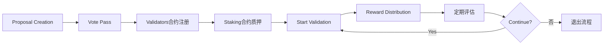

# JuChain JPoSA Blockchain Deployment and Operations Guide

## 📋 Overview

JuChain is a high-performance blockchain network built on the Ethereum technology stack, adopting the Congress JPoSA (JuChain Proof of Stake Authority) hybrid consensus mechanism. This document provides a complete deployment, configuration, and operations guide from scratch.

### � Core Features

- **🏛️ Congress JPoSA**: Hybrid consensus mechanism combining PoA and PoS
- **⚡ High Performance**: 1 second block interval, high TPS processing capability
- **🔒 Security**: Multi-layer validator management and punishment mechanisms
- **🏗️ Modular**: Separation of system contracts and business logic
- **🛠️ Toolchain**: Complete CLI tools and automation scripts

## 🏗️ System Architecture

### Core Component Architecture

```
┌─────────────────────────────────────────────────────────────┐
│                    JuChain Network                          │
├─────────────────┬─────────────────┬─────────────────────────┤
│   Geth Client   │  Congress CLI   │    System Contracts     │
│                 │                 │                         │
│ • Mining        │ • Validator Mgmt│ • Validators (0xf000)   │
│ • P2P Network   │ • Proposal Mgmt │ • Punish (0xf001)       │
│ • JSON-RPC API  │ • Query Tools   │ • Proposal (0xf002)     │
│ • External Sign │ • Auto Scripts  │ • Staking (0xf003)      │
└─────────────────┴─────────────────┴─────────────────────────┘
```

### System Contract Addresses

| Contract Name | Address | Function Description |
|---------|------|----------|
| **Validators** | `0x000000000000000000000000000000000000f000` | Validator status management, reward distribution |
| **Punish** | `0x000000000000000000000000000000000000f001` | Validator punishment mechanism, jailing handling |
| **Proposal** | `0x000000000000000000000000000000000000f002` | Governance proposals, voting management |
| **Staking** | `0x000000000000000000000000000000000000f003` | Staking management, delegation mechanism |

### Network Parameters

| Parameter | Mainnet | Testnet | Description |
|------|------|--------|------|
| **Chain ID** | 202599 | 202583 | Network identifier |
| **Block Time** | 1seconds | 1seconds | Average block interval |
| **Epoch Length** | 86400blocks | 86400blocks | Validator rotation period |
| **Max Validators** | 21 | 21 | Maximum active validators |
| **Min Stake** | 10000 JU | 1000 JU | Minimum staking requirement |

## ⚙️ System Configuration Parameters

### Congress Consensus Parameters

Configure core consensus parameters in genesis block file:

```json
{
  "config": {
    "congress": {
      "period": 1,        // Block time interval (seconds)
      "epoch": 86400,       // Validator rotation period (block count)
      "rewards": "0x56BC75E2D63100000"  // Block reward (wei)
    }
  }
}
```

### System Contract Parameters Explained

These parameters are set during contract compilation, changes require recompiling and updating genesis block:

| Parameter Name | Default Value | Unit | Description |
|----------|--------|------|------|
| `punishThreshold` | 24 | blocks | Consecutive missed blocks triggering reward forfeiture |
| `removeThreshold` | 48 | blocks | Consecutive missed blocks triggering validator removal |
| `decreaseRate` | 24 | % | Slashing rate during punishment |
| `withdrawProfitPeriod` | 28800 | blocks | Reward extraction interval (~24 hours) |
| `proposalLastingPeriod` | 86400 | seconds | Proposal validity period (24 hours) |
| `increasePeriod` | 1y | blocks | Inflation issuance period |
| `minStakeAmount` | 10000 | JU | Minimum staking amount for Staking contract |
| `commissionRateBase` | 10000 | basis points | Commission rate base (100% = 10000) |

> ⚠️ **Important Reminder**: Modifying contract parameters requires:
>
> 1. Recompile system contracts (`forge build`)
> 2. Generate new contract bytecode (`npm run generate`)
> 3. Update genesis block file (`npm run init-genesis`)
> 4. Reinitialize all node data directories

### Staking Mechanism Parameters

JuChain introduces a dual-contract validator management mechanism:

```json
{
  "staking": {
    "minStakeAmount": "10000000000000000000000",  // 10000 JU (wei)
    "maxCommissionRate": 5000,                    // Maximum commission rate 50%
    "unbondingPeriod": 201600,                    // Unbonding period 7 days (block count)
    "maxValidators": 21,                          // Maximum active validators
    "slashingRate": 500                           // Slashing rate 5%
  }
}
```

## 📄 Genesis Block Configuration

### Complete Genesis Block Structure

JuChain genesis block configuration includes network parameters, system contract deployment and initial state settings:

```json
{
  "config": {
    "chainId": 202599,
    "homesteadBlock": 0,
    "eip150Block": 0,
    "eip150Hash": "0x0000000000000000000000000000000000000000000000000000000000000000",
    "eip155Block": 0,
    "eip158Block": 0,
    "byzantiumBlock": 0,
    "constantinopleBlock": 0,
    "petersburgBlock": 0,
    "istanbulBlock": 0,
    "berlinBlock": 0,
    "londonBlock": 0,
    "congress": {
      "period": 3,
      "epoch": 200
    }
  },
  "difficulty": "0x1",
  "gasLimit": "0x47b760",
  "alloc": {
    "000000000000000000000000000000000000f000": {
      "balance": "0x0",
      "code": "0x608060405234801561001057600080fd5b50...",
      "storage": {}
    },
    "000000000000000000000000000000000000f001": {
      "balance": "0x0",
      "code": "0x608060405234801561001057600080fd5b50...",
      "storage": {}
    },
    "000000000000000000000000000000000000f002": {
      "balance": "0x0",
      "code": "0x608060405234801561001057600080fd5b50...",
      "storage": {}
    },
    "000000000000000000000000000000000000f003": {
      "balance": "0x0",
      "code": "0x608060405234801561001057600080fd5b50...",
      "storage": {}
    }
  },
  "extraData": "0x0000000000000000000000000000000000000000000000000000000000000000f39fd6e51aad88f6f4ce6ab8827279cfffb92266970e8128ab834e3eac664312d6e30df9e93cb3578ec64c67c554dddd8d1da2c256e30df9e93cb3578ec64c67c554dddd8d1da2c256a45ffca201b0a7d75fd23bb302c12332c5e40003d968443d9b72bcef4409b3a2d5e31031390fc826b175474e89094c44da98b954eedeac495271d0f0000000000000000000000000000000000000000000000000000000000000000000000000000000000000000000000000000000000000000000000000000000000",
  "gasUsed": "0x0",
  "mixHash": "0x0000000000000000000000000000000000000000000000000000000000000000",
  "nonce": "0x0",
  "number": "0x0",
  "parentHash": "0x0000000000000000000000000000000000000000000000000000000000000000",
  "timestamp": "0x0"
}
```

### Key Configuration Explained

#### 1. Network Identity Settings

```json
{
  "config": {
    "chainId": 202599,    // JuChain testnet ID
    "congress": {
      "period": 1,        // 1 second block interval
      "epoch": 86400        // Rotate validators every 86400 blocks
    }
  }
}
```

#### 2. System Contract Pre-deployment

All system contracts are pre-deployed to fixed addresses in genesis block:

- **Contract Bytecode**: Generated by compiling with `forge build`
- **Storage Layout**: Initial state stored in `storage` field
- **Balance Settings**: System contracts initial balance is 0

#### 3. Initial Validator Settings

`extraData` field encoding format:

```
extraData = vanity(32 bytes) + validators(20 bytes*N) + signature(65 bytes)
```

Where:

- **vanity**: 32 bytes of padding data (usually 0)
- **validators**: Initial validator address list (20 bytes each)
- **signature**: 65 bytes of signature data (genesis block signature)

#### 4. Preallocated Accounts

```json
{
  "alloc": {
    "f39fd6e51aad88f6f4ce6ab8827279cfffb92266": {
      "balance": "0x21e19e0c9bab2400000"  // 10000 ETH (For development)
    },
    "970e8128ab834e3eac664312d6e30df9e93cb357": {
      "balance": "0x21e19e0c9bab2400000"  // 10000 ETH (Validator 1)
    }
  }
}
```

### Contract Bytecode Generation Process

System contract bytecode must be generated through the following steps:

```bash
# 1. Compile all contracts
cd sys-contract
forge build

# 2. Generate contract deployment code
npm run generate

# 3. Automatically update genesis block file
npm run init-genesis

# 4. Verify genesis block file
node scripts/verify-genesis.js
```

> 📝 **Note**: After modifying system contract code, genesis block file must be regenerated and all nodes reinitialized.

## 🚀 Environment Setup and Compilation

### Development Environment Requirements

#### Required Software List

| Software | Minimum Version | Recommended Version | Purpose |
|------|----------|----------|------|
| **Go** | 1.23+ | 1.24+ | Compile Geth client |
| **Node.js** | 18+ | 20+ | Run contract scripts and tools |
| **Foundry** | 1.2.3+ | Latest | Smart contract development framework |
| **GCC/G++** | 7+ | 11+ | C++ compiler dependency |
| **Git** | 2.30+ | Latest | Version control |
| **Make** | 4.0+ | Latest | Build tool |

#### Environment Installation

```bash
# 🔧 Install Foundry (Smart contract toolchain)
curl -L https://foundry.paradigm.xyz | bash
foundryup

# 🔧 Install Node.js (Recommended: use nvm)
curl -o- https://raw.githubusercontent.com/nvm-sh/nvm/v0.39.0/install.sh | bash
nvm install 20
nvm use 20

# 🔧 Install Go (macOS example)
brew install go
# Or download from official: https://golang.org/dl/

# 🔧 Verify installation
go version          # Should display go1.24.x
node --version      # Should display v20.x.x
forge --version     # Should display foundry version
```

### Source Code Acquisition

#### Complete Project Structure

```bash
# 📥 Clone complete project
git clone <repository-url> ju-chain
cd ju-chain

# 📁 Project Structure Overview
ju-chain/
├── chain/                 # Geth client source code
│   ├── build/            # Build output directory
│   ├── cmd/              # Command-line tools
│   ├── consensus/        # Consensus algorithm implementation
│   │   └── congress/     # Congress JPoSA implementation
│   ├── core/             # Core blockchain logic
│   ├── eth/              # Ethereum protocol implementation
│   └── Makefile          # Build scripts
├── sys-contract/          # System contract source code
│   ├── contracts/        # Solidity contract source code
│   ├── congress-cli/     # CLI tool source code
│   ├── scripts/          # Automation scripts
│   ├── foundry.toml      # Foundry configuration
│   └── package.json      # Node.js dependencies
└── README.md             # Project description
```

### Compilation Process

#### 1. Compile Blockchain Client

```bash
# 🏗️ Compile complete toolchain
cd chain
make all

# Or compile components separately
make geth          # Compile main client only
make bootnode      # Compile bootstrap node only
make evm          # Compile EVM tool only

# ✅ Verify compilation results
ls -la build/bin/
# Should include: geth, bootnode, clef, ethkey, etc.
```

#### 2. Compile System Contracts

```bash
# 🏗️ Compile smart contracts
cd sys-contract

# Install Node.js dependencies
npm install

# Install Foundry dependencies
forge install

# Compile all contracts
forge build

# ✅ Verify contract compilation
ls -la out/
# Should include all contract compilation artifacts
```

#### 3. Generate Genesis Block Configuration

```bash
# 🔄 Generate contract deployment code
npm run generate

# 🔄 Update genesis block file
npm run init-genesis

# ✅ Verify genesis block
node scripts/verify-genesis.js
echo "✅ Genesis block file generated: genesis.json"
```

#### 4. Compile Management Tools

```bash
# 🛠️ Compile Congress CLI tool
cd sys-contract/congress-cli
make build

# ✅ Test tool functionality
./build/congress-cli --version
./build/congress-cli help

# 🛠️ Compile automation scripts
chmod +x *.sh
echo "✅ All tools compiled successfully"
```

### Build Verification

#### Integrity Check

```bash
# 🔍 Verify all components
echo "=== Verify Geth Client ==="
./chain/build/bin/geth version

echo "=== Verify System Contracts ==="
forge test --root ./sys-contract

echo "=== Verify CLI Tools ==="
./sys-contract/congress-cli/build/congress-cli --version

echo "=== Verify Genesis Block ==="
./chain/build/bin/geth --datadir temp_test init ./sys-contract/genesis.json
rm -rf temp_test

echo "✅ All components verified successfully"
```

### Common Compilation Issues

#### Go Compilation Issues

**Issue**: `go: cannot find module`

```bash
# Solution: Update Go modules
cd chain
go mod download
go mod tidy
```

**Issue**: CGO compilation error

```bash
# Solution: Install C++ compiler
# Ubuntu/Debian:
sudo apt-get install build-essential

# macOS:
xcode-select --install
```

#### Foundry Compilation Issues

**Issue**: `forge not found`

```bash
# Solution: Reinstall Foundry
curl -L https://foundry.paradigm.xyz | bash
source ~/.bashrc
foundryup
```

**Issue**: Contract dependency error

```bash
# Solution: Clean and reinstall
cd sys-contract
rm -rf lib/
forge install
forge build --force
```

## 🚀 Node Deployment and Configuration

### Deployment Architecture Selection

#### Single Node Development Environment

Suitable for development and testing, quick feature verification:

```bash
# 🔧 Create development node
mkdir -p dev-node/data
cd dev-node

# Initialize genesis block
../chain/build/bin/geth --datadir data init ../sys-contract/genesis.json

# Start development node (auto mining)
../chain/build/bin/geth \
  --datadir data \
  --http \
  --http.addr "0.0.0.0" \
  --http.port 8545 \
  --http.api "eth,net,web3,personal,admin,congress" \
  --mine \
  --miner.etherbase "0xf39Fd6e51aad88F6F4ce6aB8827279cffFb92266" \
  --allow-insecure-unlock \
  --unlock "0xf39Fd6e51aad88F6F4ce6aB8827279cffFb92266" \
  --password <(echo "") \
  --console
```

#### Multi-node Validator Network

Production environment recommended configuration, multi-validator ensures network security:

```bash
# 🏗️ Create multi-node network
for i in {1..5}; do
  mkdir -p validator$i/data
  
  # Initialize each node
  ./chain/build/bin/geth --datadir validator$i/data init sys-contract/genesis.json
  
  # Configure static node connections
  echo '[
    "enode://node1@127.0.0.1:30301",
    "enode://node2@127.0.0.1:30302",
    "enode://node3@127.0.0.1:30303"
  ]' > validator$i/data/static-nodes.json
done
```

### Node Configuration Explained

#### Basic Configuration Parameters

```bash
# 📋 Standard Validator Node Configuration
./chain/build/bin/geth \
  --datadir data \                    # Data directory
  --port 30303 \                      # P2P listening port
  --http \                            # Enable HTTP-RPC
  --http.addr "127.0.0.1" \          # RPC listening address
  --http.port 8545 \                 # RPC listening port
  --http.api "eth,net,web3,personal,admin,congress" \  # Enabled APIs
  --ws \                             # Enable WebSocket
  --ws.addr "127.0.0.1" \           # WebSocket address
  --ws.port 8546 \                  # WebSocket port
  --ws.api "eth,net,web3,congress" \ # WebSocket API
  --mine \                          # Enable mining
  --miner.etherbase "0x..." \       # Miner reward address
  --miner.threads 1 \               # Mining thread count
  --miner.gasprice 1000000000 \     # Minimum gas price
  --txpool.pricelimit 1000000000 \  # Transaction pool minimum price
  --maxpeers 50 \                   # Maximum connected nodes
  --cache 1024 \                    # Cache size (MB)
  --syncmode "full" \               # Sync mode
  --gcmode "archive"                # Garbage collection mode
```

#### Advanced Network Configuration

```bash
# 🌐 Network Discovery Configuration
--discovery \                       # Enable node discovery
--bootnodes "enode://..." \        # Bootstrap node list
--nat "extip:外部IP" \             # NAT traversal configuration
--netrestrict "192.168.0.0/24" \   # Network restriction

# 🔒 Security Configuration
--allow-insecure-unlock \          # Allow HTTP unlock (development only)
--unlock "0x..." \                 # Auto unlock account
--password password.txt \          # Password file
--keystore keystore/ \             # Keystore directory

# 📊 Monitoring Configuration
--metrics \                        # Enable metrics collection
--metrics.addr "127.0.0.1" \      # Metrics listening address
--metrics.port 6060 \              # Metrics port
--pprof \                          # Enable performance profiling
--pprof.addr "127.0.0.1" \        # Performance profiling address
--pprof.port 6061                  # Performance profiling port
```

### Validator Account Management

#### Create Validator Account

```bash
# 🔑 Create new validator account
./chain/build/bin/geth account new --datadir validator1/data
# Enter password and record address

# 🔑 Import existing private key
echo "Private key content" > private.key
./chain/build/bin/geth account import private.key --datadir validator1/data
rm private.key  # Delete plaintext private key after import

# 📋 View all accounts
./chain/build/bin/geth account list --datadir validator1/data
```

#### Account Security Management

```bash
# 🛡️ Create password file
echo "Your secure password" > validator1/password.txt
chmod 600 validator1/password.txt

# 🛡️ Configure keystore permissions
chmod 700 validator1/data/keystore/
chmod 600 validator1/data/keystore/*

# 🛡️ Use external signer (recommended for production environment)
./chain/build/bin/clef \
  --keystore validator1/data/keystore \
  --configdir validator1/clef \
  --chainid 202599 \
  --http \
  --http.addr "127.0.0.1" \
  --http.port 8550
```

### Network Connection Configuration

#### Static Node Configuration

```json
// validator1/data/static-nodes.json
[
  "enode://Node1_PublicKey@IP1:Port1",
  "enode://Node2_PublicKey@IP2:Port2",
  "enode://Node3_PublicKey@IP3:Port3"
]
```

#### Trusted Node Configuration

```json
// validator1/data/trusted-nodes.json
[
  "enode://TrustedNode1@IP1:Port1",
  "enode://TrustedNode2@IP2:Port2"
]
```

#### Dynamic Node Discovery

```bash
# 🔍 Add node through console
geth attach validator1/data/geth.ipc

# Execute in console
admin.addPeer("enode://Node_PublicKey@IP:Port")

# View connection status
admin.peers
net.peerCount
```

### Startup Script Example

#### Validator Node Startup Script

```bash
#!/bin/bash
# start-validator.sh

set -e

# Configure variables
DATADIR="./data"
VALIDATOR_ADDR="0xf39Fd6e51aad88F6F4ce6aB8827279cffFb92266"
PASSWORD_FILE="./password.txt"
LOG_FILE="./validator.log"

# Check required files
if [ ! -f "$PASSWORD_FILE" ]; then
    echo "❌ Password file does not exist: $PASSWORD_FILE"
    exit 1
fi

if [ ! -d "$DATADIR/keystore" ]; then
    echo "❌ Keystore directory does not exist: $DATADIR/keystore"
    exit 1
fi

# Start validator node
echo "🚀 Starting validator node..."
echo "📍 Validator address: $VALIDATOR_ADDR"
echo "📁 Data directory: $DATADIR"
echo "📄 Log file: $LOG_FILE"

./chain/build/bin/geth \
  --datadir "$DATADIR" \
  --port 30303 \
  --http \
  --http.addr "0.0.0.0" \
  --http.port 8545 \
  --http.corsdomain "*" \
  --http.api "eth,net,web3,personal,admin,congress" \
  --ws \
  --ws.addr "0.0.0.0" \
  --ws.port 8546 \
  --ws.origins "*" \
  --ws.api "eth,net,web3,congress" \
  --mine \
  --miner.etherbase "$VALIDATOR_ADDR" \
  --allow-insecure-unlock \
  --unlock "$VALIDATOR_ADDR" \
  --password "$PASSWORD_FILE" \
  --maxpeers 50 \
  --cache 1024 \
  --syncmode "full" \
  --log.file "$LOG_FILE" \
  --log.level 3 \
  2>&1 | tee -a "$LOG_FILE"
```

#### Non-validator Node Startup Script

```bash
#!/bin/bash
# start-fullnode.sh

# Full node (does not participate in mining)
./chain/build/bin/geth \
  --datadir "./data" \
  --port 30303 \
  --http \
  --http.addr "0.0.0.0" \
  --http.port 8545 \
  --http.api "eth,net,web3,congress" \
  --ws \
  --ws.addr "0.0.0.0" \
  --ws.port 8546 \
  --ws.api "eth,net,web3,congress" \
  --maxpeers 50 \
  --cache 512 \
  --syncmode "fast" \
  --console
```

## 👥 Validator Management and Governance

### Dual Contract Validator System

JuChain adopts innovative dual-contract validator management mechanism:

| Contract | Address | Main Functions |
|------|------|----------|
| **Validators** | 0xf000 | Validator status management, reward distribution, active validator list |
| **Staking** | 0xf003 | Staking management, delegation mechanism, economic incentives |

### Validator Lifecycle



### Add New Validator

#### 完整流程 (使用Automation scripts)

```bash
# 🤖 Use one-click add script (recommended)
cd sys-contract/congress-cli
./add_validator6.sh

# The script will automatically execute the following steps:
# 1. Create add validator proposal
# 2. Collect necessary validator votes
# 3. Execute proposal (add to Validators contract)
# 4. Register and stake in Staking contract
# 5. Verify all steps completed
```

#### Manual Execution Process

**Step 1: Prepare New Validator**

```bash
# 🔑 Create new validator account
NEW_VALIDATOR_ADDR="0xNewValidatorAddress"
echo "New validator address: $NEW_VALIDATOR_ADDR"

# Ensure account has sufficient balance for staking
echo "Please ensure account balance >= 10000 JU"
```

**Step 2: Create Add Proposal**

```bash
# 📝 Create proposal by existing validator
PROPOSER_ADDR="0xf39Fd6e51aad88F6F4ce6aB8827279cffFb92266"

./build/congress-cli create_proposal \
  -p $PROPOSER_ADDR \
  -t $NEW_VALIDATOR_ADDR \
  -o add \
  --rpc_laddr http://localhost:8545

# Sign transaction
./build/congress-cli sign \
  -f createProposal.json \
  -k proposer.key \
  -p password.txt \
  --chainId 202599

# Send transaction
./build/congress-cli send \
  -f createProposal_signed.json \
  --rpc_laddr http://localhost:8545

echo "✅ Proposal created, proposal ID: [Check transaction receipt]"
```

**Step 3: Validator Voting**

```bash
# 🗳️ Other validators vote in support
PROPOSAL_ID="0xProposalID"

# Validator 1 votes
./build/congress-cli vote_proposal \
  -s "0x970e8128ab834e3eac664312d6e30df9e93cb357" \
  -i $PROPOSAL_ID \
  -a true \
  --rpc_laddr http://localhost:8545

# Validator 2 votes
./build/congress-cli vote_proposal \
  -s "0x6e30df9e93cb3578ec64c67c554dddd8d1da2c25" \
  -i $PROPOSAL_ID \
  -a true \
  --rpc_laddr http://localhost:8545

# Validator 3 votes (reached majority)
./build/congress-cli vote_proposal \
  -s "0x3858ffca201b0a7d75fd23bb302c12332c5e4000" \
  -i $PROPOSAL_ID \
  -a true \
  --rpc_laddr http://localhost:8545

echo "✅ Proposal voting completed, waiting for execution"
```

**Step 4: Staking Contract Registration**

```bash
# 💰 Register validator in Staking contract
./build/congress-cli staking register \
  --from $NEW_VALIDATOR_ADDR \
  --stake 10000 \
  --commission 500 \
  --rpc_laddr http://localhost:8545

echo "✅ Validator registered in Staking contract"
```

**Step 5: Start Validator Node**

```bash
# 🚀 Start new validator node
./chain/build/bin/geth \
  --datadir newvalidator/data \
  --port 30306 \
  --http \
  --http.port 8547 \
  --mine \
  --miner.etherbase $NEW_VALIDATOR_ADDR \
  --unlock $NEW_VALIDATOR_ADDR \
  --password password.txt \
  --console

echo "✅ New validator node started"
```

### Validator Query and Monitoring

#### Basic Query Commands

```bash
# 📊 Query all active validators
./build/congress-cli miners --rpc_laddr http://localhost:8545

# 👤 Query specific validator details
./build/congress-cli miner \
  -a 0xf39Fd6e51aad88F6F4ce6aB8827279cffFb92266 \
  --rpc_laddr http://localhost:8545

# 💰 Query Staking contract information
./build/congress-cli staking list-top-validators \
  --rpc_laddr http://localhost:8545

# 🏆 Query specific validator staking information
./build/congress-cli staking query-validator \
  --address 0xf39Fd6e51aad88F6F4ce6aB8827279cffFb92266 \
  --rpc_laddr http://localhost:8545
```

#### Advanced Monitoring Queries

```bash
# 📈 Validator performance statistics
./build/congress-cli validator-stats \
  --address 0xf39Fd6e51aad88F6F4ce6aB8827279cffFb92266 \
  --blocks 1000 \
  --rpc_laddr http://localhost:8545

# ⚠️ Check validator punishment status
./build/congress-cli punishment-status \
  --address 0xf39Fd6e51aad88F6F4ce6aB8827279cffFb92266 \
  --rpc_laddr http://localhost:8545

# 💎 Query validator rewards
./build/congress-cli validator-rewards \
  --address 0xf39Fd6e51aad88F6F4ce6aB8827279cffFb92266 \
  --rpc_laddr http://localhost:8545
```

### Validator Reward Management

#### Reward Withdrawal

```bash
# 💸 Withdraw validator rewards
VALIDATOR_ADDR="0xf39Fd6e51aad88F6F4ce6aB8827279cffFb92266"

# Check withdrawable rewards
./build/congress-cli check-withdrawable \
  -a $VALIDATOR_ADDR \
  --rpc_laddr http://localhost:8545

# 创建提取交易
./build/congress-cli withdraw-profits \
  -a $VALIDATOR_ADDR \
  --rpc_laddr http://localhost:8545

# 签名并发送
./build/congress-cli sign \
  -f withdrawProfits.json \
  -k validator.key \
  -p password.txt \
  --chainId 202599

./build/congress-cli send \
  -f withdrawProfits_signed.json \
  --rpc_laddr http://localhost:8545

echo "✅ Reward withdrawal transaction sent"
```

#### Reward Distribution Mechanism

| 收益来源 | 分配方式 | 说明 |
|----------|----------|------|
| **交易手续费** | 按验证比例分配 | 实时累积到验证者账户 |
| **区blocks奖励** | 固定奖励 | 每个区blocks的基础奖励 |
| **委托奖励** | 按佣金率分成 | 来自委托用户的质押收益 |

### Validator Removal Process

#### 主动退出

```bash
# 📤 Validator voluntary exit
VALIDATOR_ADDR="0xValidatorAddressToExit"

# 1. Create removal proposal
./build/congress-cli create_proposal \
  -p $VALIDATOR_ADDR \
  -t $VALIDATOR_ADDR \
  -o remove \
  --rpc_laddr http://localhost:8545

# 2. Collect votes (requires other validator support)
echo "Waiting for other validators to vote in support of removal proposal"

# 3. Staking合约解除质押
./build/congress-cli staking unstake \
  --from $VALIDATOR_ADDR \
  --rpc_laddr http://localhost:8545

echo "✅ Validator exit process started"
```

#### Passive Removal (Punishment Mechanism)

When a validator exhibits the following conditions, they will be automatically punished:

| 违规行为 | 惩罚措施 | 触发条件 |
|----------|----------|----------|
| **长时间离线** | 收益没收 | 连续错过 24 个blocks |
| **严重离线** | 强制移除 | 连续错过 48 个blocks |
| **双重签名** | 大额罚没 | 在同一高度签署多个blocks |
| **恶意行为** | 永久禁入 | 被治理投票认定的恶意行为 |

### Governance Proposal System

#### System Parameter Modification

```bash
# 🔧 System parameter modification proposal
PARAM_INDEX=0      # 0: proposalLastingPeriod
NEW_VALUE=172800   # 48小时

./build/congress-cli create-config-proposal \
  -p $PROPOSER_ADDR \
  -i $PARAM_INDEX \
  -v $NEW_VALUE \
  --rpc_laddr http://localhost:8545

echo "✅ System parameter modification proposal created"
```

#### Modifiable System Parameters

| 参数索引 | 参数名称 | 说明 | 默认值 |
|----------|----------|------|--------|
| 0 | proposalLastingPeriod | 提案有效期 | 86400seconds (24小时) |
| 1 | punishThreshold | 惩罚阈值 | 24blocks |
| 2 | removeThreshold | 移除阈值 | 48blocks |
| 3 | decreaseRate | 削减比例 | 24% |
| 4 | withdrawProfitPeriod | 收益提取间隔 | 28800blocks (~24小时) |

## 🔧 System Configuration Management

### 动态参数调整

System key parameters can be adjusted through governance proposals without restarting the network:

#### Create Configuration Update Proposal

```bash
# 📝 Configuration item parameter description
echo "0: proposalLastingPeriod (提案有效期，seconds)"
echo "1: punishThreshold (惩罚阈值，block count)"  
echo "2: removeThreshold (移除阈值，block count)"
echo "3: decreaseRate (削减比例，百分比)"
echo "4: withdrawProfitPeriod (收益提取间隔，block count)"

# Example: Modify proposal validity period to 48 hours
PROPOSER_ADDR="0xf39Fd6e51aad88F6F4ce6aB8827279cffFb92266"
PARAM_INDEX=0
NEW_VALUE=172800  # 48小时

./build/congress-cli create-config-proposal \
  -p $PROPOSER_ADDR \
  -i $PARAM_INDEX \
  -v $NEW_VALUE \
  --rpc_laddr http://localhost:8545

# 签名并发送配置提案
./build/congress-cli sign \
  -f createConfigProposal.json \
  -k proposer.key \
  -p password.txt \
  --chainId 202599

./build/congress-cli send \
  -f createConfigProposal_signed.json \
  --rpc_laddr http://localhost:8545

echo "✅ Configuration update proposal created"
```

#### Query Current System Parameters

```bash
# 📊 Query all system parameters
./build/congress-cli get-params --rpc_laddr http://localhost:8545

# 🔍 Query specific parameter
curl -X POST http://localhost:8545 \
  -H "Content-Type: application/json" \
  -d '{
    "jsonrpc": "2.0",
    "method": "eth_call",
    "params": [{
      "to": "0x000000000000000000000000000000000000f001",
      "data": "0x5c19a95c"
    }, "latest"],
    "id": 1
  }'
```

### 奖励分发管理

#### Validator Reward Withdrawal

```bash
# 💰 Check withdrawable rewards
VALIDATOR_ADDR="0xf39Fd6e51aad88F6F4ce6aB8827279cffFb92266"

./build/congress-cli check-rewards \
  -a $VALIDATOR_ADDR \
  --rpc_laddr http://localhost:8545

# 创建奖励提取交易
./build/congress-cli withdraw-rewards \
  -a $VALIDATOR_ADDR \
  --rpc_laddr http://localhost:8545

# 签名并发送
./build/congress-cli sign \
  -f withdrawRewards.json \
  -k validator.key \
  -p password.txt \
  --chainId 202599

./build/congress-cli send \
  -f withdrawRewards_signed.json \
  --rpc_laddr http://localhost:8545
```

#### Withdrawal Limits and Rules

| 限制类型 | 规则 | 说明 |
|----------|------|------|
| **时间间隔** | 28800blocks | 约24小时提取一次 |
| **权限验证** | feeAddr匹配 | 只有指定收益地址可提取 |
| **状态检查** | 未被惩罚 | 被监禁验证者无法提取 |
| **余额验证** | 大于0 | 确保有可提取余额 |

## � 系统监控与运维

### Network Health Monitoring

#### Basic Status Check

```bash
# 🌐 Network connection status
curl -X POST http://localhost:8545 \
  -H "Content-Type: application/json" \
  -d '{"jsonrpc":"2.0","method":"net_peerCount","params":[],"id":1}'

# 📊 Block synchronization status
curl -X POST http://localhost:8545 \
  -H "Content-Type: application/json" \
  -d '{"jsonrpc":"2.0","method":"eth_syncing","params":[],"id":1}'

# 🔗 Latest block information
curl -X POST http://localhost:8545 \
  -H "Content-Type: application/json" \
  -d '{"jsonrpc":"2.0","method":"eth_blockNumber","params":[],"id":1}'

# ⛏️ Mining status
curl -X POST http://localhost:8545 \
  -H "Content-Type: application/json" \
  -d '{"jsonrpc":"2.0","method":"eth_mining","params":[],"id":1}'
```

#### Validator-specific Monitoring

```bash
# 👥 Active validator list
./build/congress-cli validators --rpc_laddr http://localhost:8545

# 📈 Validator performance statistics
./build/congress-cli validator-performance \
  --address 0xf39Fd6e51aad88F6F4ce6aB8827279cffFb92266 \
  --blocks 1000 \
  --rpc_laddr http://localhost:8545

# ⚠️ Punishment and jailing status
./build/congress-cli punishment-history \
  --address 0xf39Fd6e51aad88F6F4ce6aB8827279cffFb92266 \
  --rpc_laddr http://localhost:8545
```

### Event Listening and Alerting

#### Key Event Listening

```javascript
// 📡 监听验证者变更事件
const Web3 = require('web3');
const web3 = new Web3('ws://localhost:8546');

// 监听验证者添加
web3.eth.subscribe('logs', {
    address: '0x000000000000000000000000000000000000f000',
    topics: ['0x...'] // LogCreateValidator 事件签名
}).on('data', log => {
    console.log('🎉 New validator added:', log);
    // Send alert notification
});

// 监听提案创建
web3.eth.subscribe('logs', {
    address: '0x000000000000000000000000000000000000f002',
    topics: ['0x...'] // LogCreateProposal 事件签名
}).on('data', log => {
    console.log('📝 New proposal created:', log);
    // Notify related validators to vote
});

// 监听惩罚事件
web3.eth.subscribe('logs', {
    address: '0x000000000000000000000000000000000000f001',
    topics: ['0x...'] // LogPunishValidator 事件签名
}).on('data', log => {
    console.log('⚠️ Validator punished:', log);
    // Send emergency alert
});
```

#### Automated Monitoring Script

```bash
#!/bin/bash
# monitor.sh - JuChain network monitoring script

set -e

# Configuration parameters
RPC_URL="http://localhost:8545"
ALERT_WEBHOOK="https://hooks.slack.com/your-webhook"
LOG_FILE="./monitor.log"

# Get network status
get_network_status() {
    local peer_count=$(curl -s -X POST $RPC_URL \
        -H "Content-Type: application/json" \
        -d '{"jsonrpc":"2.0","method":"net_peerCount","params":[],"id":1}' \
        | jq -r '.result' | xargs printf "%d\n")
    
    local block_number=$(curl -s -X POST $RPC_URL \
        -H "Content-Type: application/json" \
        -d '{"jsonrpc":"2.0","method":"eth_blockNumber","params":[],"id":1}' \
        | jq -r '.result' | xargs printf "%d\n")
    
    local mining=$(curl -s -X POST $RPC_URL \
        -H "Content-Type: application/json" \
        -d '{"jsonrpc":"2.0","method":"eth_mining","params":[],"id":1}' \
        | jq -r '.result')
    
    echo "$(date): 连接节点数:$peer_count, 区blocks高度:$block_number, 挖矿状态:$mining" | tee -a $LOG_FILE
    
    # Alert check
    if [ $peer_count -lt 3 ]; then
        send_alert "⚠️ 警告: 连接节点数过少 ($peer_count)"
    fi
    
    if [ "$mining" != "true" ]; then
        send_alert "🚨 紧急: 节点停止挖矿"
    fi
}

# 发送告警
send_alert() {
    local message="$1"
    echo "$(date): ALERT - $message" | tee -a $LOG_FILE
    
    # 发送到Slack/Discord等
    curl -X POST $ALERT_WEBHOOK \
        -H "Content-Type: application/json" \
        -d "{\"text\":\"$message\"}" 2>/dev/null || true
}

# Check validator status
check_validators() {
    local validators=$(./build/congress-cli validators --rpc_laddr $RPC_URL | grep "0x" | wc -l)
    echo "$(date): 活跃验证者数量:$validators" | tee -a $LOG_FILE
    
    if [ $validators -lt 3 ]; then
        send_alert "🚨 严重: 活跃验证者数量不足 ($validators)"
    fi
}

# Main monitoring loop
main() {
    echo "🚀 Starting JuChain network monitoring..." | tee -a $LOG_FILE
    
    while true; do
        get_network_status
        check_validators
        echo "---" | tee -a $LOG_FILE
        sleep 60  # Check every minute
    done
}

# Start monitoring
main
```

### Performance Optimization Recommendations

#### Node Performance Tuning

```bash
# 💾 内存优化
--cache 2048 \              # 增加缓存到2GB
--cache.database 75 \       # 数据库缓存比例
--cache.trie 25 \          # Trie缓存比例

# 🌐 网络优化
--maxpeers 100 \           # 增加最大连接数
--netrestrict "10.0.0.0/8" \ # 限制网络范围

# 💿 存储优化
--gcmode "archive" \       # 归档模式保留历史
--syncmode "fast" \        # 快速同步模式
--snapshot                 # 启用快照加速
```

#### 数据库维护

```bash
# 🧹 数据库压缩
./chain/build/bin/geth removedb --datadir ./data
./chain/build/bin/geth --datadir ./data init genesis.json

# 📊 数据库统计
./chain/build/bin/geth --datadir ./data db stat

# 🔧 数据库修复
./chain/build/bin/geth --datadir ./data db check
```

## 🛠️ 故障排除指南

### Common Problem Diagnosis

#### Node Cannot Start

**Problem Symptoms**: Node startup fails or exits immediately

**Diagnosis Steps**:

```bash
# 1. Check data directory permissions
ls -la data/
chmod 755 data/
chmod 600 data/keystore/*

# 2. Verify genesis block configuration
./chain/build/bin/geth --datadir temp init genesis.json

# 3. Check port usage
netstat -tulpn | grep :30303
netstat -tulpn | grep :8545

# 4. 查看详细错误日志
./chain/build/bin/geth --datadir data --verbosity 5
```

**Common Solutions**:

| 错误信息 | 原因 | 解决方案 |
|----------|------|----------|
| `permission denied` | 权限问题 | `chmod 755 data/` |
| `port already in use` | 端口冲突 | 修改端口或停止冲突进程 |
| `invalid genesis` | 创世blocks错误 | 重新生成创世blocks文件 |
| `account unlock failed` | 账户密码错误 | 检查密码文件 |

#### Network Connection Issues

**Problem Symptoms**: Node cannot connect to other nodes

**Diagnosis Steps**:

```bash
# 1. Check network connection
admin.peers              # 查看已连接节点
net.peerCount           # 连接数量
admin.nodeInfo          # 本节点信息

# 2. 测试网络可达性
ping [目标节点IP]
telnet [目标节点IP] [端口]

# 3. 检查防火墙设置
sudo ufw status
sudo iptables -L
```

**解决方案**:

```bash
# 手动添加节点
admin.addPeer("enode://...")

# 配置静态节点
echo '[
  "enode://node1@ip1:port1",
  "enode://node2@ip2:port2"
]' > data/static-nodes.json

# 开放防火墙端口
sudo ufw allow 30303
sudo ufw allow 8545
```

#### 验证者不出blocks

**问题症状**: 验证者节点运行但不产生区blocks

**Diagnosis Steps**:

```bash
# 1. 检查验证者状态
./build/congress-cli validator-status \
  --address [验证者地址] \
  --rpc_laddr http://localhost:8545

# 2. 检查账户解锁
personal.listWallets
eth.accounts

# 3. 检查挖矿状态
eth.mining
miner.mining

# 4. 检查验证者是否在活跃列表
./build/congress-cli validators --rpc_laddr http://localhost:8545
```

**解决方案**:

```bash
# 解锁验证者账户
personal.unlockAccount("[验证者地址]", "密码", 0)

# 启动挖矿
miner.setEtherbase("[验证者地址]")
miner.start(1)

# 检查是否被惩罚
./build/congress-cli punishment-status \
  --address [验证者地址] \
  --rpc_laddr http://localhost:8545
```

#### 提案投票失败

**问题症状**: 创建提案或投票交易失败

**常见原因与解决方案**:

```bash
# 1. Gas费用不足
# 解决: 增加gas limit和gas price
--gas 500000 --gasprice 20000000000

# 2. 账户余额不足
# 解决: 确保账户有足够JU代币

# 3. 提案已过期
# 解决: 检查提案有效期，重新创建提案

# 4. 重复投票
# 解决: 检查是否已经投过票
./build/congress-cli proposal-votes \
  --proposal-id [提案ID] \
  --rpc_laddr http://localhost:8545
```

### 紧急恢复程序

#### 网络停滞恢复

当网络出现停滞时的恢复步骤：

```bash
# 1. 收集网络状态信息
echo "=== 网络诊断 ==="
./build/congress-cli network-status --rpc_laddr http://localhost:8545

# 2. 重启所有验证者节点
echo "=== 重启验证者 ==="
systemctl restart juchain-validator

# 3. 检查网络恢复
echo "=== 监控恢复 ==="
watch -n 5 'curl -s -X POST http://localhost:8545 \
  -H "Content-Type: application/json" \
  -d "{\"jsonrpc\":\"2.0\",\"method\":\"eth_blockNumber\",\"params\":[],\"id\":1}" \
  | jq -r ".result" | xargs printf "%d\n"'
```

#### 数据恢复

```bash
# 1. 备份当前数据
cp -r data/ data_backup_$(date +%Y%m%d_%H%M%S)

# 2. 从快照恢复
wget [快照下载链接]
tar -xzf snapshot.tar.gz -C data/

# 3. 重新同步
./chain/build/bin/geth --datadir data --syncmode "fast"
```

## 📚 合约接口详解

### Validators合约接口

#### 核心管理函数

```solidity
// 创建或编辑验证者信息
function createOrEditValidator(
    address payable feeAddr,    // 收益地址
    string calldata moniker,    // 验证者名称
    string calldata identity,   // 身份标识  
    string calldata website,    // 官方网站
    string calldata email,      // 联系邮箱
    string calldata details     // 详细描述
) external;

// 提取验证者收益
function withdrawProfits(address validator) external;

// 获取活跃验证者列表
function getActiveValidators() external view returns (address[] memory);

// 获取验证者详细信息
function getValidatorInfo(address val) external view returns (
    address feeAddr,
    uint256 status,
    uint256 accumulatedRewards,
    uint256 totalJailedHB,
    uint256 lastWithdrawProfitsBlock
);
```

### Proposal Contract Interface

#### Proposal Management Functions

```solidity
// Create proposal
function createProposal(
    address dst,              // Target validator address
    bool flag,               // true: add, false: remove
    string calldata details  // Proposal description
) external returns (bytes32);

// Vote
function voteProposal(
    bytes32 id,    // Proposal ID
    bool auth      // true: support, false: oppose
) external;

// Get proposal information
function getProposalInfo(bytes32 id) external view returns (
    address proposer,
    address dst,
    string memory details,
    uint256 createTime,
    uint256 voteCount,
    bool finished
);
```

### Staking Contract Interface

#### Staking Management Functions

```solidity
// Register validator and stake
function register(uint256 commissionRate) external payable;

// Delegate stake
function delegate(address validator) external payable;

// Undelegate
function undelegate(address validator, uint256 amount) external;

// Get validator stake information
function getValidatorInfo(address validator) external view returns (
    uint256 selfStake,
    uint256 totalDelegated,
    uint256 totalStake,
    uint256 commissionRate,
    bool isJailed,
    uint256 jailUntilBlock
);
```

## 📋 Best Practices Summary

### Deployment Checklist

#### Pre-deployment Preparation

- [ ] **Environment Configuration**: Go 1.23+, Node.js 20+, Foundry installed
- [ ] **Source Compilation**: All components compiled successfully, no errors
- [ ] **Genesis Block**: Generate correct genesis block file
- [ ] **Network Planning**: Node IP and port allocation reasonable
- [ ] **Security Configuration**: Private key management, firewall settings

#### Node Startup Check

- [ ] **Data Initialization**: Genesis block initialized successfully
- [ ] **Account Management**: Validator account created and unlocked
- [ ] **Network Connectivity**: Nodes can communicate normally
- [ ] **Mining Status**: Validator nodes producing blocks normally
- [ ] **Contract Functionality**: System contract calls working normally

#### Operations Monitoring

- [ ] **Performance Monitoring**: CPU, memory, disk usage
- [ ] **Network Monitoring**: Connected node count, network latency
- [ ] **Business Monitoring**: Block production speed, transaction processing
- [ ] **Alerting Mechanism**: Timely notification of anomalies
- [ ] **Backup Strategy**: Regular data backups

### Security Recommendations

#### Network Security

```bash
# 🔒 Firewall Configuration
sudo ufw enable
sudo ufw allow ssh
sudo ufw allow 30303/tcp  # P2P port
sudo ufw allow from [Trusted IP] to any port 8545  # RPC access restriction

# 🔐 TLS Configuration
# Configure TLS certificates for RPC interface
./chain/build/bin/geth \
  --http.corsdomain "*" \
  --http.vhosts "*" \
  --ws.origins "*" \
  --rpc.enabledeprecatedpersonal
```

#### 密钥管理

```bash
# 🗝️ 使用硬件钱包或外部签名器
./chain/build/bin/clef \
  --keystore /secure/keystore \
  --chainid 202599 \
  --http

# 🛡️ 密钥文件权限设置
chmod 700 keystore/
chmod 600 keystore/*
chown validator:validator keystore/
```

### 性能优化

#### 硬件建议

| 组件 | 最低配置 | 推荐配置 | 说明 |
|------|----------|----------|------|
| **CPU** | 4核 | 8核+ | 多线程处理 |
| **内存** | 8GB | 16GB+ | 大缓存提升性能 |
| **存储** | 100GB SSD | 500GB NVMe | 快速I/O很重要 |
| **网络** | 100Mbps | 1Gbps+ | 稳定的网络连接 |

#### 软件调优

```bash
# 📈 系统优化
echo "* soft nofile 65536" >> /etc/security/limits.conf
echo "* hard nofile 65536" >> /etc/security/limits.conf

# 🚀 Geth优化参数
--cache 2048 \
--cache.database 75 \
--cache.snapshot 25 \
--maxpeers 100 \
--txpool.globalslots 10000 \
--txpool.globalqueue 5000
```

## 🎯 总结

JuChain区blocks链网络通过以下关键组件实现高性能和高安全性：

### 🏛️ 技术架构优势

1. **Congress PoSA共识**: 结合PoA和PoS优势，实现快速出blocks和经济安全
2. **双合约系统**: Validators + Staking合约分工明确，功能完整
3. **治理机制**: 完善的提案投票系统，支持参数动态调整
4. **惩罚机制**: 多层次惩罚确保验证者诚实行为

### 🛠️ 运维工具完善

1. **Congress CLI**: 功能全面的命令行管理工具
2. **Automation scripts**: 一键部署和验证者管理
3. **监控系统**: 实时网络状态和性能监控
4. **故障恢复**: 完整的故障诊断和恢复流程

### 📈 扩展性设计

1. **模blocks化架构**: 各组件独立，便于升级维护
2. **参数可调**: 关键参数支持治理调整
3. **兼容性**: 与以太坊生态完全兼容
4. **可升级性**: 支持硬分叉升级机制

### 🎯 适用场景

- **企业联盟链**: 多方验证者的联盟网络
- **DeFi应用**: 高性能的去中心化金融平台  
- **NFT平台**: 快速确认的数字资产交易
- **游戏应用**: 低延迟的链上游戏体验

通过本指南，您应该能够：

✅ **成功部署**: 完整的JuChain网络环境  
✅ **熟练管理**: 验证者的增删和维护  
✅ **监控运维**: 网络状态和性能监控  
✅ **故障处理**: 常见问题的诊断和解决  

### 📖 相关资源

- [Congress CLI使用指南](./congress-cli-guide.md)
- [Clef外部签名器指南](./clef-external-signer-guide.md)
- [系统合约API文档](../contracts/README.md)
- [Foundry开发框架](https://book.getfoundry.sh/)
- [Go-Ethereum文档](https://geth.ethereum.org/docs/)

---

*🚀 恭喜！您已完成JuChain区blocks链网络的完整部署和配置。如有问题，请参考故障排除章节或联系技术支持团队。*
