# JPoSA System Contracts & Consensus Flow: Complete Guide
## Table of Contents

1. [System Overview](#system-overview)
2. [Contract Architecture](#contract-architecture)
3. [Contract Responsibilities](#contract-responsibilities)
4. [Contract Collaboration Flows](#contract-collaboration-flows)
5. [Consensus Flow & Contract Coordination](#consensus-flow--contract-coordination)
6. [Major Scenario Flows](#major-scenario-flows)
7. [Key Mechanisms](#key-mechanisms)
8. [Consensus-to-Contract Sequence](#consensus-to-contract-sequence)
9. [Key Parameters & Constants](#key-parameters--constants)
10. [Safety Mechanisms & Edge Cases](#safety-mechanisms--edge-cases)
11. [FAQ](#faq)
12. [Summary](#summary)

---

## 1. System Overview

### 1.1 JPoSA Consensus

**JPoSA (Proof of Stake Authorization)** combines PoS and PoA:- **PoS traits**: validator selection by stake; supports delegation and rewards
- **PoA traits**: proposal-gated validator admission for security
- **Hybrid advantage**: decentralization with operational stability

### 1.2 Core Components

- **4 core contracts**: Proposal, Staking, Validators, Punish
- **Consensus engine**: Congress (Go)
- **Epoch**: validator set updated every 86,400 blocks (~24h)

---

## 2. Contract Architecture

### 2.1 Relationship Diagram

```
┌─────────────────────────────────────────────────────────────┐
│                      Consensus (Congress)                   │
│  - Prepare()  → write header.Extra                          │
│  - Finalize() → call contracts for rewards, updates, punish │
└─────────────────────────────────────────────────────────────┘
                            │
                            │ calls
                            ▼
┌─────────────────────────────────────────────────────────────┐
│                    Validators (0xf010)                      │
│  - Manage validator sets (currentValidatorSet, highest...)  │
│  - Distribute tx fee rewards                                 │
│  - Provide validator queries                                 │
└─────────────────────────────────────────────────────────────┘
         │                   │                   │
         │                   │                   │
    ┌────▼────┐         ┌────▼────┐         ┌────▼────┐
    │ Proposal│         │ Staking │         │ Punish  │
    │ (0xf012)│         │ (0xf013)│         │ (0xf011)│
    └─────────┘         └─────────┘         └─────────┘
```

### 2.2 Contract Addresses

| Contract   | Address                                        | Description                               |
|------------|------------------------------------------------|-------------------------------------------|
| Validators | `0x000000000000000000000000000000000000F010`   | Validator set cache, tx fee distribution  |
| Punish     | `0x000000000000000000000000000000000000F011`   | Missed-block counters & thresholds        |
| Proposal   | `0x000000000000000000000000000000000000F012`   | Governance & config parameters            |
| Staking    | `0x000000000000000000000000000000000000F013`   | Staking, delegation, rewards, jail state  |

---

## 3. Contract Responsibilities

### 3.1 Proposal

**Role**: manage validator proposals and system config proposals

#### Main Features

1) **Validator proposals**
   - `createProposal(address dst, bool flag, string details)`: add/remove validator
   - `voteProposal(bytes32 id, bool auth)`: validator voting (active validators only)
   - Pass threshold: `agree >= activeValidators / 2 + 1`
   - On pass: set `pass[address] = true/false`

2) **System config proposals**
   - `createUpdateConfigProposal(uint256 cid, uint256 newValue)`
   - Configurable params:
     - `cid = 0`: proposalLastingPeriod (1h–30d)
     - `cid = 1`: punishThreshold (>0)
     - `cid = 2`: removeThreshold (>0)
     - `cid = 3`: decreaseRate (>0, avoid div-by-zero)
     - `cid = 4`: withdrawProfitPeriod (>0)
     - `cid = 5`: block reward (>0, wei)
     - `cid = 6`: unbondingPeriod (>0, blocks)
     - `cid = 7`: validatorUnjailPeriod (>0, blocks)
     - `cid = 8`: minValidatorStake (>0, wei)
     - `cid = 9`: maxValidators (>0, <= consensus max)
     - `cid = 10`: minDelegation (>0, wei)
     - `cid = 11`: minUndelegation (>0, wei)
     - `cid = 12`: doubleSignSlashAmount (>0, wei; >= reward)
     - `cid = 13`: doubleSignRewardAmount (>0, wei; <= slash)
     - `cid = 14`: burnAddress (non-zero address, encoded as uint256)
     - `cid = 15`: doubleSignWindow (>0, blocks)
     - `cid = 16`: commissionUpdateCooldown (>0, blocks)
     - `cid = 17`: baseRewardRatio (0-10000)
     - `cid = 18`: maxCommissionRate (0-10000)
     - `cid = 19`: proposalCooldown (>0, blocks)

3) **Proposal state**
   - `pass[address]`: whether an address passed governance
   - `proposalPassedHeight[address]`: block height for registration window (`proposalLastingPeriod`)
   - `isProposalValidForStaking(address)`: checks proposalLastingPeriod window (new registrations only)
   - Important: proposalLastingPeriod window applies **only** to new registrations; existing validators are not constrained

#### Key Data

```solidity
mapping(address => bool) public pass;
mapping(address => uint256) public proposalPassedHeight;
mapping(bytes32 => ProposalInfo) public proposals;
mapping(bytes32 => ResultInfo) public results;
```

#### Relationships

- Depends on **Validators** for active validator list / vote counting
- Used by **Staking**: checks `pass` and `isProposalValidForStaking()` on registration (proposalLastingPeriod window; default ~7 days)
- Called by **Validators**: `setUnpassed()` clears authorization when removed/exit

---

### 3.2 Staking

**Role**: manage validator staking, delegation, and staking rewards

#### Main Features

1) **Validator staking**
   - `registerValidator(uint256 commissionRate)`: register (must have passed proposal; must register within proposalLastingPeriod)
   - `addValidatorStake()`: increase self-stake
   - `withdrawValidatorStake(uint256 amount)`: partial withdraw (remaining ≥ MIN_VALIDATOR_STAKE)
   - `emergencyExit()`: exit all stake; if still in currentValidatorSet, validator is jailed first
   - `updateCommissionRate(uint256 newCommissionRate)`: update commission

2) **Delegation**
   - `delegate(address validator)`
   - `undelegate(address validator, uint256 amount)` → enters unbonding
   - `withdrawUnbonded(address validator, uint256 maxEntries)` after unbonding (~7 days)

3) **Rewards**
   - `distributeRewards()`: block reward split (validator + delegators), `msg.value` computed by consensus
   - `claimRewards(address validator)`: delegator rewards
   - `claimValidatorRewards()`: validator commission rewards

4) **Validator state**
   - `jailValidator(address validator, uint256 jailBlocks)`: jail (Punish only)
   - `unjailValidator(address validator)`: self-call unjail
   - `getTopValidators()`: top validators for epoch (filters only `selfStake > 0`)
   - `_removeFromAllValidators(address validator)`: internal removal (used by emergencyExit)

#### Key Data

```solidity
struct ValidatorStake {
    uint256 selfStake;
    uint256 totalDelegated;
    uint256 commissionRate;     // 0-10000 = 0%-100%
    uint256 accumulatedRewards;
    bool isJailed;
    uint256 jailUntilBlock;
}

struct Delegation {
    uint256 amount;
    uint256 rewardDebt;       // for precise rewards
    uint256 unbondingAmount;
    uint256 unbondingBlock;
}
```

#### Relationships

- Depends on **Proposal**: `pass` + `isProposalValidForStaking()` to allow new registration (existing validators not limited)
- Depends on **Validators**: `tryAddValidatorToHighestSet()` on registration
- Called by **Punish**: `jailValidator()`
- Called by **Consensus**: `getTopValidators()`

---

### 3.3 Validators

**Role**: manage validator sets and tx-fee reward distribution

#### Main Features

1) **Validator sets**
   - `updateActiveValidatorSet(address[] memory newSet, uint256 epoch)` (called by consensus)
   - `getTopValidators()` returns `highestValidatorsSet` (POA mode cache)
   - JPoSA mode: consensus calls `Staking.getTopValidators()` directly
   - `getActiveValidators()` / `getActiveValidatorCount()` return `currentValidatorSet` (no jail filter)

2) **Validator info**
   - `addValidator`, `removeValidator` (Punish only), `tryRemoveValidator` (Proposal only)
   - `editValidator(...)`

3) **Rewards**
   - `distributeBlockReward()`: distribute tx fees to `currentValidatorSet`, excluding jailed validators

4) **State queries**
   - `isValidatorJailed`, `isValidatorActive`, `isValidatorExist`

#### Key Data

```solidity
struct Validator {
    address payable feeAddr;
    Description description;
    uint256 aacIncoming;              // tx fee accrual
    uint256 totalJailedHb;
    uint256 lastWithdrawProfitsBlock;
    // status removed; staking contract owns jail/active state
}

address[] public currentValidatorSet;   // consensus-effective set (epoch-based)
address[] public highestValidatorsSet;  // candidate cache (not synced in updateActiveValidatorSet)
mapping(address => Validator) validatorInfo;
```

#### Relationships

- Depends on **Staking** for jail/active status and top validators
- Depends on **Proposal**: `setUnpassed()` clears authorization
- Called by **Punish**: `removeValidator()`
- Called by **Consensus**: update sets, distribute fees

---

### 3.4 Punish

**Role**: punish validators that miss blocks

#### Main Features

1) **Punishment**
   - `punish(address val)` (miner only)
   - tracks `missedBlocksCounter`
   - `punishThreshold` (24): remove validator income
   - `removeThreshold` (48): jail + remove validator

2) **Record maintenance**
   - `decreaseMissedBlocksCounter(uint256 epoch)` on epoch
   - `cleanPunishRecord(address val)` when re-staking

3) **Double-sign slashing**
   - `submitDoubleSignEvidence(bytes header1, bytes header2)` (anyone, non-epoch blocks)
   - checks same height, different header hash, same signer, within `doubleSignWindow`
   - on success: `jailValidator()` + `slashValidator()`; reporter rewarded, remainder burned

#### Key Data

```solidity
struct PunishRecord {
    uint256 missedBlocksCounter;
    uint256 index;
    bool exist;
}
```

#### Relationships

- Depends on **Validators**: `removeValidator()` / `removeValidatorIncoming()`
- Depends on **Staking**: `jailValidator()`
- Depends on **Proposal**: fetch thresholds
- Called by **Consensus**: `punish()`

---

## 4. Contract Collaboration Flows

### 4.1 Validator Registration

```
1) Proposal.createProposal(dst, true, details)
   - proposalType = 1

2) Proposal.voteProposal(id, true) by multiple validators
   - record vote: results[id].agree/reject++
   - when agree >= getVotingValidatorCount()/2 + 1:
       pass[dst] = true
       proposalPassedHeight[dst] = block.number
   - threshold uses current voting validators; votes already cast are not revoked

3) Register within proposal window (default ~7 days)
   - Proposal.isProposalValidForStaking(dst) for new registrations

4) Staking.registerValidator(commissionRate) {value >= 100000 ether}
   - require proposal.pass(msg.sender)
   - require isProposalValidForStaking(msg.sender) (within proposalLastingPeriod)
   - create ValidatorStake
   - validators.tryAddValidatorToHighestSet(msg.sender)

5) Wait next Epoch
   - consensus: staking.getTopValidators()
   - consensus: Validators.updateActiveValidatorSet(newSet, epoch)
     - updates currentValidatorSet
     - highestValidatorsSet sync handled elsewhere
```

### 4.2 Validator Punishment

```
1) Consensus detects missed block
   - Congress.punishOutOfTurnValidator()
     -> Punish.punish(validator)

2) Punish.punish
   - missedBlocksCounter++

3) If missedBlocksCounter % punishThreshold (24) == 0
   - Validators.removeValidatorIncoming(validator)  // clear income

4) If missedBlocksCounter % removeThreshold (48) == 0
   - Staking.jailValidator(validator, 86400)        // first
   - Validators.removeValidator(validator)          // then
     - Proposal.setUnpassed(validator)
     - remove from highestValidatorsSet if length > 1

5) Next Epoch
   - Staking.getTopValidators() sorts `highestValidatorsSet` (filters only `selfStake > 0`)
   - removal from active set depends on `highestValidatorsSet` updates
```

Double-sign evidence (non-epoch blocks):

```
1) Anyone submits submitDoubleSignEvidence(header1, header2)
   - same height, different header hash, same signer
   - within doubleSignWindow, not already punished

2) Punish validates evidence
   - mark doubleSigned[height][signer] = true
   - Staking.jailValidator(signer, validatorUnjailPeriod)
   - Staking.slashValidator(signer, doubleSignSlashAmount,
                            reporter, doubleSignRewardAmount, burnAddress)
```

### 4.3 Reward Distribution

```
1) Consensus Finalize()
   - if txs: distributeFeeReward()
     -> Validators.distributeBlockReward() {value: tx fees}
        - share to currentValidatorSet, excluding jailed validators
        - each gets totalReward / activeCount

   - distributeCoinbaseReward()
     -> Staking.distributeRewards() {value: actualReward}
        - actualReward = blockReward * baseRatio/10000
                       + blockReward * weightedRatio/10000
                         * validatorCount * (minerStake / totalStake)
        - weightedRatio = 10000 - baseRatio
        - validator: commission + remaining * selfStake/totalStake
        - delegators: remaining * delegated/totalStake
        - update rewardPerShare
```

### 4.4 Epoch Update

```
1) Consensus Prepare() [Epoch block]
   - getTopValidators() using parent state
     -> Staking.getTopValidators() (no jail filter; only `selfStake > 0`)
   - write to header.Extra

2) Consensus Finalize() [Epoch block]
   - handleEpochTransition()
     -> updateValidators()
        * Staking.getTopValidators() (current state)
        * Validators.updateActiveValidatorSet(newSet, epoch)

3) Consensus snapshot.apply() [historical validation]
   - getTopValidatorsFunc() using parent state
   - fallback to header.Extra if state unavailable
   - snap.Validators may include jailed validators; Finalize rejects jailed validators
```

---

## 5. Consensus Flow & Contract Coordination

### 5.1 Block Lifecycle

#### Prepare

```go
func (c *Congress) Prepare(chain consensus.ChainHeaderReader, header *types.Header) error {
    header.Coinbase = c.validator
    header.Nonce = types.BlockNonce{}

    snap, err := c.snapshot(chain, number-1, header.ParentHash, nil)

    if number % c.config.Epoch == 0 {
        newSortedValidators, err := c.getTopValidators(chain, header) // parent state
        for _, validator := range newSortedValidators {
            header.Extra = append(header.Extra, validator.Bytes()...)
        }
    }
}
```

Key points:
- Uses **parent state** to fetch validators
- Writes `header.Extra` for later verification

#### Finalize

```go
func (c *Congress) Finalize(...) error {
    if header.Number == 1 {
        initializeSystemContracts(...)
    }

    if header.Difficulty != diffInTurn {
        punishOutOfTurnValidator(...)
            // -> Punish.punish(validator)
    }

    if len(txs) > 0 {
        distributeFeeReward(...)
            // -> Validators.distributeBlockReward() {value: tx fees}
    }

    distributeCoinbaseReward(...)
        // -> Staking.distributeRewards() {value: actualReward}

    if header.Number % c.config.Epoch == 0 {
        handleEpochTransition(...)
            // -> Staking.getTopValidators() (current state)
            // -> Validators.updateActiveValidatorSet(newSet, epoch)
    }
}
```

Key points:
- Uses **current state** to update validator set
- Blocks from validators already jailed in parent state are rejected in Finalize;
  `currentValidatorSet` may still include jailed validators until next epoch

#### VerifyHeader

```go
func (c *Congress) VerifyHeader(...) error {
    // header sanity
    if header.Number % c.config.Epoch == 0 {
        // JPoSA: newValidators may be a subset of header.Extra
        // (no jail filtering here; jail check happens in Finalize)
        // POA: must match exactly    }
}
```

### 5.2 Snapshot

Snapshots store validator sets for signature checking:

```go
type Snapshot struct {
    Validators map[common.Address]struct{}
    Recents    map[uint64]common.Address
    Number     uint64
    Hash       common.Hash
}
```

Key mechanisms:
- Update `snap.Validators` on epoch blocks
- Use `getTopValidatorsFunc()` (no jail filter; only `selfStake > 0`);
  fallback to `header.Extra` if state unavailable (with warning)

### 5.3 Validator Selection

**JPoSA mode**
1. `Staking.getTopValidators()` filters:
   - `selfStake > 0` (allows genesis validators and slashed validators with remaining stake)
   - Note: min stake and proposal pass are enforced on `registerValidator()` / `unjailValidator()`,
     not inside `getTopValidators()`
   - Fallback: if all candidates have `selfStake == 0`, return original `highestValidatorsSet`
     (trimmed to `maxValidators`) to avoid empty set
2. Sort by `selfStake + totalDelegated`
3. Return top `MAX_VALIDATORS` (21)

**POA mode**
- Use cached `highestValidatorsSet`

---

## 6. Major Scenario Flows

### 6.1 New Validator Onboarding (full)

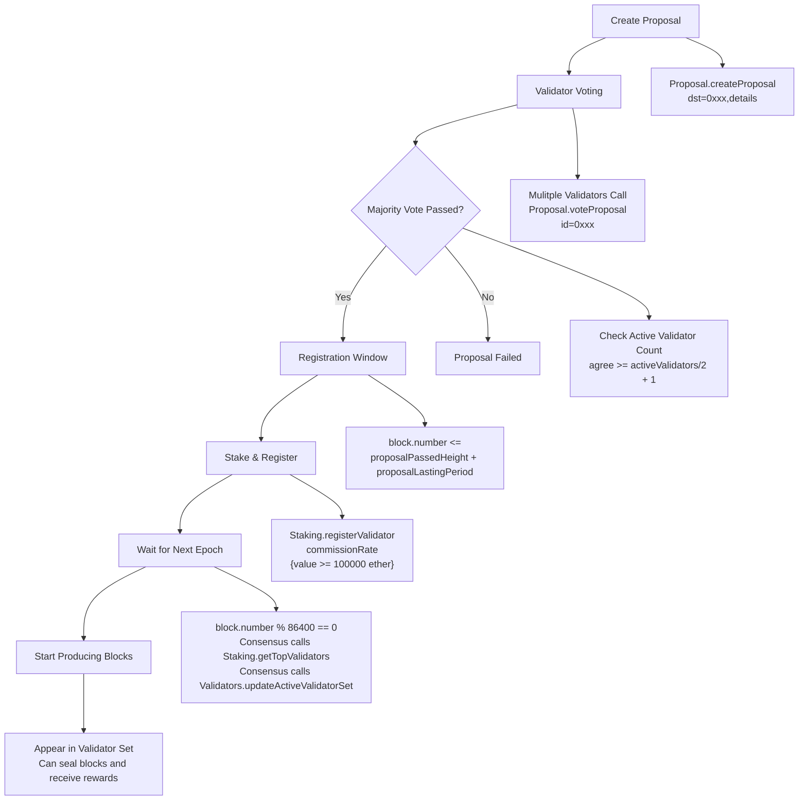

```
Stage 1: Create proposal
  Proposal.createProposal(dst, true, details)
    - ensure !pass[dst]
    - id = keccak256(proposer, dst, flag, details, proposerNonce)
    - proposalType = 1, flag = true

Stage 2: Validator voting
  Proposal.voteProposal(id, true) by active validators
    - onlyValidator: must be in currentValidatorSet and not jailed
    - not voted, not expired
    - results[id].agree++ (persistent for history)
    - check threshold on voting count:
        agree >= getVotingValidatorCount()/2 + 1
        -> pass[dst] = true
        -> proposalPassedHeight[dst] = block.number
        -> emit LogPassProposal
    - votes already cast are not revoked if validator later removed/jailed

Stage 3: Register within proposal window (default ~7 days)
  block.number <= proposalPassedHeight[dst] + proposalLastingPeriod
  Proposal.isProposalValidForStaking(dst) == true
  (window applies to new registrations only; default ~7 days)

Stage 4: Stake & register
  Staking.registerValidator(commissionRate) {value >= 100000 ether}
    - msg.value >= MIN_VALIDATOR_STAKE
    - commissionRate <= COMMISSION_RATE_BASE
    - selfStake == 0 (not registered)
    - proposal.pass(msg.sender) == true
    - isProposalValidForStaking(msg.sender) == true (within proposalLastingPeriod)
    - create ValidatorStake; add to allValidators; update totalStaked
    - validators.tryAddValidatorToHighestSet(msg.sender)
    - emit ValidatorRegistered

Stage 5: Wait for Epoch
  block.number % 86400 == 0
    - consensus calls Staking.getTopValidators()
    - consensus calls Validators.updateActiveValidatorSet(newSet, epoch)
      * updates currentValidatorSet
      * highestValidatorsSet not synced here

Stage 6: Start producing blocks
  Appears in validator set → can seal blocks and receive rewards
```


### 6.2 Validator Voting

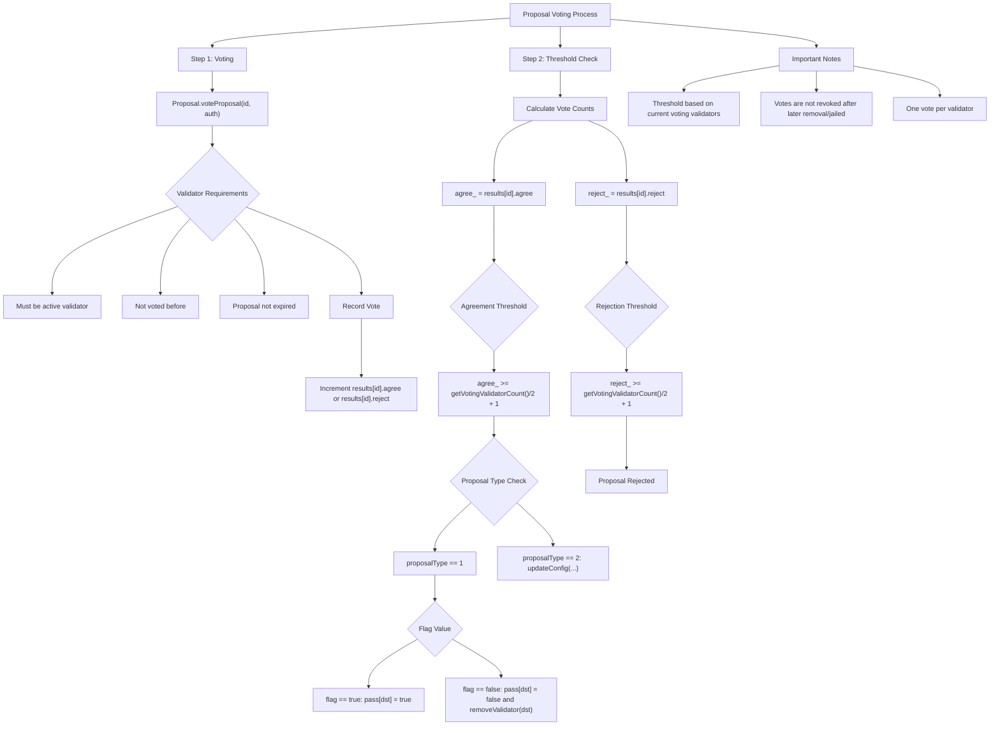

```
Step 1: Voting
  Proposal.voteProposal(id, auth) by active validator
    - must be active (in currentValidatorSet and not jailed)
    - not voted, not expired
    - record vote
    - results[id].agree++ or reject++

Step 2: Threshold check after each vote
  - agree = results[id].agree
  - reject = results[id].reject
  - if agree >= getVotingValidatorCount()/2 + 1:
      * if proposalType == 1:
          flag == true  -> pass[dst] = true
          flag == false -> pass[dst] = false; removeValidator(dst)
      * if proposalType == 2: updateConfig(...)
  - if reject >= getVotingValidatorCount()/2 + 1:
      * proposal rejected

Notes:
- Threshold based on current voting validators (excludes jailed)
- Votes already cast are not revoked after later removal/jailed
- One vote per validator; proposalLastingPeriod default 7 days
```

### 6.3 Validator Stake Registration

```mermaid
graph TD
    A[Validator Stake Registration] --> B[Pre-checks]
    B --> B1[proposal.pass#40;msg.sender#41; == true]
    B --> B2[isProposalValidForStaking == true<br/>within proposalLastingPeriod (default ~7 days)]
    B --> B3[selfStake == 0<br/>not registered]
    B --> B4[#33;isJailed or jailUntilBlock passed]
    B1 --> C
    B2 --> C
    B3 --> C
    B4 --> C
    
    C[Register Validator] --> C1[Staking.registerValidator<br/>value #62;= 100000 ether]
    C1 --> C2[value #62;= MIN_VALIDATOR_STAKE]
    C1 --> C3[commissionRate #60;= COMMISSION_RATE_BASE]
    C1 --> C4[proposal checks passed]
    C1 --> C5[Create stake record<br/>selfStake, totalDelegated=0,<br/>commissionRate, accumulatedRewards=0,<br/>isJailed=false]
    C1 --> C6[Add to allValidators<br/>update totalStaked]
    C1 --> C7[validators.tryAddValidatorToHighestSet]
    C1 --> C8[emit ValidatorRegistered]
    
    C2 --> D
    C3 --> D
    C4 --> D
    C5 --> D
    C6 --> D
    C7 --> D
    C8 --> D
    
    D[After Registration] --> D1[Can add stake<br/>addValidatorStake#40;#41;]
    D --> D2[Can update commission<br/>updateCommissionRate#40;#41;]
    D --> D3[Enter active set<br/>next epoch]
```

```
Pre-checks:
  proposal.pass(msg.sender) == true
  isProposalValidForStaking(msg.sender) == true (within proposalLastingPeriod; new registrations only)
  selfStake == 0 (not registered)

Register:
  Staking.registerValidator(commissionRate) {value >= 100000 ether}
    - value >= MIN_VALIDATOR_STAKE
    - commissionRate <= COMMISSION_RATE_BASE
    - proposal checks above
    - create stake record: selfStake, totalDelegated=0, commissionRate, accumulatedRewards=0, isJailed=false
    - add to allValidators; update totalStaked
    - validators.tryAddValidatorToHighestSet(msg.sender)
    - emit ValidatorRegistered

After:
  - can add stake: addValidatorStake()
  - can update commission: updateCommissionRate()
  - enter active set next epoch
```
### 6.4 Increase Stake
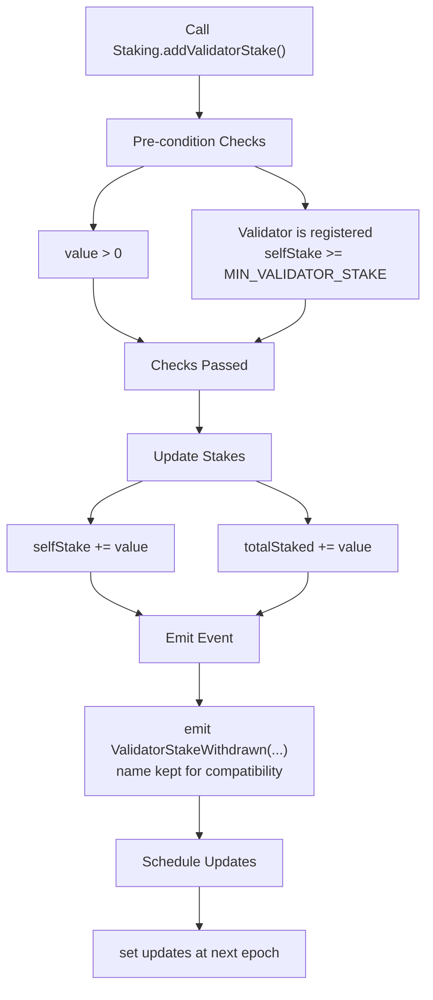

```
Staking.addValidatorStake() {value > 0}
  - must be registered
  - selfStake += value; totalStaked += value
  - emit ValidatorStakeWithdrawn(...)   // name kept for compatibility
  - set updates at next epoch
```

### 6.5 Withdraw Stake
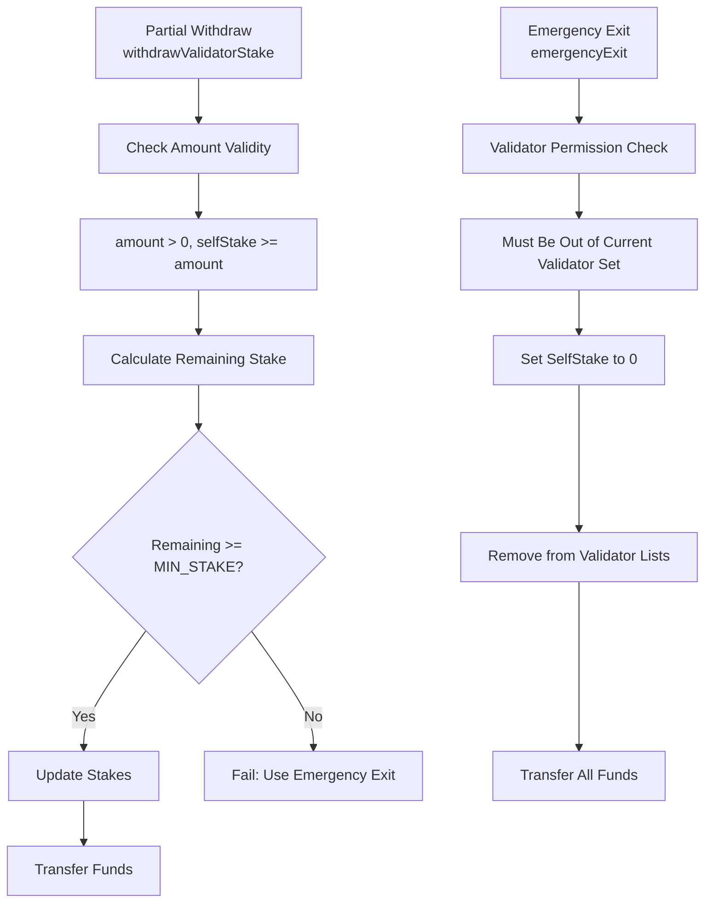

```
Partial withdraw:
  Staking.withdrawValidatorStake(amount)
    - amount > 0; selfStake >= amount
    - remaining = selfStake - amount
    - require remaining >= MIN_VALIDATOR_STAKE (else fail; use emergencyExit)
    - update selfStake, totalStaked
    - emit ValidatorStakeWithdrawn(...)
    - payable(msg.sender).call{value: amount}("") with success check

Emergency exit (full):
  Staking.emergencyExit()
    - onlyValidValidator
    - must already be out of currentValidatorSet (wait for exit)
    - set selfStake = 0; totalStaked -= withdrawAmount
    - if still authorized, removeFromHighestSet + clear pass
    - _removeFromAllValidators()
    - emit ValidatorExited(...)
    - call transfer of withdrawAmount
```

### 6.6 Delegation
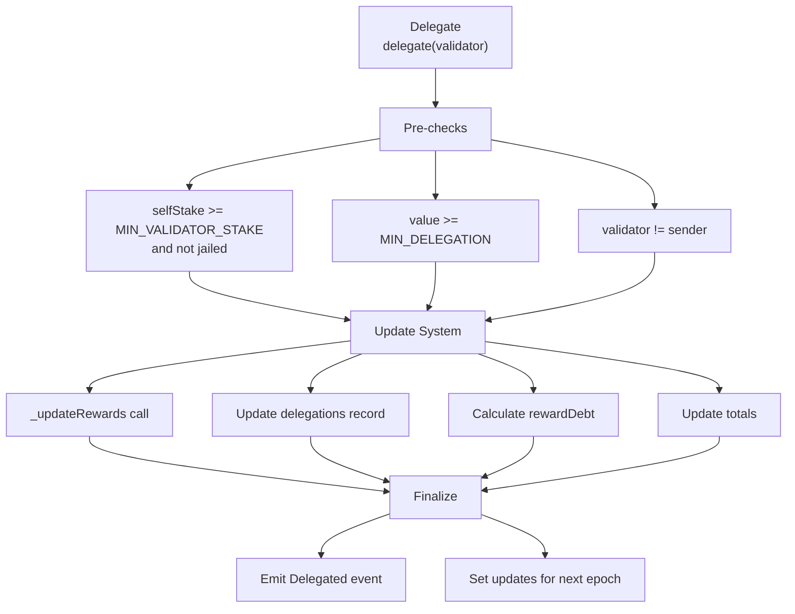
```
Delegate:
  Staking.delegate(validator) {value >= 1 ether}
    - validator selfStake >= MIN_VALIDATOR_STAKE and not jailed (no currentValidatorSet check)
    - value >= MIN_DELEGATION; validator != sender
    - _updateRewards(sender, validator)
    - delegations[delegator][validator].amount += value
    - rewardDebt = amount * rewardPerShare / 1e18
    - totalDelegated += value; totalStaked += value
    - emit Delegated(...)
    - set updates next epoch
```

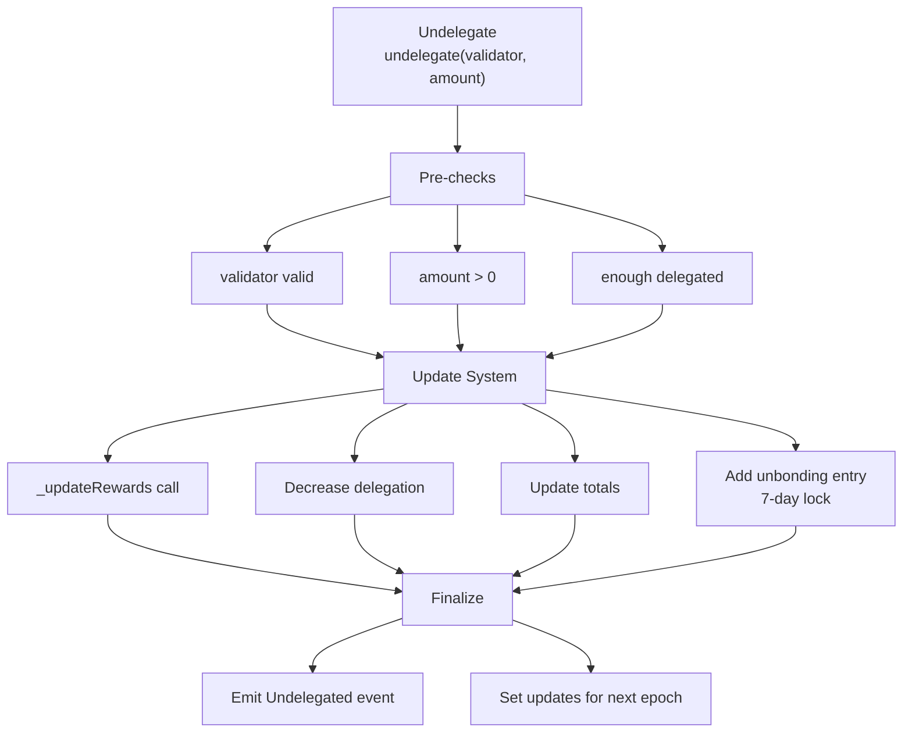
```
Undelegate:
  Staking.undelegate(validator, amount)
    - validator valid; amount > 0; enough delegated
    - _updateRewards(sender, validator)
    - decrease delegation; update rewardDebt
    - totalDelegated -= amount; totalStaked -= amount
    - add unbonding entry: completionBlock = now + unbondingPeriod (default 7d)
    - emit Undelegated(...)
    - set updates next epoch
```

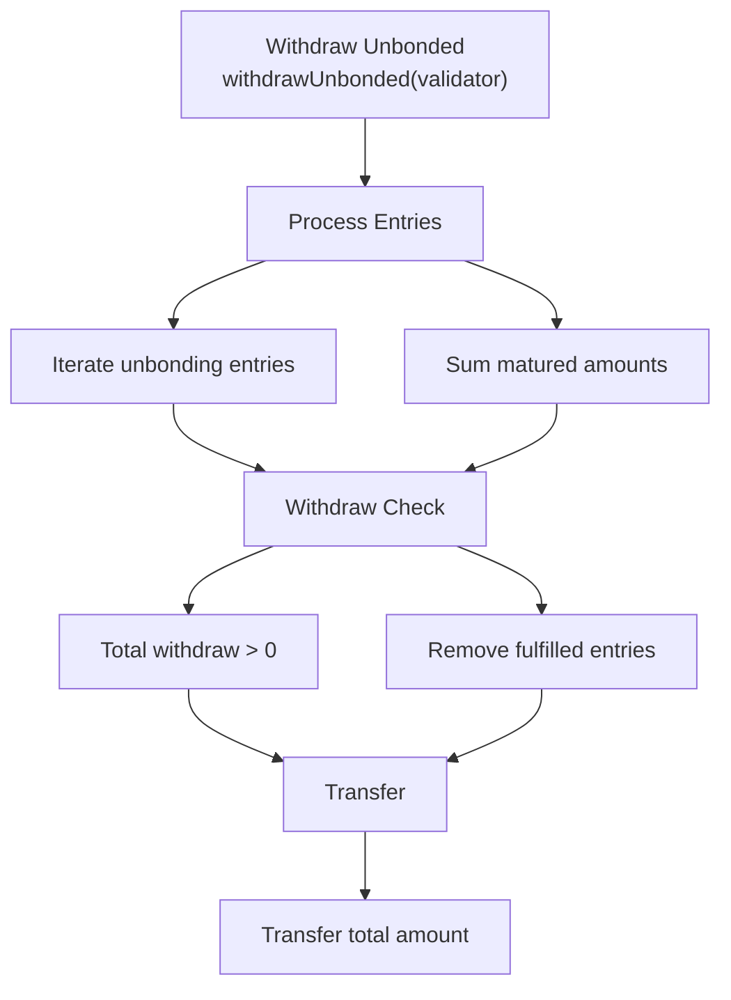

```
Withdraw unbonded:
  Staking.withdrawUnbonded(validator, maxEntries)
    - iterate unbonding entries; sum matured
    - remove fulfilled entries; require totalWithdraw > 0
    - transfer totalWithdraw
```

### 6.7 Reward Distribution & Withdrawal

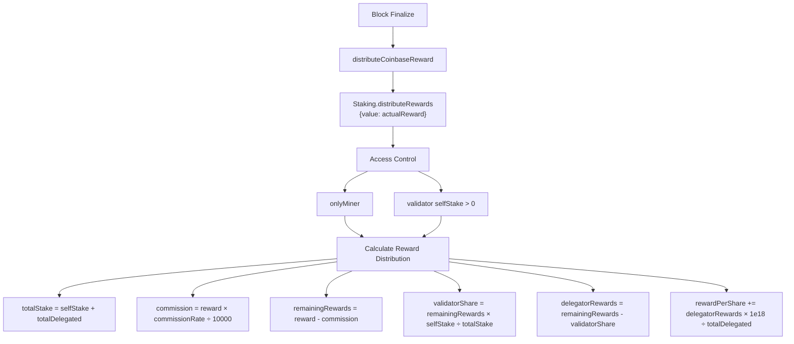

```
Block reward (JPoSA):
  consensus Finalize -> distributeCoinbaseReward()
    -> Staking.distributeRewards() {value: actualReward}
       - onlyMiner; validator selfStake > 0
       - totalStake = selfStake + totalDelegated
       - commission = reward * commissionRate / 10000
       - remainingRewards = reward - commission
       - validatorShare = remainingRewards * selfStake / totalStake
       - delegatorRewards = remainingRewards - validatorShare
       - rewardPerShare += delegatorRewards * 1e18 / totalDelegated
```

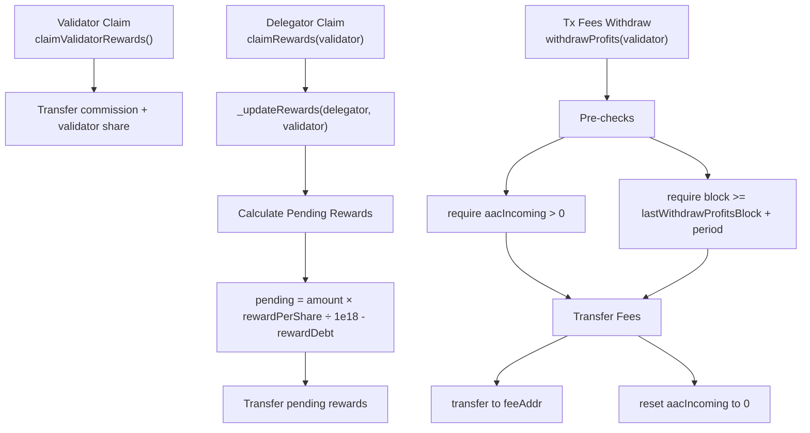

```
Claim:
  Validator: Staking.claimRewards(validator)
    - _updateRewards(validator, validator)
    - transfer commission + validator share (accumulatedRewards)

  Delegator: Staking.claimRewards(validator)
    - _updateRewards(delegator, validator)
    - pending = amount * rewardPerShare / 1e18 - rewardDebt
    - transfer pending

  Tx fees: Validators.withdrawProfits(validator)
    - require aacIncoming > 0
    - require block >= lastWithdrawProfitsBlock + withdrawProfitPeriod
    - transfer to feeAddr; reset aacIncoming
```

### 6.8 Punishment Flow

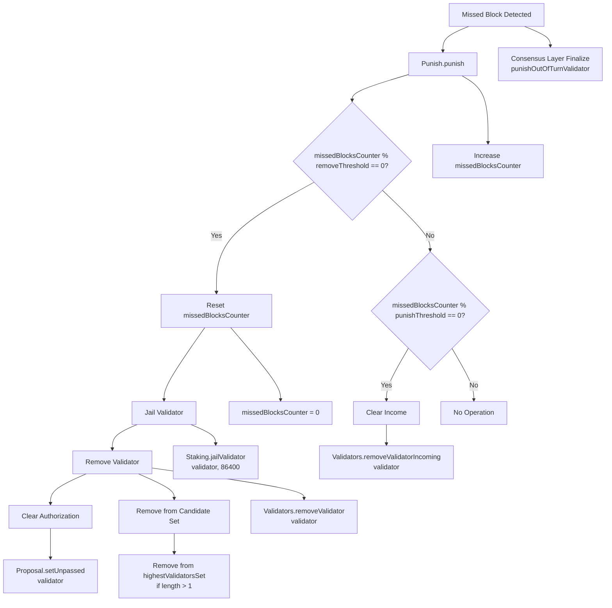

```
Detect miss:
  consensus Finalize -> punishOutOfTurnValidator()
    - expected validator = validators[number % len(validators)]
    - if not recently signed: Punish.punish(validator)

Punish.punish:
  - onlyMiner; missedBlocksCounter++
  - if missedBlocksCounter % removeThreshold (48) == 0:
      missedBlocksCounter = 0
      Staking.jailValidator(validator, 86400)   // first
      Validators.removeValidator(validator)     // then
        * Proposal.setUnpassed(validator)
        * remove from highestValidatorsSet if length > 1
  - else if missedBlocksCounter % punishThreshold (24) == 0:
      Validators.removeValidatorIncoming(validator) // clear income

Immediate effect on epoch block:
  - If current block is epoch:
      consensus gets Staking.getTopValidators() (no jail filter; `selfStake > 0`)
      Validators.updateActiveValidatorSet(newSet, epoch) → validator removed now

Non-epoch block:
  - validator still in currentValidatorSet for this epoch
  - consensus rejects jailed validators in Finalize (cannot seal after jail is in parent state)
```

### 6.9 Rejoin Flow (current)

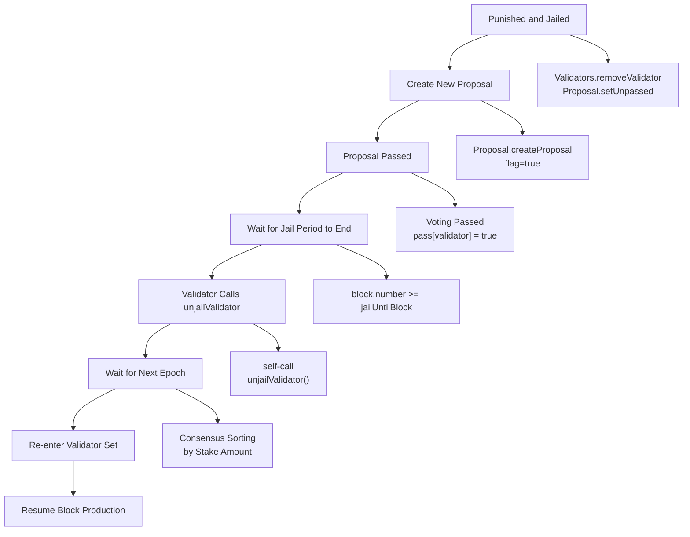

```
1) After punish+jail, pass cleared: Validators.removeValidator -> Proposal.setUnpassed
2) New proposal passes: pass[validator] = true
3) Wait jail ends: block.number >= jailUntilBlock
4) Validator calls unjailValidator():
   - self-call only; pass == true
   - selfStake still >= MIN_VALIDATOR_STAKE
   - validators.tryActive(validator) pre-activates candidate set
   - isJailed=false, jailUntilBlock=0
5) Next epoch: consensus sorts by stake; validator re-enters currentValidatorSet if stake/pass ok

If self-stake was withdrawn (< MIN_VALIDATOR_STAKE), must re-register after proposal pass (within proposalLastingPeriod window).
```

### 6.10 Epoch Update End-to-End

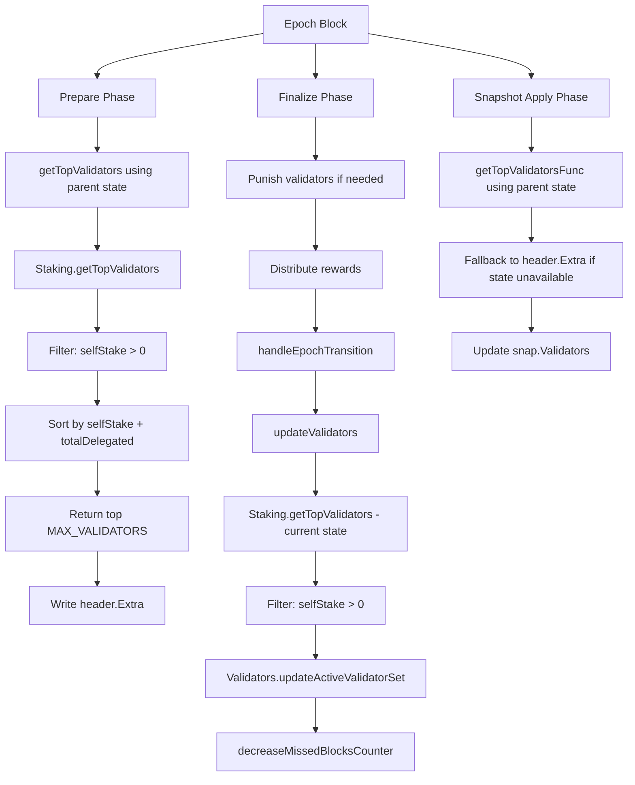

```
Prepare (epoch block):
  - getTopValidators() using parent state
    * Staking.getTopValidators(): selfStake > 0
    * sort by selfStake + totalDelegated
    * return top MAX_VALIDATORS (21)
  - write header.Extra

Finalize (epoch block):
  - punish (may jail)
  - distribute rewards
  - handleEpochTransition():
      * updateValidators():
          - Staking.getTopValidators() (current state; no jail filter)
          - Validators.updateActiveValidatorSet(newSet, epoch)
            (highestValidatorsSet not synced here)
      * decreaseMissedBlocksCounter(): Punish.decreaseMissedBlocksCounter(epoch)

Snapshot.apply:
  - if epoch block: getTopValidatorsFunc() using parent state
    * fallback to header.Extra if state unavailable
  - update snap.Validators
```
### 6.11 Update Commission Rate

```
Staking.updateCommissionRate(newCommissionRate)
  - onlyValidValidator
  - newCommissionRate <= COMMISSION_RATE_BASE
  - update commissionRate; emit ValidatorUpdated
```

### 6.12 Edit Validator Info

```
Validators.editValidator(feeAddr, moniker, identity, website, email, details)
  - require isValidatorExist
  - update feeAddr + description
  - emit LogEditValidator
```

---

## 7. Key Mechanisms

### 7.1 Proposal Mechanics

**proposalLastingPeriod registration window (default ~7 days)**
- After pass, validator must register stake within proposalLastingPeriod or lose eligibility
- Checked only in `registerValidator()`
- Applies only to new registrations; existing validators unaffected
- Purpose: prevent malicious quick flips; enforce timely onboarding

**Voting thresholds**
- Pass: `agree >= getVotingValidatorCount()/2 + 1`
- Reject: `reject >= getVotingValidatorCount()/2 + 1`
- Voting count: `getVotingValidatorCount()` (currentValidatorSet excluding jailed)
- Votes already cast are not revoked after later removal/jailed
  - `results[id].agree/reject` keep full history

### 7.2 Jail Mechanics

**Trigger**: missedBlocksCounter reaches `removeThreshold` (48).

**Effects**:
- `isJailed = true`
- `jailUntilBlock = block.number + validatorUnjailPeriod` (default 86,400)
- Excluded next epoch; consensus rejects blocks from jailed validators after jail is in parent state
- Tx fee rewards for a jailed producer are redistributed

**Unjail conditions**:
- Wait until `block.number >= jailUntilBlock`
- Must be re-authorized (`pass == true`)
- Validator self-calls `unjailValidator()`; selfStake must still meet MIN_VALIDATOR_STAKE

### 7.3 Reward Mechanics

**Base block reward (JPoSA)**
- Actual reward computed in consensus:
  `blockReward * baseRatio/10000 + blockReward * weightedRatio/10000 * validatorCount * (minerStake/totalStake)`
- Split between block validator and delegators
- Validator:
  - commission: `reward * commissionRate / 10000`
  - validator share: `(reward - commission) * selfStake / totalStake`
- Delegators:
  - `(reward - commission) * delegatedAmount / totalStake`
- Claim via `Staking.claimRewards` (delegators) / `claimValidatorRewards` (validator)

### 7.4 Delegation Mechanics

**Requirements**
- MIN_DELEGATION = 1 ether
- Validator selfStake >= MIN_VALIDATOR_STAKE and not jailed (no currentValidatorSet check)

**Unbonding**
- UNBONDING_PERIOD = 604,800 blocks (~7 days)
- Tokens stay in total stake during unbonding
- Withdraw after completion

**Rewards**
- Uses `rewardPerShare`; update `rewardDebt` on every delegate/undelegate
- Claim: `pending = amount * rewardPerShare / 1e18 - rewardDebt`

### 7.5 Validator Set Updates

**Timing**
- Only on epoch blocks (`block.number % 86400 == 0`)
- Stake/delegation changes take effect next epoch

**Process**
1. Prepare: parent state → write header.Extra
2. Finalize: current state → `Staking.getTopValidators()` → `Validators.updateActiveValidatorSet(newSet, epoch)`
   - updates `currentValidatorSet`
   - `highestValidatorsSet` managed elsewhere (e.g., tryAddValidatorToHighestSet)
3. Snapshot: parent state → update `snap.Validators`

**Filters**
- `selfStake >= MIN_VALIDATOR_STAKE`
- `!isJailed`
- `proposal.pass(validator) == true`
- No `isProposalValidForStaking()` check here (only in registerValidator)

**Sort**
- By `selfStake + totalDelegated`
- Return top `MAX_VALIDATORS` (21)

### 7.6 Unified State Ownership

**Jail state**
- Owned solely by Staking
- Validators proxies: `staking.isValidatorJailed(validator)`

**Validator queries**
- Validators.isValidatorJailed → Staking.isValidatorJailed
- Validators.isValidatorActive → currentValidatorSet + Staking.isValidatorJailed
- Validators.isValidatorExist → stake existence

**Active set queries**
- getActiveValidators / getActiveValidatorCount: from `currentValidatorSet` (no jail filter)
- For voting, use `getVotingValidatorCount()` (excludes jailed)

### 7.7 Protections

**Candidate set safety**
- removeValidator/removeFromHighestSet require `highestValidatorsSet.length > 1` to avoid empty set

**Active set lag**
- Jailed within current epoch remain in `currentValidatorSet`, but consensus rejects their blocks; removed next epoch

**Reentrancy**
- Validators and Staking inherit ReentrancyGuard
- nonReentrant on:
  - Validators.withdrawProfits
  - Staking.withdrawValidatorStake
  - Staking.emergencyExit
  - Staking.claimRewards
- `operationsDone[block.number]` to stop per-block reentry
- CEI pattern (checks-effects-interactions)

---

## 8. Consensus-to-Contract Sequence

### 8.1 Normal Block

```
Block N (non-epoch)
Prepare:
  - set header.Coinbase, header.Nonce
  - load snapshot (validators)

Execute txs

Finalize:
  - punish missed validator if any (punishOutOfTurnValidator -> Punish.punish)
  - distribute tx fees if txs (Validators.distributeBlockReward)
  - distribute actualReward (JPoSA) (Staking.distributeRewards)
  - if epoch block:
      handleEpochTransition -> updateValidators -> Staking.getTopValidators -> Validators.updateActiveValidatorSet
      decreaseMissedBlocksCounter -> Punish.decreaseMissedBlocksCounter
```

### 8.2 Epoch Block

```
Block N (epoch, N % 86400 == 0)
Prepare:
  - set coinbase/nonce
  - load snapshot
  - getTopValidators() using parent state, write header.Extra

Execute txs

Finalize:
  - punish (may jail)
  - distribute fees
  - distribute actualReward
  - handleEpochTransition:
      * updateValidators:
          - Staking.getTopValidators() (current state; no jail filter)
          - Validators.updateActiveValidatorSet(newSet, epoch)
            (highestValidatorsSet not synced here)
      * decreaseMissedBlocksCounter (Punish)
```

### 8.3 Validator Turn

```
Validator A turn (block N)
Prepare:
  - check N % len(validators) == index of A
  - ensure A in snap.Validators (snapshot may include jailed)
  - set header.Coinbase = A

Seal:
  - ensure A in snap.Validators; sign (Finalize will reject if A is jailed in parent state)

Finalize:
  - if A sealed: fee + actualReward to A (+delegators)
  - if missed: punishOutOfTurnValidator -> Punish.punish(A)
```

### 8.4 Validator Set Update Timeline

```
Epoch block N (N % 86400 == 0)
Prepare [state at N-1]:
  - getTopValidators() using parent state
  - write header.Extra

Tx execution (may change stakes/delegations)

Finalize [state at N]:
  - punish (may jail; state updated)
  - handleEpochTransition:
      * Staking.getTopValidators() (current state)
      * Validators.updateActiveValidatorSet(newSet, epoch)
      * update highestValidatorsSet

Key:
- Prepare uses parent state; Finalize uses current state
- If jailed in this block, exclusion from the next set depends on `highestValidatorsSet` updates
```

```
sequenceDiagram
    participant C as Consensus Engine
    participant S as Staking Contract
    participant V as Validators Contract
    participant P as Punish Contract
    
    Note over C,V: Epoch Block (N % 86400 == 0)
    
    C->>S: getTopValidators()<br/>(Using Parent State)
    S-->>C: Return Validator List
    
    C->>V: updateActiveValidatorSet()<br/>(Using Current State)
    V->>S: getTopValidators()<br/>(Filtering Jailed Validators)
    S-->>V: Return Validator List
    V->>V: Update currentValidatorSet
    
    C->>P: decreaseMissedBlocksCounter()
    P->>P: Decrease missedBlocksCounter Count
    
    Note over C,V: Takes Effect Before Next Epoch
```

---

## 9. Key Parameters & Constants

### 9.1 Staking

| Name                  | Value          | Note                                      |
|-----------------------|----------------|-------------------------------------------|
| `MIN_VALIDATOR_STAKE` | 100000 ether    | minimum validator self-stake              |
| `MIN_DELEGATION`      | 10 ether       | minimum delegation                        |
| `MIN_UNDELEGATION`    | 1 ether        | minimum undelegation                      |
| `MAX_VALIDATORS`      | 21             | max validators                            |
| `MIN_VALIDATORS`      | 3              | minimum validators (safety guideline)     |
| `maxCommissionRate`   | 6000           | max commission rate (60%, cid = 18)       |
| `baseRewardRatio`     | 3000           | base reward ratio (30%, cid = 17)         |
| `COMMISSION_RATE_BASE`| 10000          | 10000 = 100%                              |

### 9.2 Time

| Name                     | Value              | Note                                      |
|--------------------------|--------------------|-------------------------------------------|
| `Epoch`                  | 86400 blocks       | ~24h                                      |
| `validatorUnjailPeriod`  | 86400 blocks (def) | ~24h, configurable via cid = 7            |
| `unbondingPeriod`        | 604800 blocks (def)| ~7d, configurable via cid = 6             |
| `proposalLastingPeriod`  | 604800 blocks (def)| registration window for new validators    |
| `commissionUpdateCooldown` | 604800 blocks (def) | commission update cooldown (cid = 16)   |
| `proposalCooldown`       | 100 blocks (def)  | proposal creation cooldown (cid = 19)     |

### 9.3 Punishment

| Name                    | Value       | Note                                                      |
|-------------------------|-------------|-----------------------------------------------------------|
| `punishThreshold`       | 24 blk      | clear income                                              |
| `removeThreshold`       | 48 blk      | jail + remove                                             |
| `decreaseRate`          | 24          | reduce missedBlocksCounter by removeThreshold/decreaseRate |
| `doubleSignSlashAmount` | 50000 ether | slash amount on double-sign evidence                      |
| `doubleSignRewardAmount`| 10000 ether | reporter reward (<= slash)                                |
| `doubleSignWindow`      | 86400 blk   | evidence window                                           |
| `burnAddress`           | 0x...dEaD   | burn destination for slashed remainder                    |

### 9.4 Addresses

| Contract   | Address                                      | Note                   |
|------------|----------------------------------------------|------------------------|
| Validators | `0x000000000000000000000000000000000000F010` | validator management   |
| Punish     | `0x000000000000000000000000000000000000F011` | punishment             |
| Proposal   | `0x000000000000000000000000000000000000F012` | governance             |
| Staking    | `0x000000000000000000000000000000000000F013` | staking                |

---

## 10. Safety Mechanisms & Edge Cases

### 10.1 Reentrancy Protection

Mechanisms:
- Contract-level: Validators & Staking inherit `ReentrancyGuard`
- Function-level: `nonReentrant` on
  - Validators.withdrawProfits
  - Staking.withdrawValidatorStake
  - Staking.emergencyExit
  - Staking.claimRewards
- Block-level: `operationsDone[block.number][operation]`
  - set immediately; repeated execution reverts (prevents pre-calls)
- CEI pattern: checks → effects → interactions

Applies to:
- Validators.distributeBlockReward (no double distribution)
- Validators.updateActiveValidatorSet (no double update)

### 10.2 State Consistency

**Jail state**
- Single source of truth in Staking
- Validators queries via proxy

**Validator set updates**
- Epoch-only updates
- Prepare uses parent state; Finalize uses current
- Snapshot keeps set consistent

### 10.3 Edge Handling

**All validators jailed**
- Protection: removeValidator requires `highestValidatorsSet.length > 1`
- getTopValidators may return empty; consensus should guard against empty set before updateActiveValidatorSet (acceptable safety)

**Below minimum validators**
- `MIN_VALIDATORS` (3) is business guidance, not hard tech limit
- withdrawValidatorStake checks activeValidatorCount > MIN_VALIDATORS
- Prevents total exit; chain can technically run with fewer

**State unavailable**
- Light clients / historical validation may lack state
- Fallback to header.Extra when state-unavailable error
- Differentiate unavailable vs other errors; fallback only when unavailable

### 10.4 Proposal Security

- proposalLastingPeriod window enforced only in registerValidator (new only)
- Thresholds based on current active validators; votes from removed validators don’t count
- Ensures majority of *current* active validators approve

### 10.5 Reward Safety

- Precise distribution via rewardPerShare; rewardDebt updated on every change
- Integer division loss negligible (<4 wei/txn on 18-decimal tokens)
- `operationsDone` prevents double distribution in same block

### 10.6 Technical Improvements

- **SafeMath removed**: rely on Solidity 0.8+ checked arithmetic
- **Reentrancy hardened**: ReentrancyGuard + nonReentrant + CEI
- **Config validation**: Proposal.updateConfig validates all param ranges (no div-by-zero, etc.)
- **Inflation removed**: removed increasePeriod/receiverAddr; no token minting
- **State ownership**: removed redundant status from Validator; Staking owns jail state; getValidatorInfo computes status for compatibility

---

## 11. FAQ

### 11.1 Validator Lifecycle

**Q: How long from proposal to producing blocks?**  
A:  
1. Proposal & voting: depends on validator turnout (hours–days)  
2. proposalLastingPeriod window: must stake within proposalLastingPeriod of pass (default ~7 days)  
3. Registration: effective immediately on stake  
4. Epoch update: up to next epoch (~24h)  
**Minimum: proposalLastingPeriod + voting time (default ~7 days).**

**Q: How to recover after jail?**  
A:  
1. Re-authorize via proposal (pass = true)  
2. Wait jailUntilBlock (default 86,400)  
3. Ensure selfStake ≥ MIN_VALIDATOR_STAKE (top up or re-register)  
4. Call `unjailValidator()` (self) → isJailed=false  
5. Wait next epoch for re-entry to currentValidatorSet

### 11.2 Staking & Delegation

**Q: Can a validator withdraw part of the stake?**  
A: Yes, if remaining selfStake ≥ MIN_VALIDATOR_STAKE (100,000 ether).  
Otherwise transaction reverts; use `emergencyExit()` to fully exit.  
`emergencyExit()` also checks remaining active validators ≥ MIN_VALIDATORS (3).

**Q: Can delegators undelegate anytime?**  
A: Yes; funds enter 7-day unbonding. Tokens still count toward total stake during unbonding and can be withdrawn after.

### 11.3 Rewards

**Q: How are rewards split?**  
A:  
- Tx fees: if producer not jailed, go to producer; if producer jailed, redistributed to non-jailed validators  
- Block reward (actualReward): validator commission + validator share; remaining to delegators

**Q: How to claim?**  
A:  
- Validator commission/validator share: `Staking.claimValidatorRewards()`  
- Delegator rewards: `Staking.claimRewards(validator)`  
- Tx fees: `Validators.withdrawProfits(validator)`

### 11.4 Epoch Updates

**Q: When does the validator set change?**  
A: Only on epoch blocks (`block.number % 86400 == 0`):  
- Prepare: parent state → header.Extra  
- Finalize: current state → updateActiveValidatorSet  
- Snapshot: parent state → snap.Validators

**Q: When is a jailed validator removed?**  
A:  
- If epoch block: removed immediately in Finalize  
- If non-epoch: still in currentValidatorSet; cannot seal once jailed is in parent state; removed next epoch

---

## 12. Summary

### 12.1 Principles

1. Governance-gated admission (proposal required)  
2. Minimum self-stake 100,000 ether  
3. proposalLastingPeriod window for new registrations after pass (default ~7 days; existing validators exempt)  
4. Validator set updates only on epoch blocks  
5. Jail: cannot seal after jail is in parent state; removal next epoch  
6. Unified state ownership: jail in Staking, authorization in Proposal

### 12.2 Key Flows

1. Join: proposal → vote → proposal window (default ~7 days) → stake → epoch update  
2. Punish: miss → Punish counter → threshold → jail+remove+clear pass → re-propose + wait jail + unjail  
3. Exit: `resignValidator()` (technical jail + clear pass) → leave active set → `emergencyExit()` full withdraw  
4. Recover: re-propose, wait jail end, call `unjailValidator()`; re-register if stake < minimum  
5. Rewards: tx fees to currentValidatorSet excluding jailed (if producer jailed, redistributed);
   base reward (actualReward) to block validator + delegators

### 12.3 Safety

1. Reentrancy: ReentrancyGuard, nonReentrant, operationsDone, CEI  
2. State consistency: single-source jail state  
3. Edge safety: keep at least one validator; guard low counts  
4. Precision: rewardPerShare for accurate splits

---

**Doc version**: v1.5  
**Last updated**: 2025-12-15  
**Maintainer**: JPoSA Dev Team

**Changes (v1.5):**
- System contract addresses updated to F010/F011/F012/F013
- Removed staged punishment text (violationCount/autoRestorePass); unified to “re-propose + wait jail end + self-unjail”
- Clarified `emergencyExit` needs leaving active set first; no min-validator check; resign removes from candidate set and clears pass
- Epoch update no longer syncs highestValidatorsSet; active set overwritten only via `updateActiveValidatorSet`
- Rewards/punish note: jailed producer’s fees redistributed; current epoch still cached; blocks from jailed validators rejected after jail is in parent state; removed next epoch

**Changes (v1.4):**
- Removed `updateValidatorSetByStake()`; use `updateActiveValidatorSet()` only
- Consensus now calls `Staking.getTopValidators()` then `updateActiveValidatorSet()`
- Updated all related flows and checklists

**Changes (v1.3):**
- Added ReentrancyGuard/nonReentrant coverage
- Added config parameter range validation
- Removed inflation features (cid 5/6)
- CEI clarifications

**Changes (v1.2):**
- getTopValidators filters: removed isProposalValidForStaking; only pass + !isJailed
- proposalLastingPeriod window enforced only in registerValidator
- emergencyExit flow and totalStaked fixes
- getActiveValidators distinction from getTopValidators

**Changes (v1.1):**
- emergencyExit: remaining-validator check, jail mechanism, allValidators cleanup
- withdrawValidatorStake: forbid partial exit that makes validator inactive
- added _removeFromAllValidators note
- updated validator exit FAQ
